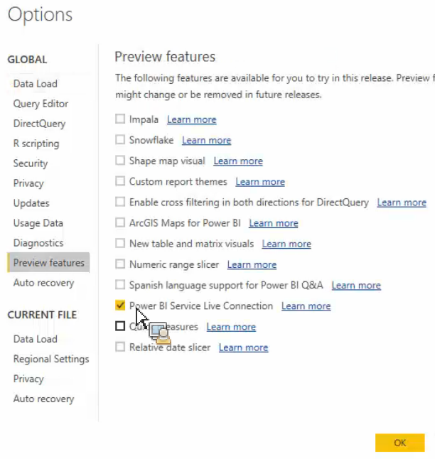

# Richiamare in Power BI Desktop le risorse pubblicate

{{legacy-arb}}

Spiega come richiamare in Power BI Desktop le risorse pubblicate in Power Builder

## Prerequisiti {#section_BDFDAE1E300B429FB6EBCB21AD1383A0}

* È necessario che sia installata la versione più recente di Power BI Desktop (versione di aprile 2017)
* Questa procedura presuppone che siano già state pubblicate le tabelle formattate o le richieste Report Builder inviate nel servizio di Power BI.

## Processo {#section_CB03E6E1B066457EA0F6FC08FFF5EFDD}

Nell’aggiornamento di aprile 2017 di Power BI Desktop, Microsoft ha introdotto la possibilità di connettersi ai set di dati nel servizio Power BI. Questa funzione consente di creare nuovi rapporti di set di dati esistenti già pubblicati nel cloud. Puoi sfruttare questa funzione per collaborare meglio e ridurre le attività duplicate all’interno del team.

1. In Power BI Desktop, vai a **[!UICONTROL File]** > **[!UICONTROL Options and settings]** > **[!UICONTROL Options]** > **[!UICONTROL Preview features.]**
1. Abilita **[!UICONTROL Power BI Service Live Connection]** e fai clic su **[!UICONTROL OK]**. 

1. Riavvia Power BI Desktop.
1. Dopo aver riavviato il desktop, passa a **[!UICONTROL Home]** > **[!UICONTROL Get Data]** > **[!UICONTROL More...]**.
1. Cerca e seleziona **[!UICONTROL Power BI service]**.
1. In **[!UICONTROL Microsoft Power BI service]** > **[!UICONTROL My Workspace]**, seleziona il set di dati precedentemente pubblicato da Report Builder.

Per ulteriori informazioni, consulta i [post del blog di Microsoft](https://powerbi.microsoft.com/en-us/blog/connecting-to-datasets-in-the-power-bi-service-from-desktop/).
