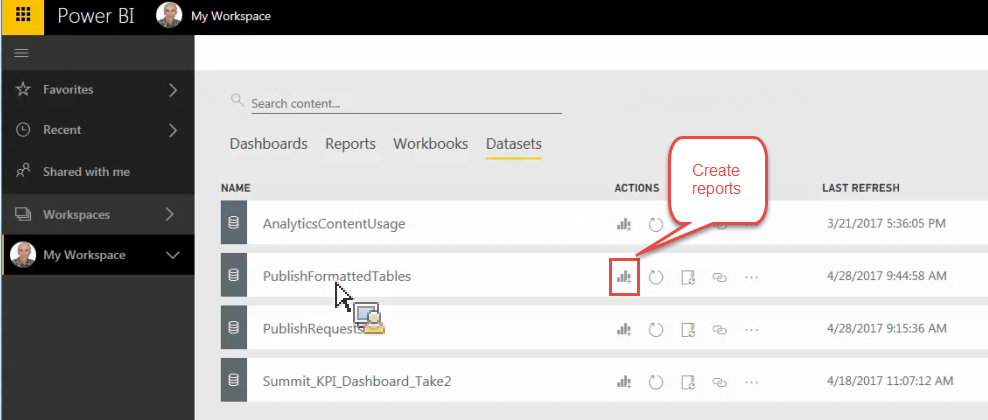
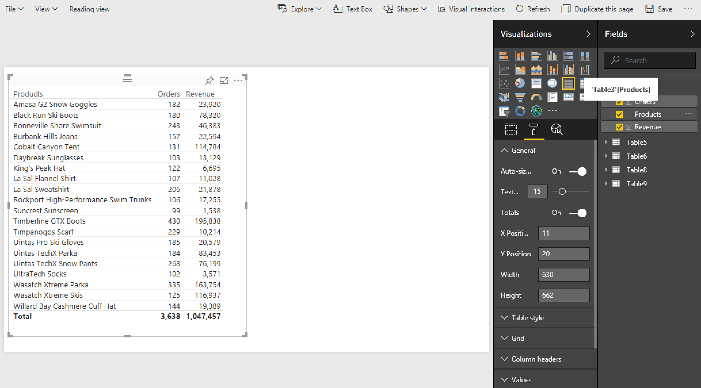
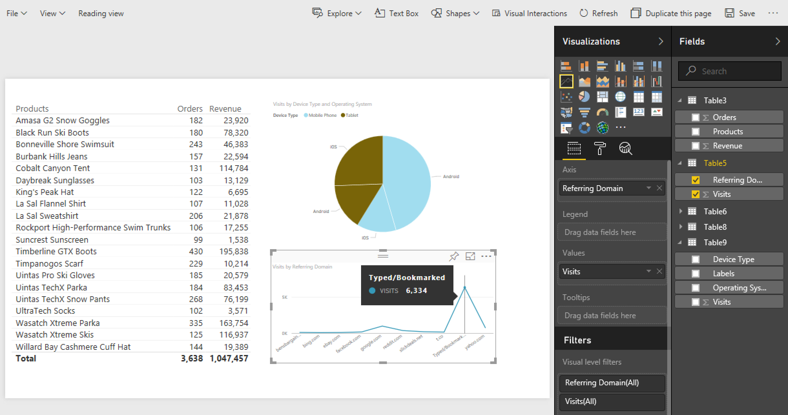

# Pubblicare su Power BI: panoramica

Microsoft Power BI è una suite di dashboard di analisi business per l’analisi dei dati e la condivisione di approfondimenti. L’integrazione di Adobe Analytics con Power BI consente di visualizzare i dati del Report Builder di Analytics all’interno di Microsoft Power BI e di condividerli facilmente in tutta l’organizzazione.

In precedenza gli analisti dovevano pianificare la distribuzione della cartella di lavoro di Report Builder utilizzando e-mail o ftp. Ora è possibile consentire agli stakeholder aziendali interessati di accedere, dall’interno dei loro account Power BI, a dati precisi e aggiornati in un ambiente basato sul web accessibile su più piattaforme e dispositivi.

La combinazione della capacità di generazione rapporti di Report Builder e delle funzionalità di visualizzazione di Power BI rende le informazioni più accessibili per tutti coloro che fanno parte dell’organizzazione. Con Power BI è possibile inoltre integrare Adobe Analytics con altre origini dati, ad es. punti vendita o origini CRM, per scoprire approfondimenti specifici su clienti, associazioni e opportunità.

## Requisiti di sistema {#section_0B71092D853446F38FA36447DAC0D32B}

* Adobe Report Builder 5.5 [installato](/help/analyze/legacy-report-builder/setup/t-install-arb.md)
* Account Microsoft attivo che consente di accedere a Power BI

## Pubblicare una cartella di lavoro su Power BI {#section_21CA66229EC240D49594A9A7D3FBA687}

Le cartelle di lavoro pianificate sono fogli di calcolo Excel formattati, compilati con dati di Adobe Analytics che vengono distribuiti sulla base di una programmazione regolare.

**Pubblicare una cartella di lavoro in Report Builder**

1. In Report Builder, genera e salva una cartella di lavoro.
1. Sulla barra degli strumenti di Report Builder fai clic su **[!UICONTROL Schedule]** > **[!UICONTROL New]**.

1. Nella procedura guidata della pianificazione di base, seleziona la casella accanto a **[!UICONTROL Publish Workbook to Microsoft Power BI]**.

   

1. Specifica l’e-mail e inviala subito oppure scegli una frequenza di pianificazione (oraria, giornaliera, ecc.).
1. Fai clic su **[!UICONTROL OK]** per la pubblicazione.
1. Ora ti verrà chiesto di accedere al tuo account Microsoft. Immetti le tue credenziali.
1. La cartella di lavoro di Report Builder viene pianificata e pubblicata in Power BI.

   Con ogni istanza pianificata e dopo che il processo di pianificazione di Report Builder ha aggiornato la cartella di lavoro con i dati di Analytics aggiornati, la cartella di lavoro verrà pubblicata in Microsoft Power BI.

**Visualizzare i dati della cartella di lavoro di Report Builder in Power BI**

1. In Power BI, fai doppio clic sulla cartella di lavoro sotto il menu [!UICONTROL Workbooks].

   

1. È ora possibile visualizzare i dati della dashboard della cartella di lavoro.  

1. È quindi possibile fissare un’area della cartella di lavoro per includerla in una delle dashboard di Power BI.

## Pubblicare tutte le tabelle formattate della cartella di lavoro come tabelle di set di dati Power BI. {#section_7C54A54E75184DD6BAEF4ACCE241239A}

>[!NOTE]
>
>Se la cartella di lavoro contiene una macro, l’opzione “Pubblica tutte le tabelle formattate nella cartella di lavoro come tabelle di set di dati di Power BI” verrà disabilitata.

Anziché importare l’intera cartella di lavoro, è possibile importare solo il contenuto di tutte le tabelle formattate al suo interno.

**Caso d’uso**: una cartella di lavoro di Excel consente di estrarre dati da più richieste di Report Builder e di creare una tabella di riepilogo con numerose formule. Puoi importare solo la tabella di riepilogo in Power BI e crearne una visualizzazione.

**Pubblicare una tabella formattata in Report Builder**

1. In Report Builder, genera una tabella di dati che includa una riga di intestazione, seguita da una riga di dati.
1. Seleziona la tabella e quindi scegli **[!UICONTROL Format as Table]** dal menu [!UICONTROL Home]. La tabella viene denominata per impostazione predefinita (Tabella 1, Tabella 2, ecc.), ma è possibile modificarne il nome nel menu [!UICONTROL Design].

1. Sulla barra degli strumenti di Report Builder, fai clic su **[!UICONTROL Schedule]** > **[!UICONTROL New]**.

1. Nella procedura guidata per la pianificazione di base, fai clic su **[!UICONTROL Advanced Scheduling Options]**.
1. Nella [!UICONTROL Scheduling Wizard - Advanced], sulla scheda **[!UICONTROL Publishing Options]**, seleziona la casella accanto a **[!UICONTROL Publish all Formatted Tables as Power BI dataset tables]**.

   

1. (Facoltativo) In Power BI, puoi personalizzare il nome della risorsa pubblicata. Ciò può essere utile se utilizzi le versioni come parte del nome della cartella di lavoro (ad esempio, myworkbook_v1.1.xlsx) e non desideri che il numero di versione venga visualizzato nel nome della risorsa Power BI pubblicata. Il vantaggio aggiuntivo è che la risorsa pubblicata non cambierà se cambia il numero di versione. (Consulta le [specifiche](/help/analyze/legacy-report-builder/c-publish-power-bi/specifications-limits.md) qui).

**Visualizzare i dati della tabella in Power BI**

1. In Power BI, passa al menu **[!UICONTROL Workspaces]** > **[!UICONTROL Datasets]**.

   

1. Seleziona il set di dati pubblicato e fai clic sull’icona [!UICONTROL Create report] accanto. Tieni presente che le tabelle verranno visualizzate come Campi.

   

1. Seleziona una tabella e le colonne associate.

   

1. Dal menu [!UICONTROL Visualizations] puoi selezionare la modalità di visualizzazione di una tabella in Power BI. Ad esempio, puoi scegliere di presentare i dati come un grafico a linee:

   

1. Da qui puoi creare visualizzazioni da questa tabella di set di dati.

## Pubblicare tutte le richieste di Report Builder in forma di tabelle di set di dati di Power BI. {#section_0C26057C7DBB4068A643FDD688F6E463}

Puoi trasformare tutte le richieste in tabelle di set di dati e aggiungere visualizzazioni.

>[!IMPORTANT]
>
>Se la cartella di lavoro contiene più di 100 richieste, solo le prime 100 richieste verranno pubblicate in Power BI. Inoltre, per ogni richiesta pubblicata in Power BI, verranno pubblicate solo le prime 10.000 righe di dati. Pertanto, anche se queste richieste verranno consegnate correttamente tramite la pianificazione, l’ambito di pubblicazione in Power BI è limitato.

1. In Report Builder apri o crea una cartella di lavoro con le richieste di Report Builder.
1. Sulla barra degli strumenti del Report Builder, fai clic su **[!UICONTROL Schedule]** > **[!UICONTROL New]**.

1. Nella procedura guidata per la pianificazione di base, fai clic su **[!UICONTROL Advanced Scheduling Options]**.
1. Nella [!UICONTROL Scheduling Wizard - Advanced], sulla scheda **[!UICONTROL Publishing Options]**, seleziona la casella accanto a **[!UICONTROL Publish all Report Builder Requests as Power BI Dataset Tables]** 

1. Fai clic su **[!UICONTROL OK]**.

**Visualizzare i dati della richiesta in Power BI**

Ogni richiesta di Report Builder pianificata verrà pubblicata come tabella nel set di dati. Ogni tabella della richiesta è denominata in base alla dimensione primaria nella richiesta e presenta una [!UICONTROL Report Suite] e una colonna [!UICONTROL Segments].

1. In Power BI, passa al menu **[!UICONTROL Workspaces]** > **[!UICONTROL Datasets]**.

1. Seleziona la richiesta pubblicata e fai clic sull’icona [!UICONTROL Create report] accanto.

   Tieni presente che le richieste vengono visualizzate come tabelle nel menu [!UICONTROL Fields].

   

   >[!NOTE]
   >
   >Indipendentemente dal modo in cui hai configurato la richiesta di Report Builder per essere disposta sul foglio di lavoro (layout pivot, layout personalizzato, alcune colonne invisibili), Report Builder pubblicherà sempre la richiesta nello stesso formato bidimensionale di riga a intestazione singola: Data, Dimensioni, Metriche, Suite di rapporti, Segmenti.

1. Inoltre, tieni presente che è disponibile una tabella aggiuntiva denominata **[!UICONTROL Legend]**. Se elimini una richiesta dal contesto di Report Builder, potrebbe essere difficile ricordare cosa rappresenta una richiesta. Lo scopo della tabella Legenda è, ad esempio, quello di mostrare il nome di ogni richiesta in ID tabella. Puoi anche aggiungere le altre colonne della legenda per ottenere una visualizzazione completa della richiesta.

   
