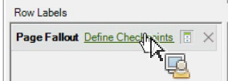

# Filtrare un rapporto di fallout mediante la Creazione guidata richieste

Descrive i passaggi necessari per applicare filtri a un rapporto di fallout.

Questo esempio mostra il rapporto Fallout pagina.

1. In Adobe Report Builder, fare clic su **[!UICONTROL Create]** per aprire la Creazione guidata richieste.
1. Seleziona la suite di rapporti corretta.
1. Nella visualizzazione struttura a sinistra, selezionare **[!UICONTROL Paths]** > **[!UICONTROL Page]** > **[!UICONTROL Page Fallout]**.

   

1. Configura gli [intervalli di date](/help/analyze/legacy-report-builder/data-requests/configuring-report-dates/custom-calendar.md) appropriati.
1. Fai clic su **[!UICONTROL Next]**.
1. Nel passaggio 2 della procedura guidata fare clic sul collegamento **[!UICONTROL Define Checkpoints]** in **[!UICONTROL Row Labels]**. In un rapporto di fallout, è sempre necessario definire gli elementi del percorso, a differenza di un rapporto di percorso, in cui un pattern è preapplicato.

   

1. Selezionare l&#39;opzione **[!UICONTROL Filter]**.

1. Nella finestra di dialogo **[!UICONTROL Define Site Section Fallout Checkpoints]**, definisci i punti di controllo da un intervallo di celle o da un elenco. Quindi fai clic su **[!UICONTROL OK]**.
1. Decidi se effettuare una selezione da un intervallo di celle o da un elenco.
1. Se si seleziona da un elenco, fare clic su **[!UICONTROL Add]** per selezionare i punti di controllo da aggiungere al percorso di abbandono. Puoi definire tra 3 e 8 punti di controllo. (Cercare gli elementi disponibili facendo clic su **[!UICONTROL More]**.)

   Per ulteriori informazioni sull&#39;ottimizzazione del filtro, vedere [Dimension di filtri](/help/analyze/legacy-report-builder/layout/c-filter-dimensions/filter-dimensions.md).

1. Spostare **[!UICONTROL Available Elements]** dalla colonna sinistra a destra selezionandoli e facendo clic sulla freccia arancione.
1. Fare clic su **[!UICONTROL OK]** tre volte, quindi fare clic su **[!UICONTROL Finish]**.

   Il rapporto dovrebbe essere aggiornato ora.
