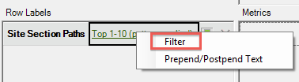
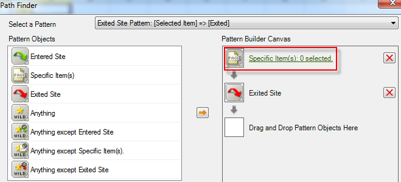

# Filtrare un rapporto di percorso mediante la Creazione guidata richieste

{{legacy-arb}}

Descrive i passaggi necessari per applicare filtri a un rapporto di percorsi.

In questo esempio vengono utilizzati i percorsi delle sezioni del sito.

1. In Adobe Report Builder, fare clic su **[!UICONTROL Create]** per aprire la Creazione guidata richieste.
1. Seleziona la suite di rapporti corretta.
1. Nella visualizzazione struttura a sinistra, selezionare **[!UICONTROL Paths]** > **[!UICONTROL Site Sections]** > **[!UICONTROL Site Section Paths]**.

   

1. Specifica le date appropriate.

1. Fai clic su **[!UICONTROL Next]**.

1. Nel passaggio 2 della procedura guidata fare clic sul collegamento **[!UICONTROL Top 1-10 (pattern applied)]** in **[!UICONTROL Row Labels]**. In un report di percorsi, viene applicato un pattern per impostazione predefinita.

   

1. Selezionare l&#39;opzione **[!UICONTROL Filter]**.

   

1. Nella finestra di dialogo **[!UICONTROL Define 'Site Section Paths' Path Pattern]**, puoi specificare
   * Grado iniziale del primo report.
   * Il numero di voci che si desidera visualizzare nel rapporto.
1. Fare clic su **[!UICONTROL Edit]** per definire un pattern di percorso.

1. Se desideri un pattern personalizzato, trascina un elemento **[!UICONTROL Pattern Objects]** dall&#39;elenco a sinistra a **[!UICONTROL Pattern Build Canvas]** a destra.

   

1. È inoltre possibile selezionare un pattern predefinito dall&#39;elenco a discesa **[!UICONTROL Select a Pattern]** e modificarlo. Di seguito sono riportati i pattern disponibili:

   

   Alcuni di questi modelli sono specifici di Report Builder: Pattern elemento successivo del percorso di ingresso, Pattern elemento precedente del percorso di uscita, Pattern elemento successivo.

## Per modificare un pattern predefinito

Dopo aver selezionato una serie, potete modificare una serie predefinita.

1. Continuando dalla procedura precedente, selezionate la serie. Ad esempio, selezionare **[!UICONTROL Exited Site Pattern]**:

   

1. Definisci il percorso della sezione del sito che l’utente segue prima di uscire. Fai clic su **[!UICONTROL Specific Item(s): 0 selected]**. Puoi definire questo percorso selezionandolo da un intervallo di celle se stai modificando una richiesta esistente o selezionandolo da un elenco di sezioni.

1. Per selezionare da un intervallo di celle di una richiesta precedente, selezionare **[!UICONTROL From range of cells]** e fare clic sull&#39;icona del selettore di celle. Selezionare quindi le celle dal report.

   

1. Per selezionare da un elenco di sezioni del sito, selezionare **[!UICONTROL From list]** e fare clic su **[!UICONTROL Add]**.

1. Spostare gli elementi dalla colonna **[!UICONTROL Available Elements]** alla colonna **[!UICONTROL Selected Elements]** selezionandoli e facendo clic sulla freccia arancione. Fare clic su **[!UICONTROL OK]**.

   

1. Per salvare il modello appena stabilito, fare clic su **[!UICONTROL Save]**.

1. Fare clic tre volte su **[!UICONTROL OK]**, quindi su **[!UICONTROL Finish]** per generare il percorso filtrato.
