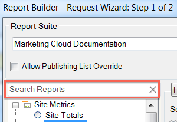

# Panoramica sui tipi di rapporto

{{legacy-arb}}

Puoi selezionare il tipo di rapporto di base per la richiesta di dati, ad esempio Metriche del sito, Contenuto del sito e Video.

È possibile scegliere un solo tipo di report di base per un intervallo di celle del foglio di calcolo. Se si modifica una richiesta creata in precedenza, è possibile modificare il tipo di report nella finestra [!UICONTROL Request Wizard: Step 1] senza riconfigurare altre impostazioni nella richiesta.

Puoi cercare i rapporti utilizzando la barra di ricerca di completamento automatico. Dopo aver selezionato un report da questo controllo, la visualizzazione struttura seleziona automaticamente il nodo corrispondente.

