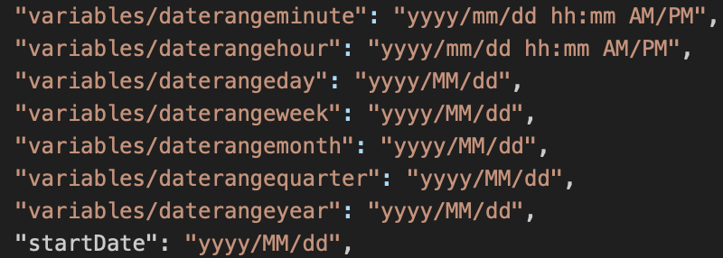

# Date da una cella

{{legacy-arb}}

È possibile specificare un intervallo di date selezionando le celle da un foglio di lavoro che contiene una richiesta. Report Builder utilizza le informazioni specifiche sull’intervallo di date in tali richieste. Se selezioni la data odierna, verranno visualizzati dati parziali in base all’ora del giorno in cui viene eseguita la richiesta.

**Per configurare le date da una cella**

1. In [!UICONTROL Request Wizard: Step 1], selezionare **[!UICONTROL Dates From Cell]**.
1. Immettere i riferimenti di cella nei campi **[!UICONTROL From]** e **[!UICONTROL To]** oppure fare clic sul selettore e selezionare le celle contenenti le richieste con le date di inizio e di fine.

   Ad esempio, crea una richiesta Report Builder con intervallo di date impostato su &quot;ieri&quot; e genera la data della richiesta nella stessa cella di &quot;oggi()-1&quot;.

Elenco dei formati di data supportati:

