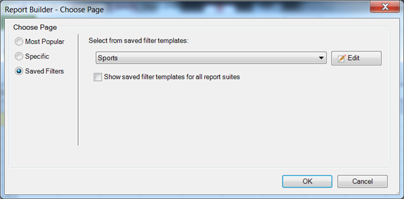

# Filtri salvati

{{legacy-arb}}

È possibile salvare filtri o altri parametri nel Report Builder e utilizzarli in altri fogli di lavoro o cartelle di lavoro. Questi parametri vengono salvati in Analytics per essere certi di essere disponibili per altri utenti del Report Builder su altri computer.

Salvare i filtri nel modulo [!UICONTROL Choose Page] durante la creazione di un filtro. Per un esempio di questa procedura, vedere [Filtri specifici](/help/analyze/legacy-report-builder/layout/c-filter-dimensions/t-specific-filters.md).

