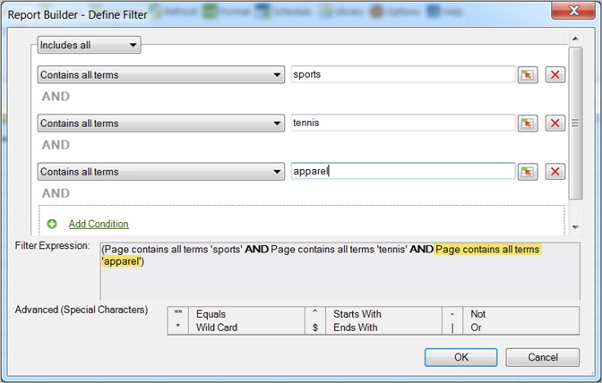

# Filtraggio più comune

Classificazione e filtri condizionali configurati utilizzando logica booleana con espressioni di ricerca AND/OR.

La maggior parte dei filtri popolari sono filtri di espressione configurati utilizzando logica booleana con condizioni AND/OR, ad esempio [!UICONTROL Page does not contain]*`<product name>`*con condizioni o gruppi di condizioni come [!UICONTROL Includes All], [!UICONTROL Includes Any] o [!UICONTROL Excludes All]. È possibile [salvare](/help/analyze/legacy-report-builder/layout/c-filter-dimensions/saved-filters.md) queste espressioni per altre richieste in questa cartella di lavoro o in altre cartelle di lavoro.

**Per creare un filtro più popolare**

1. Crea o modifica una richiesta e passa a [!UICONTROL Request Wizard: Step 2].

1. In [!UICONTROL Request Wizard: Step 2] fare clic sul collegamento accanto alla dimensione nella griglia, quindi scegliere **[!UICONTROL Filter]**.

   

1. Nel modulo [!UICONTROL Choose Page], abilita **[!UICONTROL Most Popular]**, quindi configura le seguenti opzioni:

   **Classificazione iniziale:** Classificazione iniziale di una dimensione. Una classificazione predefinita pari a 1 indica la voce principale nell’elenco dei dati segnalati. Ad esempio, per la dimensione [!UICONTROL Page], un segno di inizio pari a 1 indica la singola pagina più richiesta del sito. È possibile specificare 10 o un altro valore come cella di rango iniziale, che produce un rapporto che inizia con 10 come cella di rango superiore. Le metriche sono disposte in ordine decrescente, in modo che gli elementi di riga con l’attività più importante vengano segnalati per primi nell’elenco. Se una richiesta richiede più di 50.000 nomi di pagina, ma sono presenti migliaia di pagine sulle quali eseguire il rapporto, puoi copiare la richiesta e modificare la classificazione iniziale per recuperare i dati appropriati in blocchi di 50.000.

   **Numero di voci:** (solo [!UICONTROL Pivot Layout]) definisce quanti elementi vengono segnalati per una particolare metrica in un intervallo di date. Alcune metriche possono elencare centinaia di voci per una metrica, mentre altre possono mostrarne solo alcune. Ad esempio, per la dimensione [!UICONTROL Site Section], un numero di voci pari a 25 indica che il rapporto mostra le 25 pagine più visitate.

   Le frecce consentono di modificare [!UICONTROL Starting Rank] e [!UICONTROL Number of Entries] del primo punto dati nel foglio. Per impostazione predefinita, [!UICONTROL Starting Rank] è impostato su 1 e [!UICONTROL Number of Entries] su 10. Questi valori sono regolabili da un minimo di uno a un massimo di 50.000 per determinate metriche. Ogni metrica ha il proprio limite massimo su [!UICONTROL Number of Entries]. In questi campi non sono consentiti valori negativi o zero. Se scegli un [!UICONTROL Starting Rank] come 15 e [!UICONTROL Number of Entries] come 10, le richieste di dati per la metrica restituiscono le 10 pagine più visitate, dove la prima pagina più visitata è la numero 15 nell&#39;elenco per l&#39;intervallo di date specifico. Tutte le pagine più richieste classificate dalla quindicesima alla venticinquesima vengono elencate in ordine decrescente.

   >[!NOTE]
   >
   >L’applicazione dei filtri alle richieste esistenti causa modifiche nei dati presentati. Supponiamo di aver mappato i primi dieci [!UICONTROL Pages] alle celle da $A$1 a $A$10, con 1 per [!UICONTROL Starting Rank] e 10 per [!UICONTROL Number of Entries]. Se si modificano questi valori in modo da visualizzare 1 per [!UICONTROL Starting Rank] e solo 3 per [!UICONTROL Number of Entries], i dati che precedentemente riempivano le celle da $A$4 a $A$10 non verranno più visualizzati.

1. Per creare un&#39;espressione di ricerca, scegliere **[!UICONTROL Add]**.

1. Nel modulo [!UICONTROL Define Filter], configura le condizioni appropriate per le tue esigenze.

   

   L’icona di selezione della cella ti consente di individuare una condizione definita nel valore di una cella. 

   Il collegamento **Aggiungi condizione** consente di aggiungere una condizione all&#39;espressione. Non esiste alcun limite al numero di condizioni che è possibile aggiungere.

1. Fai clic su **[!UICONTROL OK]**.

   

1. Nel modulo [!UICONTROL Choose Page], fare clic su **[!UICONTROL Save]** per salvare l&#39;espressione.
1. Fai clic su **[!UICONTROL OK]**.
