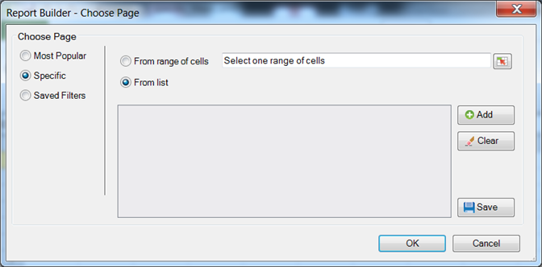

# Filtri specifici

Filtri che applicano termini di dimensione specifici.

Puoi eseguire ricerche su elementi dimensionali specifici creando un filtro che corrisponda a criteri esatti. Ad esempio, è possibile creare il seguente tipo di filtro: pagina in [!DNL homepage.htm], [!DNL contact_us.html], [!DNL corporate_info.html].

**Per creare un filtro specifico**

1. Crea o modifica una richiesta e passa a [!UICONTROL Request Wizard: Step 2].

   

1. In [!UICONTROL Request Wizard: Step 2] fare clic sul collegamento accanto alla dimensione nella griglia, quindi scegliere **[!UICONTROL Filter]**.

1. Abilita **[!UICONTROL Specific]**.

   

1. Abilita una delle seguenti opzioni specifiche:

   * **Da intervallo di celle:** consente di selezionare dati dalle celle. Puoi selezionare:
      * **Tutte le celle nell&#39;intervallo:** Consente di mappare ogni cella dell&#39;intervallo. Il testo descrittivo spiega il numero di gruppi di celle da selezionare. Per eseguire il mapping di più gruppi di celle, premere il tasto Ctrl mentre si effettuano selezioni successive. Se l’intervallo da mappare contiene una sola cella, questa è l’unica opzione disponibile
      * **Prima cella dell&#39;intervallo:** Selezionare solo la cella superiore sinistra dell&#39;intervallo, quindi scegliere una direzione per i dati. Inoltre, se la richiesta ha più periodi, è possibile scegliere la direzione dei periodi e scegliere se si desidera saltare un numero impostato di celle tra i periodi.
   * **Dall&#39;elenco:** consente di selezionare i dati da un elenco a cui è possibile aggiungere dati.
1. Se abiliti **[!UICONTROL From List]**, seleziona gli elementi elencati disponibili o fai clic su **[!UICONTROL Add]**.

   Quando fai clic su **[!UICONTROL Add]**, il modulo [!UICONTROL Select From List] visualizza un elenco di elementi dimensionali disponibili per l&#39;intervallo di date della richiesta corrente, limitato ai primi 10.000 elementi. È possibile eseguire ricerche in questi elementi oppure fare clic su **[!UICONTROL More ...]**, in cui viene visualizzato [!UICONTROL Search Form], per creare una ricerca più dettagliata delle dimensioni.
1. In [!UICONTROL Select From List], fare clic su **[!UICONTROL OK]**.
1. Nel modulo [!UICONTROL Choose Page], salva il filtro Specifico, se lo desideri, quindi fai clic su **[!UICONTROL OK]**.
