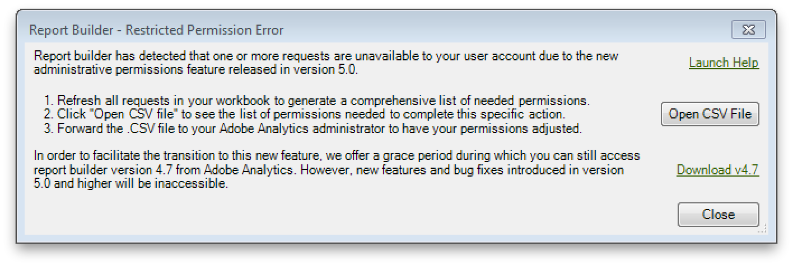

# Autorizzazioni di accesso utente per dimensioni e metriche

{{legacy-arb}}

Adobe Report Builder offre impostazioni di autorizzazione simili a quelle degli strumenti di amministrazione di Analytics.

In qualità di utente non amministratore, potresti aver creato in precedenza cartelle di lavoro con richieste che puntano a dimensioni e metriche a cui non hai accesso. Queste autorizzazioni vengono ora applicate.

Ad esempio, se aggiorni una richiesta che include dimensioni o metriche a cui non hai accesso, riceverai un Errore di autorizzazione limitata. Il messaggio di errore indica che una richiesta non è disponibile per l’account utente a causa di autorizzazioni amministrative.

Segui queste istruzioni per **ogni** cartella di lavoro di Report Builder gestita:

1. Aprire la cartella di lavoro.
1. Aggiorna tutte le richieste.
1. Se viene richiesto un errore di autorizzazione di accesso utente, fare clic su **[!UICONTROL Open CSV File]** per accedere all&#39;elenco degli errori relativi alle autorizzazioni limitate.
1. Crea un file &quot;AllRestrictedPermissionErrors.xlsx&quot; e copia/incolla l’elenco degli errori di autorizzazione con restrizioni dal file CSV in questo file.
1. Chiudere la cartella di lavoro di Report Builder.

Dopo aver elaborato tutte le cartelle di lavoro, è necessario disporre di un elenco completo degli errori di autorizzazione con restrizioni in &quot;AllRestrictedPermissionErrors.xlsx&quot;. Invia questo elenco all’amministratore degli accessi utente di Adobe Analytics, chiedendogli di concederti l’accesso alle metriche e alle dimensioni.
