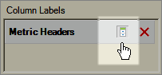

# Nascondere o mostrare le intestazioni

Questa procedura descrive come nascondere o visualizzare le intestazioni.

Fare clic su **[!UICONTROL Hide/Show]** nell&#39;output [!UICONTROL Pivot Layout] o [!UICONTROL Custom Layout] nel modulo [!UICONTROL Request Wizard: Step 2].

