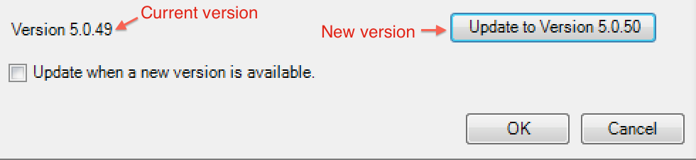

# Aggiornare Report Builder

{{legacy-arb}}

Quando aggiorni Report Builder, tieni presenti le seguenti linee guida:

* La vecchia versione verrà rimossa.

* Tutti i rapporti esistenti continueranno a funzionare.

* Tutte le impostazioni personali, comprese quelle di autenticazione, continueranno a funzionare.

Per aggiornare Report Builder

1. Accedi alla versione corrente di Report Builder.
1. Passa al menu **[!UICONTROL Options]** per eseguire l&#39;aggiornamento alla versione più recente. Il numero di versione corrente viene visualizzato nella parte inferiore della finestra di dialogo Opzioni.

   

1. Se è disponibile una nuova versione, fare clic su **[!UICONTROL Update...]**. Il pulsante mostra la versione in cui stai eseguendo l&#39;aggiornamento, ad esempio: *Aggiorna alla versione 5.0.50*

   >[!NOTE]
   >
   >Se questo pulsante è disattivato, non è disponibile alcuna nuova versione di Report Builder.

1. (Facoltativo) Selezionare la casella di controllo **[!UICONTROL Update when a new version is available]**. In futuro, il processo di aggiornamento verrà avviato automaticamente non appena sarà disponibile una nuova versione.
1. Quando viene visualizzata la schermata di installazione, fare clic su **[!UICONTROL Next >]**.

   

1. Al termine dell’aggiornamento, accedi di nuovo a Report Builder.

## Istruzioni per l’aggiornamento manuale {#section_27A0200010DC4747A718F1A65B180599}

Puoi sempre ottenere la versione più recente di Report Builder da Adobe Analytics.

1. Accedi ad Adobe Analytics e passa a **[!UICONTROL Tools]**.
1. Fai clic su **[!UICONTROL Report Builder]**.
1. Nella schermata **[!UICONTROL Overview]**, selezionare la versione a 32 bit o a 64 bit.
1. Fai clic su **[!UICONTROL Download Now!]**.
