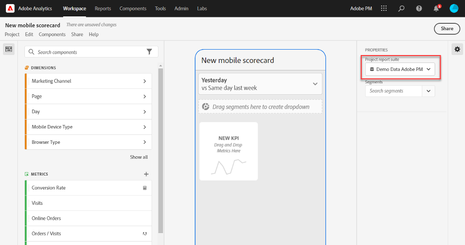
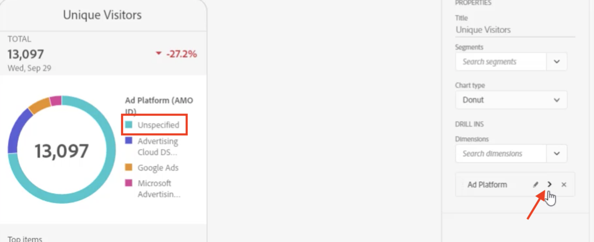

# Creare una scorecard

Le informazioni riportate di seguito spiegano ai curatori di dati di Adobe Analytics come configurare e presentare dashboard per gli utenti esecutivi. Per iniziare, puoi visualizzare il video Creatore di scorecard delle dashboard di Adobe Analytics:

>[!VIDEO](https://video.tv.adobe.com/v/34544)

Una scheda di valutazione di Adobe Analytics visualizza le visualizzazioni dei dati chiave per gli utenti esecutivi in un layout a tessere, come illustrato di seguito:

In qualità di curatore di questa scorecard, puoi utilizzare lo strumento di creazione delle scorecard per configurare quali tessere visualizzare sulla scorecard per il consumatore esecutivo. Puoi anche configurare in che modo le viste dettagliate, o le suddivisioni, possono essere regolate una volta che le tessere vengono toccate. L’interfaccia del Creatore di scorecard è mostrata di seguito:

Per creare la scorecard, devi effettuare le seguenti operazioni:

1. Accedi al modello [!UICONTROL Blank Mobile Scorecard].
2. Configura la scorecard con i dati e salvala.

## Accedi al modello [!UICONTROL Blank Mobile Scorecard]

Puoi accedere al modello [!UICONTROL Blank Mobile Scorecard] creando un nuovo progetto o dal menu Strumenti .

### Creare un nuovo progetto

1. Apri Adobe Analytics e fai clic sulla scheda **[!UICONTROL Workspace]**.
1. Fai clic su **[!UICONTROL Create project]** e seleziona il modello di progetto **[!UICONTROL Blank mobile scorecard]**.
1. Fai clic su **[!UICONTROL Create]**.

### Menu Strumenti

1. Dal menu **[!UICONTROL Tools]**, seleziona **[!UICONTROL Analytics dashboards (Mobile App)]**.
1. Nella schermata successiva, fai clic su **[!UICONTROL Create new scorecard]**.

## Configura la scorecard con i dati e salvala

Per implementare il template della scorecard:

1. Alla voce **[!UICONTROL Properties]** (nella barra a destra), specifica la **[!UICONTROL Project report suite]** della quale desideri utilizzare i dati.

   

1. Per aggiungere una nuova tessera alla scorecard, trascina una metrica dal pannello a sinistra e rilasciala nella zona **[!UICONTROL Drag and Drop Metrics Here]**. È anche possibile inserire una metrica tra due tessere utilizzando un flusso di lavoro simile.

   

1. Da ogni tessera, è possibile accedere a una vista dettagliata che visualizza informazioni aggiuntive sulla metrica, come gli elementi principali di un elenco di dimensioni correlate.

## Aggiungere dimensioni o metriche

Per aggiungere una dimensione correlata a una metrica, trascina una dimensione dal pannello di sinistra e rilasciala su una tessera.

Ad esempio, puoi aggiungere dimensioni appropriate (come **[!DNL Marketing Channel]**, in questo esempio) alla metrica **[!UICONTROL Unique Visitors]** trascinandola e rilasciandola sulla tessera. Le suddivisioni dei Dimension vengono visualizzate nella sezione [!UICONTROL Drill Ins] (suddivisione) del riquadro specifico **[!UICONTROL Properties]**. Puoi aggiungere più dimensioni a ogni tessera.

## Applicare i segmenti

Per applicare segmenti alle singole tessere, trascina un segmento dal pannello di sinistra e rilascialo direttamente sulla tessera.

Se vuoi applicare il segmento a tutte le tessere della scorecard, rilascia la tessera sopra la scorecard. Oppure, puoi anche applicare i segmenti selezionandoli nel menu del filtro sotto gli intervalli di date. Puoi [configurare e applicare filtri per le scorecard](https://experienceleague.adobe.com/docs/analytics-learn/tutorials/analysis-workspace/using-panels/using-drop-down-filters.html?lang=it) nello stesso modo che utilizzeresti in Adobe Analytics Workspace.

## Aggiungi intervalli di date

Aggiungi e rimuovi combinazioni di intervalli di date che possono essere selezionate nella scorecard mediante il menu a discesa dell’intervallo di date.

Ogni nuova scorecard inizia con 6 combinazioni di intervalli di date incentrate sui dati di oggi e ieri. Per rimuovere gli intervalli di date di cui non hai bisogno, fai clic sulla x. Per modificare una combinazione di intervalli di date, fai clic sull’icona della matita.

Per creare o modificare una data primaria, utilizza il menu a discesa per selezionare uno degli intervalli di date disponibili oppure trascina un componente data dalla barra a destra fino alla zona di rilascio.

Per creare una data di confronto, puoi scegliere tra i pratici predefiniti per i confronti temporali più comuni, disponibili nel menu a discesa. Puoi anche trascinare un componente data dalla barra a destra.

Se l’intervallo di date desiderato non è ancora stato creato, puoi crearne uno nuovo facendo clic sull’icona Calendario.

Viene visualizzato il generatore di intervalli di date, in cui è possibile creare e salvare un nuovo componente Intervallo di date.

## Applicare visualizzazioni

Le dashboard di Analytics offrono quattro visualizzazioni che consentono di ottenere informazioni approfondite su elementi e metriche delle dimensioni. Passa a una visualizzazione diversa modificando il valore [!UICONTROL chart type] di un riquadro [!UICONTROL Properties]. Seleziona la porzione destra e modifica il tipo di grafico.

Oppure fai clic sull’icona [!UICONTROL Visualizations] nella barra a sinistra e trascina la visualizzazione a destra nella tessera:

**[!UICONTROL Summary Number]**

Utilizza la visualizzazione Numero di riepilogo per evidenziare un numero elevato importante in un progetto.

**[!UICONTROL Donut]visualizzazione**

Questa visualizzazione è simile al grafico a torta e presenta i dati come parti o segmenti di un intero. Utilizzare un grafico ad anello per confrontare percentuali di un totale. Ad esempio, supponiamo che desideri vedere quale piattaforma di annunci ha contribuito al numero totale di visitatori unici:

**[!UICONTROL Line]visualizzazione**

La visualizzazione delle linee rappresenta le metriche con linee che mostrano come cambiano i valori nel tempo. Un grafico a linee mostra le dimensioni nel tempo, ma funziona con qualsiasi visualizzazione. In questo esempio stai visualizzando la dimensione della categoria di prodotto.

**[!UICONTROL Horizontal Bar]visualizzazione**

Questa visualizzazione mostra barre orizzontali che rappresentano diversi valori per una o più metriche. Ad esempio, per vedere facilmente quali sono i tuoi prodotti principali, utilizza [!UICONTROL Horizontal Bar] per la visualizzazione preferita.

**Rimuovi elementi  [!UICONTROL Unspecified] dimensionali**

Per rimuovere elementi dimensionali [!UICONTROL Unspecified] dai dati, procedi come segue:

1. Seleziona la porzione corretta.
1. Nella barra a destra, sotto **[!UICONTROL Drill ins]**, seleziona la freccia destra accanto all’elemento dimensione di cui desideri rimuovere gli elementi **[!UICONTROL Unspecified]**.

   

1. Fai clic sull’icona accanto a **[!UICONTROL Unspecified]** per rimuovere i dati non specificati dal rapporto. È inoltre possibile rimuovere qualsiasi altro elemento di dimensione.

## Visualizzare e configurare le proprietà dei riquadri

Quando fai clic su una tessera nel Creatore di scorecard, la barra a destra mostra le proprietà e le caratteristiche associate a tale tessera. In questa barra puoi assegnare un nuovo **[!UICONTROL Title]** alla tessera e, in alternativa, configurarla specificando i componenti invece di trascinarli dalla barra di sinistra.

Quando fai clic sulle tessere, un pop-up dinamico mostra come la visualizzazione Drill ins (Breakdown) viene visualizzata dall’utente esecutivo nell’app. Se non è stata applicata alcuna dimensione alla tessera, la dimensione di raggruppamento sarà **ore** o **giorni**, a seconda dell’intervallo date predefinito.

Le suddivisioni consentono di perfezionare l’analisi suddividendo letteralmente metriche e dimensioni per altre metriche e dimensioni, come in questo esempio di vendita al dettaglio:

* Metrica Visitatori univoci suddivisa per piattaforma di annunci (AMO ID)
* Visite suddivise per categoria di prodotto (al dettaglio)
* Entrate totali suddivise per nome prodotto

Ogni dimensione aggiunta alla tessera viene visualizzata in un elenco a discesa nella vista dettagliata dell’app. L’utente esecutivo può quindi scegliere tra le opzioni elencate nell’elenco a discesa.

## Rimuovere i componenti

Allo stesso modo, per rimuovere un componente applicato all’intera scorecard, fai clic sulla scorecard al di fuori delle tessere, quindi fai clic sulla **x** che compare quando passi il mouse sul componente, come mostrato di seguito per il segmento **Nuovo visitatore**:

## Assegnare un nome a una scorecard

Per dare un nome alla scorecard, fai clic sullo spazio del nome in alto a sinistra dello schermo e digita il nuovo nome.

## Condividere una scorecard

Per condividere la scorecard con un utente esecutivo:

1. Fai clic sul menu **[!UICONTROL Share]** e seleziona **[!UICONTROL Share scorecard]**.

1. Nel modulo **[!UICONTROL Share mobile scorecard]**, compila i campi:

   * Immetti il nome della scorecard
   * Descrizione della scorecard
   * Aggiungendo tag rilevanti
   * Specifica dei destinatari della scorecard

1. Fai clic su **[!UICONTROL Share]**.

Dopo aver condiviso una scorecard, i destinatari possono accedervi sulle proprie dashboard di Analytics. Se apporti modifiche successive alla scorecard nel Creatore di scorecard, queste verranno aggiornate automaticamente nella scorecard condivisa. Gli utenti esecutivi vedranno poi i cambiamenti dopo aver aggiornato la scorecard nella loro app.

Se aggiorni la scorecard aggiungendo nuovi componenti, ti consigliamo di condividerla nuovamente (e di selezionare l’opzione **[!UICONTROL Share embedded components]**) per assicurarti che gli utenti esecutivi abbiano accesso a queste modifiche.