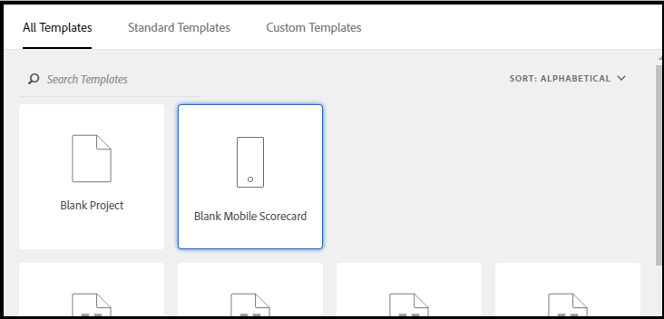

# Guida del curatore per le dashboard di Adobe Analytics

>[!IMPORTANT]
>
>I dashboard di Adobe Analytics non vengono rilasciati ed è disponibile solo per il test beta tra i clienti invitati. Questa documentazione è destinata solo agli utenti della versione beta e non rappresenta la funzionalità completa della funzione. Se siete interessati a diventare un utente beta per questa caratteristica, si prega di contattare Ashok Gorrepati (gorrepati@adobe.com).

## Introduzione

Le dashboard di Adobe Analytics forniscono informazioni ovunque e in qualsiasi momento da Adobe Analytics. L’app ti consente di accedere da dispositivi mobili a scorecard intuitive che crei e condividi dall’interfaccia utente desktop di Adobe Analytics. Le scorecard sono una raccolta di metriche chiave e di altri componenti presentati in un layout a tessere che puoi toccare per visualizzare raggruppamenti più dettagliati e rapporti sulle tendenze. Puoi personalizzare le scorecard in base ai dati che ritieni più importanti. Le dashboard di Analytics sono supportate sia sui sistemi operativi iOS che su quelli Android.

## Informazioni su questa guida

Questa guida è stata creata per aiutare i curatori dei dati di Adobe Analytics a configurare le scorecard per i propri utenti esecutivi sulle dashboard di Analytics. I curatori possono essere amministratori organizzativi o persone con altri ruoli responsabili della configurazione delle scorecard dell’app, il che consente agli utenti esecutivi di visualizzare una rappresentazione generale di importanti dati riassuntivi in modo semplice e veloce sui propri dispositivi mobili. Sebbene gli utenti esecutivi siano gli utenti finali delle dashboard di Analytics, questa guida aiuterà i curatori di dati a configurare l&#39;app in modo efficace per tali utenti.

## Glossario dei termini

Nella tabella seguente sono descritti i termini per comprendere l&#39;audience, le funzioni e il funzionamento delle dashboard di Analytics.

| Termine | Definizione |
|--- |--- |
| Consumatore | Utente esecutivo che visualizza metriche e conoscenze chiave provenienti da Analytics su un dispositivo mobile |
| Curatore | Persona esperta in materia di dati che trova e distribuisce le conoscenze provenienti da Analytics e configura le scorecard da mostrare al consumatore |
| Cura | Creazione o modifica di una scorecard mobile contenente metriche, dimensioni e altri componenti rilevanti per il consumatore |
| Scorecard | Una vista per dashboard contenente una o più sezioni |
| Tessera | Una rappresentazione di una metrica all’interno di una vista Scorecard |
| Raggruppamento | Una vista secondaria accessibile toccando una tessera nella scorecard. Questa vista mostra maggiori informazioni sulla metrica visualizzata sulla tessera e, opzionalmente, riporta informazioni su dimensioni di raggruppamento aggiuntive. |
| Intervallo date | Intervallo di date principale per il reporting dei dashboard |
| Intervallo date di confronto | L’intervallo date che viene confrontato con l’intervallo date primario |

 
## Creare una scorecard per utenti esecutivi

Una scorecard visualizza le visualizzazioni dei dati chiave per gli utenti esecutivi in un layout a sezioni, come illustrato di seguito:

In qualità di curatore di questa scorecard, puoi usare lo strumento di creazione delle scorecard per configurare quali tessere visualizzerà il consumatore sulla scorecard. Puoi anche configurare in che modo le viste dettagliate, o Raggruppamenti, possono essere regolati una volta che le tessere vengono toccate. L’interfaccia del Creatore di scorecard è mostrata di seguito:

Per creare la scorecard, dovrai fare quanto segue:

1. Accedi al template Scorecard per dispositivi mobili vuota.
2. Configura la scorecard con i dati e salvala.

### Accedi al template Scorecard per dispositivi mobili vuota

Puoi accedere al template Scorecard per dispositivi mobili vuota in uno dei seguenti modi:

**Creare un nuovo progetto**

1. Apri Adobe Analytics e fai clic sulla scheda **Area di lavoro**.
2. Fai clic sul pulsante **Crea nuovo progetto** e seleziona il template di progetto **Scorecard per dispositivi mobili vuota**.
3. Fai clic sul pulsante **Crea**.

*Nota: se non vedi il template Scorecard per dispositivi mobili vuota, come mostrato di seguito, significa che la tua azienda non ha ancora ricevuto l’attivazione per la Beta. Contatta il tuo responsabile del Servizio Clienti.*

**Aggiungere un progetto**

Dalla schermata **Progetti**, sotto la scheda **Componenti**, fai clic sul pulsante **Aggiungi** e seleziona **Scorecard per dispositivi mobili**.

**Usare gli strumenti di Analytics**

In Analytics, click the **Tools** menu and select **dashboards**. Nella schermata successiva, fai clic sul pulsante **Crea scorecard**.

### Configura la scorecard con i dati e salvala

Per implementare il template della scorecard:

1. Alla voce **Proprietà** (nella barra a destra), specifica una **Suite di rapporti di progetto** della quale desideri utilizzare i dati.

   

2. Per aggiungere una nuova tessera alla scorecard, trascina una metrica dal pannello di sinistra e rilasciala nella zona **Trascina e rilascia metriche qui**. È anche possibile inserire una metrica tra due tessere utilizzando un flusso di lavoro simile.

   

   *Da ogni tessera, è possibile accedere a una vista dettagliata che visualizza informazioni aggiuntive sulla metrica, come gli elementi principali di un elenco di dimensioni correlate.*

3. Per aggiungere una dimensione correlata a una metrica, trascina una dimensione dal pannello di sinistra e rilasciala su una tessera. Per esempio, è possibile aggiungere le dimensioni appropriate (come **Area geografica DMA**, in questo esempio) alla metrica **Visitatori unici** trascinandole e rilasciandole sulla tessera; le dimensioni che aggiungi verranno visualizzate nella sezione raggruppamento delle **Proprietà** specifiche della tessera. Puoi aggiungere più dimensioni a ogni tessera.

   

   *Nota: puoi anche aggiungere una dimensione a tutte le tessere rilasciandola sull’area di lavoro della scorecard.*

   Quando fai clic su una tessera nel Creatore di scorecard, la barra di destra mostra le proprietà e le caratteristiche associate a quella tessera. In questa barra puoi assegnare un nuovo **Titolo** alla tessera e, in alternativa, configurare la tessera specificando i componenti invece di trascinarli e rilasciarli dalla barra di sinistra.

   Inoltre, se fai clic sulle tessere, un pop-up dinamico mostrerà come la vista Raggruppamento viene visualizzata dall’utente esecutivo nell’app. Se non è stata applicata alcuna dimensione alla tessera, la dimensione di raggruppamento sarà **ore** o **giorni**, a seconda dell’intervallo date predefinito.

   

   *Nota come ogni dimensione aggiunta alla tessera verrà visualizzata in un elenco a discesa nella vista dettagliata dell’app. L’utente esecutivo può quindi scegliere tra le opzioni elencate nell’elenco a discesa.*

4. Per applicare segmenti alle singole tessere, trascina un segmento dal pannello di sinistra e rilascialo direttamente sulla tessera. Se vuoi applicare il segmento a tutte le tessere della scorecard, rilascia la tessera sopra la scorecard.

5. Allo stesso modo, per rimuovere un componente applicato all’intera scorecard, fai clic in qualsiasi punto della scorecard al di fuori delle tessere e poi rimuovilo facendo clic sulla **x** che appare quando passi il mouse sul componente, come mostrato di seguito per il segmento **Clienti di dispositivi mobili**:

   

6. Nelle **Proprietà** della scorecard puoi inoltre specificare opzionalmente quanto segue:

   * Un **Intervallo date predefinito**. Gli intervalli che specifichi qui saranno gli stessi applicati al primo accesso dell’utente esecutivo alla scorecard nell’app.

   * Un **Intervallo date di confronto**

   * Eventuali **Segmenti** da applicare a tutta la scorecard

7. Per dare un nome alla scorecard, fai clic sullo spazio del nome in alto a sinistra dello schermo e digita il nuovo nome.

   

## Condividere la scorecard

Per condividere la scorecard con un utente esecutivo:

1. Fai clic sul menu **Condividi** e seleziona **Condividi scorecard**.

2. Nel modulo **Condividi**, compila i campi:

   * Inserendo il nome della scorecard
   * Inserendo una descrizione della scorecard
   * Aggiungendo tag rilevanti
   * Specificando i destinatari della scorecard
   * Seleziona l’opzione **Condividi i componenti incorporati con i destinatari** per assicurarti che l’utente esecutivo abbia accesso a tutti i componenti della scorecard.

3. Fai clic su **Condividi**.

Dopo aver condiviso una scorecard, i destinatari possono accedervi mediante le dashboard di Analytics. Se apporti successive modifiche alla scorecard nel Creatore di scorecard, queste verranno automaticamente aggiornate nella scorecard condivisa. Gli utenti esecutivi vedranno poi i cambiamenti dopo aver aggiornato la scorecard nella loro app.

*Nota: se aggiorni la scorecard aggiungendo nuovi componenti, ti consigliamo di condividere nuovamente la scorecard (e di selezionare l’opzione **Condividi automaticamente i componenti incorporati con i destinatari**) per assicurarti che gli utenti esecutivi abbiano accesso a queste modifiche.*

## Aiutare gli utenti esecutivi a configurare l’app

In alcuni casi, gli utenti esecutivi potrebbero aver bisogno di ulteriore assistenza per accedere all’app e utilizzarla. Questa sezione offre informazioni per aiutarti a fornire tale assistenza.

### Aiutare gli utenti esecutivi ad accedere

Per aiutare gli utenti esecutivi ad accedere alle tue scorecard nell’app, assicurati che:

* Il sistema operativo per dispositivi mobili sui loro dispositivi sia iOS versione 10 o superiore o Android versione 4.4 (KitKat) o superiore
* Abbiano un accesso valido ad Adobe Analytics
* Tu abbia creato correttamente le scorecard per dispositivi mobili a essi destinate e condividi con essi tali scorecard.
* Abbiano accesso all’Analysis Workspace e alla suite di rapporti su cui si basa la scorecard
* Abbiano accesso ai Componenti che la scorecard include. Nota: puoi selezionare un’opzione quando condividi le scorecard per **Condividere automaticamente i componenti incorporati con i destinatari**.

### Aiutare gli utenti esecutivi a utilizzare l’app

Durante la fase beta, e prima che l’app venga svelata al pubblico, puoi controllare chi ha accesso all’app.

1. Aiuta gli utenti esecutivi a scaricare e installare l’app. Per farlo, indica ai tuoi utenti esecutivi i seguenti passaggi per estendere l’accesso, a seconda che utilizzino un dispositivo iOS o Android.

   **Per gli utenti esecutivi su iOS:**

   1. Click the following public link (it is also available in Analytics under **Tools** > **dashboards**):

      [Link iOS](https://testflight.apple.com/join/WtXMQxlI): `https://testflight.apple.com/join/WtXMQxlI`

      Dopo aver fatto clic sul link, viene visualizzata la seguente schermata di Testflight:

      

   2. Toccare il link **Visualizza nell’App Store** sullo schermo per scaricare l’app Testflight.

   3. Dopo aver installato l’app Testflight, trova e installa le dashboard di Adobe Analytics dall’interno di Testflight come mostrato di seguito:

      
   **Per gli utenti esecutivi su Android:**

   1. Tap the following Play Store link on the user&#39;s device (It is also available in Analytics under **Tools** > **dashboards**):
      [Android](https://play.google.com/apps/testing/com.adobe.analyticsmobileapp): `https://play.google.com/apps/testing/com.adobe.analyticsmobileapp`

      Dopo aver toccato il link, toccare il link Diventa un tester nella seguente schermata:

      

   2. Toccare il link **scarica su Google Play** nella seguente schermata:

      

   3. Scaricare e installare l’app.
Una volta scaricata e installata, gli utenti esecutivi possono accedere all’app utilizzando le loro credenziali esistenti di Adobe Analytics; supportiamo sia gli ID Adobe che quelli Enterprise/Federated.
   

2. Aiutali ad accedere alla tua scorecard. Dopo che gli utenti esecutivi effettuano l’accesso all’app, viene visualizzata la schermata **Scegli un’azienda**. Questa schermata elenca le aziende di accesso a cui appartiene l’utente esecutivo. Per aiutarli a trovare la scorecard:

   * Toccare il nome dell’azienda di accesso o dell’organizzazione Experience Cloud che si applica alla scorecard che hai condiviso. L’elenco delle scorecard mostra quindi tutte le scorecard che sono state condivise con l’utente esecutivo da quell’azienda di accesso.
   * Aiutali a ordinare questo elenco secondo il parametro **Modificata più di recente**, se applicabile.
   * Toccare il nome della scorecard per visualizzarla.
   

   Nota: se l’utente esecutivo effettua l’accesso e vede un messaggio che dice che non è stato condiviso nulla:

   * L’utente esecutivo può aver selezionato l’istanza di Analytics sbagliata
   * La scorecard potrebbe non essere stata condivisa con l’utente esecutivo

      
   Verifica che l’utente esecutivo possa accedere alla giusta istanza di Analytics e che la scorecard sia stata condivisa.

3. Spiega all’utente esecutivo come appaiono le tessere nelle scorecard che condividi.

   

   Ulteriori informazioni sulle tessere:

   * La granularità dei grafici sparkline dipende dalla lunghezza dell’intervallo date:
      * Un giorno mostra una tendenza oraria
      * Più di un giorno e meno di un anno mostra una tendenza giornaliera
      * Un anno o più mostra una tendenza settimanale
   * La formula della variazione percentuale del valore è metrica totale (intervallo date attuale) – metrica totale (intervallo date di confronto)/metrica totale (intervallo date di confronto).
   * È possibile trascinare lo schermo verso il basso per aggiornare la scorecard.

4. Toccare una tessera per mostrare come funziona un raggruppamento dettagliato della tessera.

   

5. Per modificare gli intervalli date per la tua scorecard:

   

   *Nota: è possibile modificare allo stesso modo anche gli intervalli date all’interno della vista Raggruppamento mostrata sopra.*

   A seconda dell’intervallo che si tocca (**Giorno**, **Settimana**, **Mese** o **Anno**), si vedranno due opzioni per gli intervalli date: l’intervallo di tempo attuale o quello immediatamente prima. Toccare una di queste due opzioni per selezionare il primo intervallo. Nell’elenco **CONFRONTA CON**, toccare una delle opzioni che vengono mostrate per confrontare i dati di questo periodo di tempo con il primo intervallo date selezionato. Toccare **Fine** in alto a destra dello schermo. Il campo **Intervalli date** e le tessere della scorecard vengono aggiornati con i nuovi dati di confronto dei nuovi intervalli selezionati.

6. Per lasciare un feedback su questa app:

   1. Toccare l’icona dell’utente in alto a destra della schermata dell’app.
   2. Nella schermata **Il mio account**, toccare l’opzione **Feedback**.
   3. Toccare per visualizzare le opzioni per lasciare un feedback.
   
   

**Per segnalare un bug**:

Toccare l’opzione e scegliere una sottocategoria del bug. Nel modulo per la segnalazione di un bug, fornisci il tuo indirizzo e-mail nel campo superiore e la tua descrizione del bug nel campo sotto di esso. Al messaggio viene automaticamente allegata una schermata con le informazioni del tuo account, ma puoi cancellarla, se lo desideri, toccando la **X** nell’immagine allegata. Ci sono anche delle opzioni per effettuare una registrazione dello schermo, aggiungere altre schermate o allegare file. Per inviare la segnalazione, toccare l’icona dell’aeroplano di carta in alto a destra del modulo.

**Per suggerire un miglioramento**:

Toccare l’opzione e scegliere una sottocategoria del suggerimento. Nel modulo di suggerimento, fornisci il tuo indirizzo e-mail nel campo superiore e la tua descrizione del bug nel campo sotto di esso. Al messaggio viene automaticamente allegata una schermata con le informazioni del tuo account, ma puoi cancellarla, se lo desideri, toccando la **X** nell’immagine allegata. Ci sono anche delle opzioni per effettuare una registrazione dello schermo, aggiungere altre schermate o allegare file. Per inviare il suggerimento, toccare l’icona dell’aeroplano di carta in alto a destra del modulo.

**Per fare una domanda**:

Tocca l’opzione e fornisci il tuo indirizzo e-mail nel campo superiore e la tua domanda nel campo sotto di esso. Al messaggio viene automaticamente allegata una schermata, ma puoi cancellarla, se lo desideri, toccando la **X** nell’immagine allegata. Ci sono anche delle opzioni per effettuare una registrazione dello schermo, aggiungere altre schermate o allegare file. Per inviare la domanda, toccare l’icona dell’aeroplano di carta in alto a destra del modulo.
