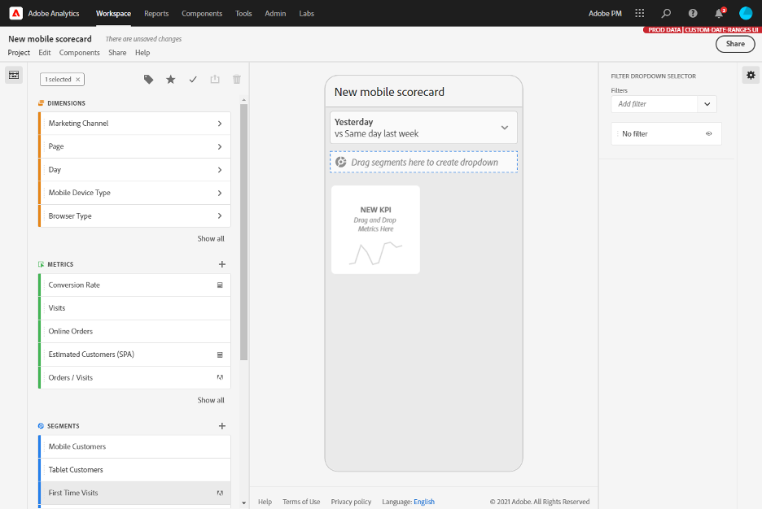

# Guida del curatore per le dashboard di Adobe Analytics

Le informazioni riportate di seguito illustrano ai curatori di dati di Adobe  Analytics come configurare e presentare dashboard per gli utenti esecutivi. Per un video che illustra queste informazioni, consultate [Adobe  Analytics dashboards Scorecard Builder](https://youtu.be/tnnl6hrcP94).

## Introduzione

Le dashboard di Adobe Analytics forniscono informazioni provenienti da Adobe Analytics ovunque e in qualsiasi momento. L’app consente agli utenti di accedere da dispositivi mobili alle scorecard intuitive create e condivise dall’interfaccia utente desktop di Adobe  Analytics. Le scorecard sono una raccolta di metriche chiave e di altri componenti presentati in un layout a tessere che puoi toccare per visualizzare raggruppamenti più dettagliati e rapporti sulle tendenze. Puoi personalizzare le scorecard in base ai dati che ritieni più importanti. Le dashboard di Analytics sono supportate sia sui sistemi operativi iOS che su quelli Android.

## Ulteriori informazioni su questa guida

Questa guida è destinata a aiutare i curatori di dati di Adobe  Analytics a configurare le scorecard per i loro utenti esecutivi sulle dashboard. I curatori possono essere amministratori organizzativi o persone con altri ruoli responsabili della configurazione delle scorecard dell’app, il che consente agli utenti esecutivi di visualizzare una rappresentazione generale di importanti dati riassuntivi in modo semplice e veloce sui propri dispositivi mobili. Sebbene gli utenti esecutivi siano gli utenti finali delle dashboard di Analytics, questa guida aiuterà i curatori dei dati a configurare l’app in modo efficace per questi utenti.

## Glossario dei termini

La tabella seguente descrive i termini per comprendere il pubblico, le funzioni e il funzionamento delle dashboard di Analytics.

| Termine | Definizione |
|--- |--- |
| Consumatore | Utente esecutivo che visualizza metriche e conoscenze chiave provenienti da Analytics su un dispositivo mobile |
| Curatore | Persona esperta in materia di dati che trova e distribuisce le conoscenze provenienti da Analytics e configura le scorecard da mostrare al consumatore |
| Cura | L’atto di creare o modificare una scorecard mobile contenente metriche, dimensioni e altri componenti pertinenti per il consumatore |
| Scorecard | Una vista delle dashboard contenente una o più tessere |
| Tessera | Una rappresentazione di una metrica all’interno di una vista Scorecard |
| Raggruppamento | Una vista secondaria accessibile toccando una tessera nella scorecard. Questa vista mostra maggiori informazioni sulla metrica visualizzata sulla tessera e, opzionalmente, riporta informazioni su dimensioni di raggruppamento aggiuntive |
| Intervallo date | L’intervallo date primario per la generazione di rapporti delle dashboard |
| Intervallo date di confronto | L’intervallo date che viene confrontato con l’intervallo date primario |

 
## Creare una scorecard per utenti esecutivi

Una scorecard mostra le visualizzazioni dei dati chiave per gli utenti esecutivi in un layout a tessere, come mostrato di seguito:

In qualità di curatore di questa scorecard, puoi usare lo strumento di creazione delle scorecard per configurare quali tessere visualizzerà il consumatore sulla scorecard. Puoi anche configurare in che modo le viste dettagliate, o Raggruppamenti, possono essere regolati una volta che le tessere vengono toccate. L’interfaccia del Creatore di scorecard è mostrata di seguito:

Per creare la scorecard, dovrai fare quanto segue:

1. Accedi al template Scorecard per dispositivi mobili vuota.
2. Configura la scorecard con i dati e salvala.

### Accedi al template Scorecard per dispositivi mobili vuota

Puoi accedere al template Scorecard per dispositivi mobili vuota in uno dei seguenti modi:

**Creare un nuovo progetto**

1. Apri Adobe Analytics e fai clic sulla scheda **Area di lavoro**.
2. Fai clic sul pulsante **Crea nuovo progetto** e seleziona il template di progetto **Scorecard per dispositivi mobili vuota**.
3. Fai clic sul pulsante **Crea**.

**Aggiungere un progetto**

Dalla schermata **Progetti**, sotto la scheda **Componenti**, fai clic sul pulsante **Aggiungi** e seleziona **Scorecard per dispositivi mobili**.

**Usare gli strumenti di Analytics**

In Analytics, fai clic sul menu **Strumenti** e seleziona **dashboard**. Nella schermata successiva, fai clic sul pulsante **Crea scorecard**.

### Configura la scorecard con i dati e salvala

Per implementare il template della scorecard:

1. Alla voce **Proprietà** (nella barra a destra), specifica una **Suite di rapporti di progetto** della quale desideri utilizzare i dati.

   

2. Per aggiungere una nuova tessera alla scorecard, trascina una metrica dal pannello di sinistra e rilasciala nella zona **Trascina e rilascia metriche qui**. È anche possibile inserire una metrica tra due tessere utilizzando un flusso di lavoro simile.

   

   *Da ogni tessera, è possibile accedere a una vista dettagliata che visualizza informazioni aggiuntive sulla metrica, come gli elementi principali di un elenco di dimensioni correlate.*

3. Per aggiungere una dimensione correlata a una metrica, trascina una dimensione dal pannello di sinistra e rilasciala su una tessera. Per esempio, è possibile aggiungere le dimensioni appropriate (come **Area geografica DMA**, in questo esempio) alla metrica **Visitatori unici** trascinandole e rilasciandole sulla tessera; le dimensioni che aggiungi verranno visualizzate nella sezione raggruppamento delle **Proprietà** specifiche della tessera. Puoi aggiungere più dimensioni a ogni tessera.

   

   È inoltre possibile aggiungere una dimensione a tutte le sezioni rilasciandola nell&#39;area di lavoro Scorecard.

   Quando fai clic su una tessera nel Creatore di scorecard, la barra di destra mostra le proprietà e le caratteristiche associate a quella tessera. In questa barra puoi assegnare un nuovo **Titolo** alla tessera e, in alternativa, configurare la tessera specificando i componenti invece di trascinarli e rilasciarli dalla barra di sinistra.

   Inoltre, se fai clic sulle tessere, un pop-up dinamico mostrerà come la vista Raggruppamento viene visualizzata dall’utente esecutivo nell’app. Se non è stata applicata alcuna dimensione alla tessera, la dimensione di raggruppamento sarà **ore** o **giorni**, a seconda dell’intervallo date predefinito.

   

   Ogni dimensione aggiunta alla sezione verrà visualizzata in un elenco a discesa nella visualizzazione dettagliata dell&#39;app. L’utente esecutivo può quindi scegliere tra le opzioni elencate nell’elenco a discesa.

4. Per applicare segmenti alle singole tessere, trascina un segmento dal pannello di sinistra e rilascialo direttamente sulla tessera. Se vuoi applicare il segmento a tutte le tessere della scorecard, rilascia la tessera sopra la scorecard. Oppure, puoi anche applicare i segmenti selezionando i segmenti nel menu del filtro sotto gli intervalli di date. Puoi [configurare e applicare i filtri per le schede](https://docs.adobe.com/content/help/en/analytics-learn/tutorials/analysis-workspace/using-panels/using-drop-down-filters.html) allo stesso modo in Adobe  Analytics Workspace.

   

5. Allo stesso modo, per rimuovere un componente applicato all’intera scorecard, fai clic in qualsiasi punto della scorecard al di fuori delle tessere e poi rimuovilo facendo clic sulla **x** che appare quando passi il mouse sul componente, come mostrato di seguito per il segmento **Clienti di dispositivi mobili**:

   

6. Nelle **Proprietà** della scorecard puoi inoltre specificare opzionalmente quanto segue:

   * Un **Intervallo date predefinito**. Gli intervalli che specifichi qui saranno gli stessi applicati al primo accesso dell’utente esecutivo alla scorecard nell’app.

   * Un **Intervallo date di confronto**

   * Eventuali **Segmenti** da applicare a tutta la scorecard

7. Per dare un nome alla scorecard, fai clic sullo spazio del nome in alto a sinistra dello schermo e digita il nuovo nome.

   

## Condividere la scorecard

Per condividere la scorecard con un utente esecutivo:

1. Fai clic sul menu **Condividi** e seleziona **Condividi scorecard**.

2. Nel modulo **Condividi**, compila i campi:

   * Inserendo il nome della scorecard
   * Inserendo una descrizione della scorecard
   * Aggiungendo tag rilevanti
   * Specificando i destinatari della scorecard

3. Fai clic su **Condividi**.

Dopo che hai condiviso una scorecard, i destinatari possono accedervi sulle loro dashboard di Analytics. Se apporti successive modifiche alla scorecard nel Creatore di scorecard, queste verranno automaticamente aggiornate nella scorecard condivisa. Gli utenti esecutivi vedranno poi i cambiamenti dopo aver aggiornato la scorecard nella loro app.

If you update the Scorecard by adding new components, you may want to share the scorecard again (and check the **Share embedded components** option) in order to make sure that your executive users have access to these changes.

## Aiutare gli utenti esecutivi a configurare l’app

In alcuni casi, gli utenti esecutivi potrebbero aver bisogno di ulteriore assistenza per accedere all’app e utilizzarla. Questa sezione offre informazioni per aiutarti a fornire tale assistenza.

### Aiutare gli utenti esecutivi ad accedere

Per aiutare gli utenti esecutivi ad accedere alle tue scorecard nell’app, assicurati che:

* Il sistema operativo per dispositivi mobili sui loro dispositivi sia iOS versione 10 o superiore o Android versione 4.4 (KitKat) o superiore
* Abbiano un accesso valido ad Adobe Analytics
* Sono state create correttamente delle scorecard mobili per loro e sono state condivise queste scorecard con loro
* Abbiano accesso all’Analysis Workspace e alla suite di rapporti su cui si basa la scorecard
* Abbiano accesso ai Componenti che la scorecard include. Note that you can select an option when sharing your Scorecards to **Share embedded components**.

### Assistenza agli utenti con l&#39;app

Per aiutare gli utenti esecutivi:

1. Aiutateli a scaricare e installare l&#39;app. Per farlo, indica ai tuoi utenti esecutivi i seguenti passaggi per estendere l’accesso, a seconda che utilizzino un dispositivo iOS o Android.

   **Per gli utenti esecutivi su iOS:**

   * Fai clic sul seguente collegamento (disponibile anche in  Analytics in **Strumenti** > **Dashboard**) e segui le istruzioni per scaricare, installare e aprire l&#39;app:

      [Link iOS](https://apple.co/2zXq0aN)
   **Per gli utenti esecutivi su Android:**

   * Fai clic sul seguente collegamento (disponibile anche in  Analytics in **Strumenti** > **Dashboard**) e segui le istruzioni per scaricare, installare e aprire l&#39;app:

      [Collegamento Android](https://bit.ly/2LM38Oo)
   Una volta scaricata e installata, gli utenti esecutivi possono accedere all’app utilizzando le loro credenziali esistenti di Adobe Analytics; supportiamo sia gli ID Adobe che quelli Enterprise/Federated.

   

2. Aiutali ad accedere alla tua scorecard. Dopo che gli utenti esecutivi effettuano l’accesso all’app, viene visualizzata la schermata **Scegli un’azienda**. Questa schermata elenca le aziende di accesso a cui appartiene l’utente esecutivo. Per aiutarli a trovare la scorecard:

   * Toccare il nome dell’azienda di accesso o dell’organizzazione Experience Cloud che si applica alla scorecard che hai condiviso. L’elenco delle scorecard mostra quindi tutte le scorecard che sono state condivise con l’utente esecutivo da quell’azienda di accesso.
   * Aiutali a ordinare questo elenco secondo il parametro **Modificata più di recente**, se applicabile.
   * Toccare il nome della scorecard per visualizzarla.

   

   Se l&#39;utente esecutivo accede e visualizza un messaggio che indica che non è stato condiviso nulla:

   * L’utente esecutivo può aver selezionato l’istanza di Analytics sbagliata

   * La scorecard potrebbe non essere stata condivisa con l’utente esecutivo

      

   * Verifica che l’utente esecutivo possa accedere alla giusta istanza di Analytics e che la scorecard sia stata condivisa.

3. Spiegare all’utente esecutivo come vengono visualizzate le sezioni nelle scorecard condivise (la prima scorecard sottostante è impostata in modalità scura; consultate **Preferenze** di seguito se pensate che l&#39;utente esecutivo preferisca questa opzione di visualizzazione):

   

   

   Ulteriori informazioni sulle tessere:

   * La granularità dei grafici sparkline dipende dalla lunghezza dell’intervallo date:
      * Un giorno mostra una tendenza oraria
      * Più di un giorno e meno di un anno mostra una tendenza giornaliera
      * Un anno o più mostra una tendenza settimanale
   * La formula della variazione percentuale del valore è metrica totale (intervallo date attuale) – metrica totale (intervallo date di confronto)/metrica totale (intervallo date di confronto).
   * È possibile trascinare lo schermo verso il basso per aggiornare la scorecard.

4. Toccare una tessera per mostrare come funziona un raggruppamento dettagliato della tessera.

   

   * Toccate un punto qualsiasi di una linea di scintilla per visualizzare i dati associati a tale punto sulla linea.

   * Una tabella è inclusa per visualizzare i dati delle dimensioni aggiunte alla sezione. Toccate la freccia giù per selezionare le dimensioni. Se non è stata aggiunta alcuna dimensione alla sezione, nella tabella vengono visualizzati i dati del grafico.

5. Per modificare gli intervalli date per la tua scorecard:

   

   * Puoi anche modificare allo stesso modo gli intervalli di date all’interno della visualizzazione Suddivisione mostrata sopra.

   * A seconda dell’intervallo che si tocca (**Giorno**, **Settimana**, **Mese** o **Anno**), si vedranno due opzioni per gli intervalli date: l’intervallo di tempo attuale o quello immediatamente prima. Toccare una di queste due opzioni per selezionare il primo intervallo. Nell’elenco **CONFRONTA CON**, toccare una delle opzioni che vengono mostrate per confrontare i dati di questo periodo di tempo con il primo intervallo date selezionato. Toccare **Fine** in alto a destra dello schermo. Il campo **Intervalli date** e le tessere della scorecard vengono aggiornati con i nuovi dati di confronto dei nuovi intervalli selezionati.

6. Per lasciare un feedback su questa app:

   1. Toccate l&#39;icona delle impostazioni in alto a destra della schermata dell&#39;app.
   2. On the **Settings** screen, tap the **Feedback** option.
   3. Toccare per visualizzare le opzioni per lasciare un feedback.

      

7. Per modificare le preferenze, toccate l’opzione **Preferenze** riportata sopra. Nelle preferenze, potete attivare l’accesso biometrico oppure impostare l’app per la modalità scura come illustrato di seguito:

   

**Per segnalare un bug**:

Toccare l’opzione e scegliere una sottocategoria del bug. Nel modulo per la segnalazione di un bug, fornisci il tuo indirizzo e-mail nel campo superiore e la tua descrizione del bug nel campo sotto di esso. Al messaggio viene automaticamente allegata una schermata con le informazioni del tuo account, ma puoi cancellarla, se lo desideri, toccando la **X** nell’immagine allegata. Ci sono anche delle opzioni per effettuare una registrazione dello schermo, aggiungere altre schermate o allegare file. Per inviare la segnalazione, toccare l’icona dell’aeroplano di carta in alto a destra del modulo.

**Per suggerire un miglioramento**:

Toccare l’opzione e scegliere una sottocategoria del suggerimento. Nel modulo di suggerimento, fornisci il tuo indirizzo e-mail nel campo superiore e la tua descrizione del bug nel campo sotto di esso. Al messaggio viene automaticamente allegata una schermata con le informazioni del tuo account, ma puoi cancellarla, se lo desideri, toccando la **X** nell’immagine allegata. Ci sono anche delle opzioni per effettuare una registrazione dello schermo, aggiungere altre schermate o allegare file. Per inviare il suggerimento, toccare l’icona dell’aeroplano di carta in alto a destra del modulo.

**Per fare una domanda**:

Tocca l’opzione e fornisci il tuo indirizzo e-mail nel campo superiore e la tua domanda nel campo sotto di esso. Al messaggio viene automaticamente allegata una schermata, ma puoi cancellarla, se lo desideri, toccando la **X** nell’immagine allegata. Ci sono anche delle opzioni per effettuare una registrazione dello schermo, aggiungere altre schermate o allegare file. Per inviare la domanda, toccare l’icona dell’aeroplano di carta in alto a destra del modulo.
