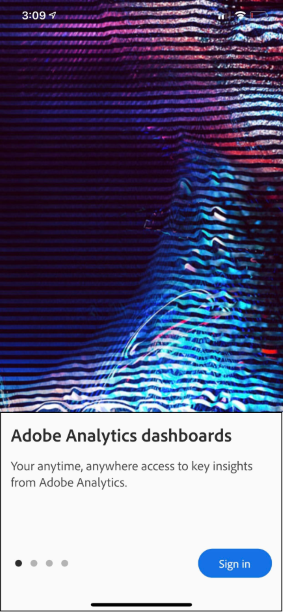

# BETA: Guida del curatore per l'app mobile Analytics

## Introduzione

L'app mobile Adobe Analytics fornisce informazioni ovunque e in qualsiasi momento da Adobe Analytics.   L’app consente agli utenti di accedere da dispositivi mobili alle scorecard intuitive, create e condivise dall’interfaccia utente desktop di Adobe Analytics. Le scorecard sono una raccolta di metriche chiave e altri componenti presentati in un layout a piastrelle che potete toccare per suddivisioni più dettagliate e report con tendenze. È possibile personalizzare le scorecard in base ai dati più importanti. L'app mobile è supportata sia sui sistemi operativi iOS che su quelli Android.

## Informazioni su questa guida

Questa guida è stata creata per aiutare i curatori dei dati di Adobe Analytics a configurare le scorecard per gli utenti esecutivi nell'app mobile Analytics. I curatori possono essere amministratori dell'organizzazione o persone in altri ruoli responsabili della configurazione delle scorecard delle app, che consentono agli utenti esecutivi di visualizzare un ampio rendering di importanti dati di riepilogo in modo rapido e semplice sui propri dispositivi mobili. Sebbene gli utenti esecutivi siano gli utenti finali per l'app mobile Analytics, questa guida aiuterà i curatori di dati a configurare l'app in modo efficace per tali utenti.

## Glossario dei termini

La tabella seguente descrive i termini per comprendere l'audience, le funzioni e il funzionamento dell'app mobile Analytics.

| Termine | Definizione |
|--- |--- |
| Consumer | Personalità esecutiva che visualizza metriche chiave e informazioni da Analytics su un dispositivo mobile |
| Curatore | Persona con informazioni sui dati che trova e distribuisce approfondimenti da Analytics e configura gli scorecard da visualizzare per il consumatore |
| Cura | Creazione o modifica di una scorecard mobile contenente metriche, dimensioni e altri componenti rilevanti per il consumatore |
| Scorecard | Visualizzazione app mobile contenente uno o più riquadri |
| Affianca | Rendering di una metrica in una visualizzazione scorecard |
| Suddividi | Vista secondaria accessibile toccando una sezione nella scorecard. Questa visualizzazione si espande sulla metrica visualizzata nella sezione e, facoltativamente, riporta ulteriori dimensioni di suddivisione. |
| Intervallo date | L'intervallo di date principale per il reporting delle app mobili |
| Intervallo date confronto | Intervallo di date confrontato con l'intervallo di date principale |

 
## Creare una scorecard per gli utenti esecutivi

Una scorecard mobile visualizza le visualizzazioni dei dati chiave per gli utenti con layout a sezioni, come illustrato di seguito:

Come curatore di questa scorecard, è possibile utilizzare il Generatore scorecard per configurare quali sezioni visualizzare sulla scorecard per il consumatore. È inoltre possibile configurare la modalità di modifica delle viste dettagliate o delle suddivisioni dopo aver toccato le sezioni. L'interfaccia di Scorecard Builder è mostrata di seguito:

Per creare la scorecard, è necessario effettuare le seguenti operazioni:

1. Accedi al modello Scorecard mobile vuoto.
2. Configura la scorecard con i dati e salvala.

### Accesso al modello Scorecard mobile vuoto

Puoi accedere al modello Blank Mobile Scorecard in uno dei modi seguenti:

**Creare un nuovo progetto**

1. Apri Adobe Analytics e fai clic sulla scheda **Workspace** .
2. Fate clic sul pulsante **Crea nuovo progetto** e selezionate il modello di progetto della scorecard **mobile** vuota.
3. Click the **Create** button.

*Nota: Se non visualizzi il modello Scorecard mobile vuota, come illustrato di seguito, la tua società non è ancora stata attivata per la versione beta. Contatta il tuo Customer Service Manager.*

**Aggiungere un progetto**

Dalla schermata **Progetti** , nella scheda **Componenti** , fate clic sul pulsante **Aggiungi** e selezionate **Mobile Scorecard**.

**Utilizzare gli strumenti di Analytics**

In Analytics, fai clic sul menu **Strumenti** e seleziona App **** mobile. Nella schermata successiva, fare clic sul pulsante **Crea scorecard** .

### Configurare la scorecard con i dati e salvarla

Per implementare il modello Scorecard:

1. In **Proprietà** (nella barra a destra), specificate una suite **di rapporti** progetto da cui desiderate utilizzare i dati.

   

2. Per aggiungere una nuova sezione alla scorecard, trascina una metrica dal pannello a sinistra e rilasciala nella zona **Trascina qui** le metriche di rilascio. È inoltre possibile inserire una metrica tra due sezioni utilizzando un flusso di lavoro simile.

   

   *Da ciascuna sezione potete accedere a una visualizzazione dettagliata in cui sono visualizzate informazioni aggiuntive sulla metrica, come gli elementi principali per un elenco di dimensioni correlate.*

3. Per aggiungere una dimensione correlata a una metrica, trascinala dal pannello a sinistra e rilasciala su una sezione. Ad esempio, puoi aggiungere dimensioni appropriate (come Regione **** DMA, in questo esempio) alla metrica Visitatori **** unici trascinandola sulla sezione; le dimensioni aggiunte verranno visualizzate nella sezione di suddivisione delle **proprietà** specifiche della sezione. Potete aggiungere più dimensioni a ciascuna sezione.

   

   *Nota: È inoltre possibile aggiungere una dimensione a tutte le sezioni rilasciandola nell'area di lavoro Scorecard.*

   Quando si fa clic su una sezione nel Generatore scorecard, nella barra a destra vengono visualizzate le proprietà e le caratteristiche associate a tale sezione. In questa barra, potete fornire un nuovo **Titolo** per la sezione e, in alternativa, configurare la sezione specificando i componenti invece di trascinarli dalla barra a sinistra.

   Inoltre, se fate clic sulle sezioni, un pop-up dinamico mostrerà la visualizzazione Suddivisione all'utente esecutivo nell'app. Se non è stata applicata alcuna dimensione alla sezione, la dimensione di suddivisione sarà **ora** o **giorni**, a seconda dell’intervallo di date predefinito.

   

   *Ogni dimensione aggiunta alla sezione verrà visualizzata in un elenco a discesa nella visualizzazione dettagliata dell'app. L'utente esecutivo può quindi scegliere tra le opzioni elencate nell'elenco a discesa.*

4. Per applicare segmenti a singole sezioni, trascinate un segmento dal pannello sinistro e rilasciatelo direttamente sulla parte superiore della sezione. Se si desidera applicare il segmento a tutte le sezioni della scorecard, posizionare la sezione sopra la scorecard.

5. Analogamente, per rimuovere un componente applicato all’intera scorecard, fare clic in un punto qualsiasi della scorecard all’esterno delle sezioni e rimuoverlo facendo clic sulla **x** visualizzata al passaggio del mouse sul componente, come illustrato di seguito per il segmento Clienti **** mobili:

   

6. In **Proprietà** scorecard è inoltre possibile specificare quanto segue:

   * Un Intervallo **Di Date** Predefinito. Gli intervalli qui specificati saranno gli stessi applicati al primo accesso dell'utente esecutivo alla scorecard nella sua app.

   * Un Intervallo Di Date **Di Confronto**

   * Qualsiasi **segmento** da applicare all’intera scorecard

7. Per assegnare un nome alla scorecard, fare clic sullo spazio dei nomi in alto a sinistra nella schermata e digitare il nuovo nome.

   

## Condivisione della scorecard

Per condividere la scorecard con un utente esecutivo:

1. Fate clic sul menu **Condivisione** e selezionate **Condivisione scorecard**.

2. Nel modulo **Condivisione** , completa i campi nei seguenti modi:

   * Nome della scorecard
   * Descrizione della scorecard
   * Aggiunta di tag rilevanti
   * Specifica dei destinatari della scorecard
   * Selezionare l'opzione per **condividere i componenti incorporati con i destinatari** per garantire che l'utente esecutivo abbia accesso a tutti i componenti della scorecard.

3. Fai clic su **Condividi**.

Dopo aver condiviso una scorecard, i destinatari possono accedervi dall'app mobile Analytics. Se si apportano modifiche successive alla scorecard nel Generatore scorecard, queste verranno aggiornate automaticamente nella scorecard condivisa. Gli utenti esecutivi visualizzeranno quindi le modifiche dopo l'aggiornamento della scorecard nella loro app.

*Nota: Se si aggiorna la scorecard aggiungendo nuovi componenti, è possibile condividere di nuovo la scorecard (e selezionare l'opzione Condividi **automaticamente i componenti incorporati con i destinatari**) per essere certi che gli utenti esecutivi abbiano accesso a tali modifiche.*

## Impostazione di utenti esecutivi con l'app

In alcuni casi, gli utenti esecutivi potrebbero aver bisogno di ulteriore assistenza per accedere e utilizzare l'app. Questa sezione fornisce informazioni utili per fornire assistenza.

### Assistenza agli utenti con diritti di accesso

Per aiutare gli utenti esecutivi ad accedere ai tuoi scorecard nell'app, accertati che:

* I requisiti minimi del sistema operativo mobile sui loro dispositivi sono iOS versione 10 o successiva o Android versione 4.4 (KitKat) o superiore
* Hanno un accesso valido ad Adobe Analytics
* Sono state create delle scorecard mobili per loro correttamente e le potete condividere.
* Hanno accesso ad Analysis Workspace e alla suite di rapporti su cui si basa la scorecard
* Hanno accesso ai componenti inclusi nella scorecard. Nota: Potete selezionare un’opzione quando condividete gli scorecard per condividere **automaticamente i componenti incorporati con i destinatari**.

### Aiutare gli utenti esecutivi a utilizzare l'app

Durante la fase beta, e prima che l'app venga rivelata al pubblico, potete controllare chi ha accesso all'app.

1. Aiuta gli utenti esecutivi a scaricare e installare l'app. A questo scopo, fornisci i seguenti passaggi per estendere l'accesso ai tuoi utenti esecutivi, a seconda che utilizzino un dispositivo iOS o Android.

   **Per gli utenti esecutivi su iOS:**

   1. Fai clic sul seguente collegamento pubblico (disponibile anche in Analytics in **Strumenti** &gt; App **** mobile):

      [Collegamento](https://testflight.apple.com/join/WtXMQxlI)iOS: `https://testflight.apple.com/join/WtXMQxlI`

      Dopo aver fatto clic sul collegamento, viene visualizzata la seguente schermata Verifica:

      

   2. Toccate il collegamento **Visualizza in App Store** sullo schermo per scaricare l'app TestFlight.

   3. Dopo aver installato l'app Testflight, trova e installa l'app mobile Adobe Analytics dall'interno di TestFlight come mostrato di seguito:

      
   **Per gli utenti esecutivi su Android:**

   1. Toccate il seguente collegamento Play Store sul dispositivo dell'utente (è disponibile anche in Analytics in **Strumenti** &gt; App ****mobile):
      [Android](https://play.google.com/apps/testing/com.adobe.analyticsmobileapp): `https://play.google.com/apps/testing/com.adobe.analyticsmobileapp`

      Dopo aver toccato il collegamento, toccate il collegamento Diventa un tester nella schermata seguente:

      

   2. Toccate il **download sul collegamento Google Play** nella schermata seguente:
      

   3. Scaricate e installate l'app.
Una volta scaricati e installati, gli utenti esecutivi possono accedere all'app utilizzando le credenziali Adobe Analytics esistenti; supportiamo sia Adobe che Enterprise/Federated ID.
   

2. Aiutali ad accedere alla tua scorecard. Dopo che gli utenti esecutivi hanno effettuato l'accesso all'app, viene visualizzata la schermata **Scegli una società** . In questa schermata sono elencate le società di accesso alle quali appartiene l’utente esecutivo. Per aiutarli a raggiungere la scorecard:

   * Toccate il nome della società di accesso o dell’organizzazione Experience Cloud applicabile alla scorecard condivisa. Nell'elenco Scorecard vengono quindi visualizzate tutte le scorecard condivise con il manager all'interno della società di accesso.
   * Aiutateli a ordinare l’elenco in base all’ **ultima modifica**, se applicabile.
   * Toccate il nome della scorecard per visualizzarla.
   

   Nota: Se l'utente esecutivo accede e visualizza un messaggio che indica che non è stato condiviso nulla:

   * L'utente esecutivo potrebbe aver selezionato l'istanza di Analytics sbagliata
   * La scorecard potrebbe non essere stata condivisa con l'utente esecutivo

      
   Verifica che l'utente esecutivo possa accedere all'istanza di Analytics corretta e che la scorecard sia stata condivisa.

3. Spiegate all’utente esecutivo in che modo le sezioni vengono visualizzate nelle scorecard condivise.

   

   Ulteriori informazioni sulle sezioni:

   * La granularità dei grafici sparkline dipende dalla lunghezza dell'intervallo di date:
      * Un giorno mostra una tendenza oraria
      * Più di un giorno e meno di un anno mostra una tendenza giornaliera
      * Un anno o più mostra una tendenza settimanale
   * La formula di variazione del valore percentuale è totale della metrica (intervallo di date corrente) - totale della metrica (intervallo di date di confronto) / totale della metrica (intervallo di date di confronto).
   * Per aggiornare la scorecard è possibile spostare lo schermo verso il basso.

4. Toccate una sezione per vedere come funziona una suddivisione dettagliata per la sezione.

   

5. Per modificare gli intervalli di date per la scorecard:

   

   *Nota: Puoi anche modificare allo stesso modo gli intervalli di date all’interno della visualizzazione Suddivisione mostrata sopra.*

   A seconda dell’intervallo di tempo che toccate (**Giorno**, **Settimana**, **Mese** o **Anno**), verranno visualizzate due opzioni per gli intervalli di date, quella attuale o quella immediatamente precedente. Toccate una di queste due opzioni per selezionare il primo intervallo. Nell'elenco **COMPARE A** , toccare una delle opzioni presentate per confrontare i dati di questo periodo di tempo con il primo intervallo di date selezionato. Toccate **Fine** in alto a destra nella schermata. I campi **Intervalli** di date e Scorecard vengono aggiornati con i nuovi dati di confronto dei nuovi intervalli selezionati.

6. Per lasciare un feedback su questa app:

   1. Toccate l'icona utente in alto a destra della schermata dell'app.
   2. Nella schermata **Account** personale, toccate l'opzione **Feedback** .
   3. Toccate per visualizzare le opzioni per lasciare il feedback.
   
   

**Per segnalare un bug**:

Toccate l’opzione e scegliete una sottocategoria del bug. Nel modulo per segnalare un bug, fornite il vostro indirizzo e-mail nel campo superiore e la descrizione del bug nel campo sottostante. Al messaggio viene automaticamente collegata una schermata delle informazioni dell'account, ma è possibile eliminarla toccando la **X** nell'immagine dell'allegato. Sono inoltre disponibili opzioni per effettuare una registrazione dello schermo, aggiungere altre schermate o allegare file. Per inviare il rapporto, toccare l'icona del piano carta in alto a destra nel modulo.

**Per suggerire un miglioramento**:

Toccate l’opzione e scegliete una sottocategoria per il suggerimento. Nel modulo dei suggerimenti, fornite il vostro indirizzo e-mail nel campo superiore e la descrizione del bug nel campo sottostante. Al messaggio viene automaticamente collegata una schermata delle informazioni dell'account, ma è possibile eliminarla toccando la **X** nell'immagine dell'allegato. Sono inoltre disponibili opzioni per effettuare una registrazione dello schermo, aggiungere altre schermate o allegare file. Per inviare il suggerimento, toccate l'icona del piano carta in alto a destra nel modulo.

**Per porre una domanda**:

Toccate l’opzione e fornite il vostro indirizzo e-mail nel campo superiore e la domanda nel campo sottostante. Una schermata viene automaticamente collegata al messaggio, ma è possibile eliminarla toccando la **X** nell'immagine dell'allegato. Sono inoltre disponibili opzioni per effettuare una registrazione dello schermo, aggiungere altre schermate o allegare file. Per inviare la domanda, toccate l'icona del piano carta in alto a destra nel modulo.
