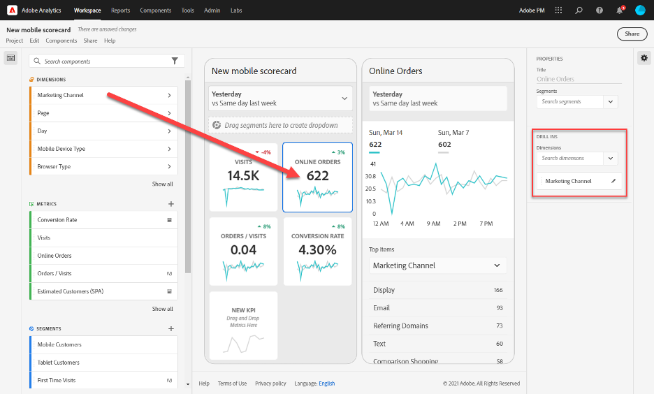

# Guida del curatore per le dashboard di Adobe Analytics

Le informazioni riportate di seguito spiegano ai curatori di dati di Adobe Analytics come configurare e presentare dashboard per gli utenti esecutivi. Per visualizzare un video che illustra queste informazioni, consultate il video  Adobe Analytics dashboards Scorecard Builder:

>[!VIDEO](https://video.tv.adobe.com/v/34544)

## Introduzione

Le dashboard di Adobe Analytics forniscono informazioni provenienti da Adobe Analytics ovunque e in qualsiasi momento. L’app ti consente di accedere da dispositivi mobili a scorecard intuitive che crei e condividi dall’interfaccia utente desktop di Adobe Analytics. Le scorecard sono una raccolta di metriche chiave e di altri componenti presentati in un layout a tessere che puoi toccare per visualizzare raggruppamenti più dettagliati e rapporti sulle tendenze. Puoi personalizzare le scorecard in base ai dati che ritieni più importanti. Le dashboard di Analytics sono supportate sia sui sistemi operativi iOS che su quelli Android.

## Ulteriori informazioni su questa guida

Questa guida ha lo scopo di aiutare i curatori di Adobe Analytics a configurare le scorecard per i loro utenti esecutivi sulle dashboard. I curatori possono essere amministratori organizzativi o persone con altri ruoli responsabili della configurazione delle scorecard dell’app, il che consente agli utenti esecutivi di visualizzare una rappresentazione generale di importanti dati riassuntivi in modo semplice e veloce sui propri dispositivi mobili. Sebbene gli utenti esecutivi siano gli utenti finali delle dashboard di Analytics, questa guida aiuterà i curatori dei dati a configurare l’app in modo efficace per questi utenti.

## Glossario dei termini

La tabella seguente descrive i termini per comprendere il pubblico, le funzioni e il funzionamento delle dashboard di Analytics.

| Termine | Definizione |
|--- |--- |
| Consumatore | Utente esecutivo che visualizza metriche e conoscenze chiave provenienti da Analytics su un dispositivo mobile |
| Curatore | Persona esperta in materia di dati che trova e distribuisce le conoscenze provenienti da Analytics e configura le scorecard da mostrare al consumatore |
| Cura | L’atto di creare o modificare una scorecard mobile contenente metriche, dimensioni e altri componenti pertinenti per il consumatore |
| Scorecard | Una vista delle dashboard contenente una o più tessere |
| Tessera | Una rappresentazione di una metrica all’interno di una vista Scorecard |
| Raggruppamento | Una vista secondaria accessibile toccando una tessera nella scorecard. Questa vista mostra maggiori informazioni sulla metrica visualizzata sulla tessera e, opzionalmente, riporta informazioni su dimensioni di raggruppamento aggiuntive |
| Intervallo date | L’intervallo date primario per la generazione di rapporti delle dashboard |
| Intervallo date di confronto | L’intervallo date che viene confrontato con l’intervallo date primario |

## Creare una scorecard per utenti esecutivi

Una scorecard mostra le visualizzazioni dei dati chiave per gli utenti esecutivi in un layout a tessere, come mostrato di seguito:

In qualità di curatore di questa scorecard, puoi usare lo strumento di creazione delle scorecard per configurare quali tessere visualizzerà il consumatore sulla scorecard. Puoi anche configurare in che modo le viste dettagliate, o Raggruppamenti, possono essere regolati una volta che le tessere vengono toccate. L’interfaccia del Creatore di scorecard è mostrata di seguito:

Per creare la scorecard, dovrai fare quanto segue:

1. Accedere al [!UICONTROL Blank Mobile Scorecard] modello.
2. Configura la scorecard con i dati e salvala.

### Accesso al [!UICONTROL Blank Mobile Scorecard] modello

You can access the [!UICONTROL Blank Mobile Scorecard] template in one of the following ways:

**Creare un nuovo progetto**

1. Open Adobe Analytics and click the **[!UICONTROL Workspace]** tab.
2. Fate clic sul **[!UICONTROL Create New Project]** pulsante e selezionate il modello di **[!UICONTROL Blank Mobile Scorecard]** progetto.
3. Fai clic sul pulsante **[!UICONTROL Create]**.

**Aggiungere un progetto**

Dalla **[!UICONTROL Projects]** schermata, sotto la **[!UICONTROL Components]** scheda, fare clic sul **[!UICONTROL Add]** pulsante e selezionare **[!UICONTROL Mobile Scorecard]**.

**Utilizzare [!DNL Analytics] gli strumenti**

In [!DNL Analytics], fate clic sul **[!UICONTROL Tools]** menu e selezionate **[!UICONTROL Analytics dashboards (Mobile App)]**. On the subsequent screen, click the **[!UICONTROL Create new scorecard]** button.

### Configura la scorecard con i dati e salvala

Per implementare il template della scorecard:

1. Under **[!UICONTROL Properties]** (in the right-hand rail), specify a **[!UICONTROL Project report suite]** from which you want to use data.

   

2. To add a new tile to your Scorecard, drag a metric from the left panel and drop it into the **[!UICONTROL Drag and Drop Metrics Here]** zone. È anche possibile inserire una metrica tra due tessere utilizzando un flusso di lavoro simile.

   

   *Da ogni tessera, è possibile accedere a una vista dettagliata che visualizza informazioni aggiuntive sulla metrica, come gli elementi principali di un elenco di dimensioni correlate.*

3. Per aggiungere una dimensione correlata a una metrica, trascina una dimensione dal pannello di sinistra e rilasciala su una tessera. For example, you can add appropriate dimensions (like **[!DNL DMA Region]**, in this example) to the **[!UICONTROL Unique Visitors]** metric by dragging and dropping it onto the tile; dimensions you add will appear under the breakdown section of the tile-specific **[!UICONTROL Properties]**. Puoi aggiungere più dimensioni a ogni tessera.

   

   Puoi anche aggiungere una dimensione a tutte le tessere rilasciandola sull’area di lavoro della scorecard.

   Quando fai clic su una tessera nel Creatore di scorecard, la barra di destra mostra le proprietà e le caratteristiche associate a quella tessera. In this rail, you can provide a new **[!UICONTROL Title]** for the tile and alternatively configure the tile by specifying components instead of dragging and dropping them from the left-hand rail.

   Inoltre, se fai clic sulle tessere, un pop-up dinamico mostrerà come la vista Raggruppamento viene visualizzata dall’utente esecutivo nell’app. Se non è stata applicata alcuna dimensione alla tessera, la dimensione di raggruppamento sarà **ore** o **giorni**, a seconda dell’intervallo date predefinito.

   

   Ogni dimensione aggiunta alla tessera viene visualizzata in un elenco a discesa nella vista dettagliata dell’app. L’utente esecutivo può quindi scegliere tra le opzioni elencate nell’elenco a discesa.

4. Per applicare segmenti alle singole tessere, trascina un segmento dal pannello di sinistra e rilascialo direttamente sulla tessera. Se vuoi applicare il segmento a tutte le tessere della scorecard, rilascia la tessera sopra la scorecard. Oppure, puoi anche applicare i segmenti selezionandoli nel menu del filtro sotto gli intervalli di date. Puoi [configurare e applicare filtri per le scorecard](https://experienceleague.adobe.com/docs/analytics-learn/tutorials/analysis-workspace/using-panels/using-drop-down-filters.html) nello stesso modo che utilizzeresti in Adobe Analytics Workspace.

   

5. Similarly, to remove a component that is applied to the entire Scorecard, click anywhere on the Scorecard outside of the tiles and then remove it by clicking the **x** that appears when you hover over the component, as shown below for the **[!DNL Mobile Customers]** segment:

   

6. Under Scorecard **[!UICONTROL Properties]**, you also can optionally specify the following:

   * A **[!UICONTROL Default date range]**. Gli intervalli che specifichi qui saranno gli stessi applicati al primo accesso dell’utente esecutivo alla scorecard nell’app.

   * A **[!UICONTROL Comparison date range]**

   * Any **[!UICONTROL Segments]** to apply to the whole Scorecard

7. Per dare un nome alla scorecard, fai clic sullo spazio del nome in alto a sinistra dello schermo e digita il nuovo nome.

   

## Condividere la scorecard

Per condividere la scorecard con un utente esecutivo:

1. Fare clic sul **[!UICONTROL Share]** menu e selezionare **[!UICONTROL Share scorecard]**.

2. In the **[!UICONTROL Share mobile scorecard]** form, complete the fields by:

   * Inserendo il nome della scorecard
   * Inserendo una descrizione della scorecard
   * Aggiungendo tag rilevanti
   * Specificando i destinatari della scorecard

3. Fai clic su **[!UICONTROL Share]**.

Dopo che hai condiviso una scorecard, i destinatari possono accedervi sulle loro dashboard di Analytics. Se apporti successive modifiche alla scorecard nel Creatore di scorecard, queste verranno automaticamente aggiornate nella scorecard condivisa. Gli utenti esecutivi vedranno poi i cambiamenti dopo aver aggiornato la scorecard nella loro app.

Se aggiorni la scorecard aggiungendo nuovi componenti, ti consigliamo di condividerla nuovamente e di selezionare l’opzione **[!UICONTROL Share embedded components]** (condividi componenti incorporati) per assicurarti che gli utenti esecutivi abbiano accesso a queste modifiche.

## Impostazione di utenti esecutivi con l&#39;app

In alcuni casi, gli utenti esecutivi potrebbero aver bisogno di ulteriore assistenza per accedere all’app e utilizzarla. Questa sezione offre informazioni per aiutarti a fornire tale assistenza.

### Aiutare gli utenti esecutivi ad accedere

Per aiutare gli utenti esecutivi ad accedere alle tue scorecard nell’app, assicurati che:

* Il sistema operativo per dispositivi mobili sui loro dispositivi sia iOS versione 10 o superiore o Android versione 4.4 (KitKat) o superiore
* Abbiano un accesso valido ad Adobe Analytics
* Tu abbia creato correttamente le scorecard per dispositivi mobili a essi destinate e condiviso con essi tali scorecard
* Abbiano accesso all’Analysis Workspace e alla suite di rapporti su cui si basa la scorecard
* Abbiano accesso ai Componenti che la scorecard include. Note that you can select an option when sharing your Scorecards to **[!UICONTROL Share embedded components]**.

### Aiutare gli utenti esecutivi a utilizzare l’app

Per aiutare gli utenti esecutivi:

1. Aiutali a scaricare e installare l’app. Per farlo, indica ai tuoi utenti esecutivi i seguenti passaggi per estendere l’accesso, a seconda che utilizzino un dispositivo iOS o Android.

   **Per gli utenti esecutivi su iOS:**

   * Click the following link (it is also available in Analytics under **[!UICONTROL Tools]** > **[!UICONTROL Analytics dashboards (Mobile App)]**) and follow the prompts to download, install, and open the app:

      [Collegamento per iOS](https://apple.co/2zXq0aN)
   **Per gli utenti esecutivi su Android:**

   * Click the following link (it is also available in Analytics under **[!UICONTROL Tools]** > **[!UICONTROL Analytics dashboards (Mobile App)]**) and follow the prompts to download, install, and open the app:

      [Collegamento per Android](https://bit.ly/2LM38Oo)
   Una volta scaricata e installata, gli utenti esecutivi possono accedere all’app utilizzando le loro credenziali esistenti di Adobe Analytics; supportiamo sia gli ID Adobe che quelli Enterprise/Federated.

   

2. Aiutali ad accedere alla tua scorecard. After executive users sign into the app, the **[!UICONTROL Choose a company]** screen appears. Questa schermata elenca le aziende di accesso a cui appartiene l’utente esecutivo. Per aiutarli a trovare la scorecard:

   * Toccare il nome dell’azienda di accesso o dell’organizzazione Experience Cloud che si applica alla scorecard che hai condiviso. L’elenco delle scorecard mostra quindi tutte le scorecard che sono state condivise con l’utente esecutivo da quell’azienda di accesso.
   * Aiutateli a ordinare l’elenco in base **[!UICONTROL Most recently modified]**, se applicabile.
   * Toccare il nome della scorecard per visualizzarla.

   

   Se l’utente esecutivo effettua l’accesso e vede un messaggio che dice che non è stato condiviso nulla:

   * L’utente esecutivo può aver selezionato l’istanza di Analytics sbagliata

   * La scorecard potrebbe non essere stata condivisa con l’utente esecutivo

      

   * Verifica che l’utente esecutivo possa accedere alla giusta istanza di Analytics e che la scorecard sia stata condivisa.

3. Explain to the executive user how tiles appear in the Scorecards you share (the first Scorecard below is set in dark mode; see **[!UICONTROL Preferences]** below if you think your executive user prefers this viewing opt-on):

   

   

   Ulteriori informazioni sulle tessere:

   * La granularità dei grafici sparkline dipende dalla lunghezza dell’intervallo date:
      * Un giorno mostra una tendenza oraria
      * Più di un giorno e meno di un anno mostra una tendenza giornaliera
      * Un anno o più mostra una tendenza settimanale
   * La formula della variazione percentuale del valore è metrica totale (intervallo date attuale) – metrica totale (intervallo date di confronto)/metrica totale (intervallo date di confronto).
   * È possibile trascinare lo schermo verso il basso per aggiornare la scorecard.

4. Toccare una tessera per mostrare come funziona un raggruppamento dettagliato della tessera.

   

   * Tocca un punto qualsiasi di una sparkline per visualizzare i dati associati a tale punto sulla linea.

   * È inclusa una tabella per visualizzare i dati delle dimensioni aggiunte alla tessera. Tocca la freccia giù per selezionare le dimensioni. Se non è stata aggiunta alcuna dimensione alla tessera, nella tabella vengono visualizzati i dati relativi al grafico.

5. Per modificare gli intervalli date per la tua scorecard:

   

   * Puoi modificare allo stesso modo anche gli intervalli date all’interno della vista raggruppamento mostrata sopra.

   * A seconda dell’intervallo che si tocca (**Giorno**, **Settimana**, **Mese** o **Anno**), si vedranno due opzioni per gli intervalli date: l’intervallo di tempo attuale o quello immediatamente prima. Toccare una di queste due opzioni per selezionare il primo intervallo. Under the **[!UICONTROL COMPARE TO]** list, tap one of the presented options to compare the data of this time period with the first date range you selected. Tap **[!UICONTROL Done]** in the upper right of the screen. The **[!UICONTROL Date Ranges]** field and the Scorecard tiles are updated with the new comparison data from the new ranges you selected.

6. Per lasciare un feedback su questa app:

   1. Tocca l’icona dell’utente in alto a destra della schermata dell’app.
   2. On the **[!UICONTROL Settings]** screen, tap the **[!UICONTROL Feedback]** option.
   3. Tocca per visualizzare le opzioni per lasciare un feedback.

      

7. Per modificare le preferenze, tocca l’opzione **[!UICONTROL Preferences]** mostrata sopra. Nelle preferenze, puoi attivare l’accesso biometrico oppure la modalità scura dell’app come illustrato di seguito:

   

**Per segnalare un bug**:

Toccare l’opzione e scegliere una sottocategoria del bug. Nel modulo per la segnalazione di un bug, fornisci il tuo indirizzo e-mail nel campo superiore e la tua descrizione del bug nel campo sotto di esso. Al messaggio viene automaticamente allegata una schermata con le informazioni del tuo account, ma puoi cancellarla, se lo desideri, toccando la **X** nell’immagine allegata. Ci sono anche delle opzioni per effettuare una registrazione dello schermo, aggiungere altre schermate o allegare file. Per inviare la segnalazione, toccare l’icona dell’aeroplano di carta in alto a destra del modulo.

**Per suggerire un miglioramento**:

Toccare l’opzione e scegliere una sottocategoria del suggerimento. Nel modulo di suggerimento, fornisci il tuo indirizzo e-mail nel campo superiore e la tua descrizione del bug nel campo sotto di esso. Al messaggio viene automaticamente allegata una schermata con le informazioni del tuo account, ma puoi cancellarla, se lo desideri, toccando la **X** nell’immagine allegata. Ci sono anche delle opzioni per effettuare una registrazione dello schermo, aggiungere altre schermate o allegare file. Per inviare il suggerimento, toccare l’icona dell’aeroplano di carta in alto a destra del modulo.

**Per fare una domanda**:

Tocca l’opzione e fornisci il tuo indirizzo e-mail nel campo superiore e la tua domanda nel campo sotto di esso. Al messaggio viene automaticamente allegata una schermata, ma puoi cancellarla, se lo desideri, toccando la **X** nell’immagine allegata. Ci sono anche delle opzioni per effettuare una registrazione dello schermo, aggiungere altre schermate o allegare file. Per inviare la domanda, toccare l’icona dell’aeroplano di carta in alto a destra del modulo.

>[!IMPORTANT]
>
>A partire da ottobre 2020,  Adobe sta gradualmente implementando una serie di miglioramenti per ottimizzare le prestazioni dell&#39;app &quot; Adobe Analytics dashboards&quot;. Questi miglioramenti sono incentrati sulla memorizzazione nella cache dei dati Analytics storici utilizzati per popolare le scorecard con le date (escluso il giorno corrente). Questi dati verranno memorizzati nella cache fino a 24 ore in un account di archiviazione cloud pubblico Microsoft Azure protetto. Contattate il CSM per non utilizzare queste funzioni di miglioramento delle prestazioni.
