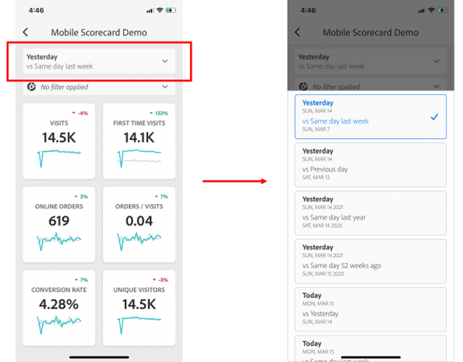

# Dashboard di Adobe Analytics: guida introduttiva rapida per utenti esecutivi

Le informazioni seguenti forniscono agli utenti amministratori informazioni sulle procedure ottimali per l&#39;utilizzo e la visualizzazione delle dashboard di Adobe Analytics. Per vedere un video che illustra queste informazioni, consultate [Dashboard di Adobe Analytics Esperienza](https://youtu.be/QXqQ_PkArbA)in-app.

## Introduzione

Le dashboard di Adobe Analytics forniscono informazioni provenienti da Adobe Analytics ovunque e in qualsiasi momento. L’app consente agli utenti di accedere a scorecard intuitive da dispositivi mobili. Le scorecard sono una raccolta di metriche chiave e di altri componenti presentati in un layout a tessere che puoi toccare per visualizzare raggruppamenti più dettagliati e rapporti sulle tendenze. Le dashboard sono supportate sia sui sistemi operativi iOS che su quelli Android.

## Ulteriori informazioni su questa guida

Questa guida ha lo scopo di aiutare gli utenti esecutivi a leggere e interpretare le scorecard sulle dashboard di Analytics. L’app consente agli utenti esecutivi di visualizzare una rappresentazione generale di importanti dati riassuntivi in modo semplice e veloce sui propri dispositivi mobili.

## Glossario dei termini

| Termine | Definizione |
|--- |--- |
| Consumatore | Utente esecutivo che visualizza metriche e conoscenze chiave provenienti da Analytics su un dispositivo mobile |
| Curatore | Persona esperta in materia di dati che trova e distribuisce le conoscenze provenienti da Analytics e configura le scorecard da mostrare al consumatore |
| Cura | L’atto di creare o modificare una scorecard mobile contenente metriche, dimensioni e altri componenti pertinenti per il consumatore |
| Scorecard | Una vista delle dashboard contenente una o più tessere |
| Tessera | Una rappresentazione di una metrica all’interno di una vista Scorecard |
| Raggruppamento | Una vista secondaria accessibile toccando una tessera nella scorecard. Questa vista mostra maggiori informazioni sulla metrica visualizzata sulla tessera e, opzionalmente, riporta informazioni su dimensioni di raggruppamento aggiuntive |
| Intervallo date | L’intervallo date primario per la generazione di rapporti delle dashboard |
| Intervallo date di confronto | L’intervallo date che viene confrontato con l’intervallo date primario |

## Configurare le dashboard sul dispositivo

Per utilizzare le dashboard in modo efficace è necessario che il curatore della scorecard ti aiuti a configurarle. Questa sezione fornisce informazioni per aiutarti a effettuare la configurazione con l’assistenza del tuo curatore.

### Ottenere l’accesso

Per accedere alle scorecard sulle dashboard, assicurati:

* Di avere un accesso valido ad Adobe Analytics
* Che il tuo curatore abbia creato correttamente le scorecard per dispositivi mobili e le abbia condivise con te

### Scaricare e installare dashboard

Per scaricare e installare l’app, segui i passaggi relativi al sistema operativo del tuo dispositivo.

**Per gli utenti esecutivi su iOS:**

Fai clic sul seguente collegamento (disponibile anche in Analytics in **Strumenti** > **Dashboard**) e segui le istruzioni per scaricare, installare e aprire l&#39;app:

[Link iOS](https://apple.co/2zXq0aN)

**Per gli utenti esecutivi su Android:**

Fai clic sul seguente collegamento (disponibile anche in Analytics in **Strumenti** > **Dashboard**) e segui le istruzioni per scaricare, installare e aprire l&#39;app:

[Collegamento Android](https://bit.ly/2LM38Oo)

Una volta scaricati e installati, gli utenti esecutivi possono accedere all&#39;app utilizzando le credenziali Adobe Analytics esistenti.

## Utilizzare le dashboard

Per utilizzare le dashboard:

1. Accedi all’app. La schermata di accesso apparirà all’avvio delle dashboard. Segui le istruzioni utilizzando le tue credenziali esistenti di Adobe Analytics. Supportiamo sia gli ID Adobe che quelli Enterprise/Federated.

   

2. Scegli un’azienda. Dopo aver effettuato l’accesso alle dashboard appare la schermata **Scegli un’azienda**. Questa schermata elenca le aziende di accesso a cui appartieni. Tocca il nome dell’azienda associata alla scorecard condivisa con te.

3. L’elenco delle scorecard mostra quindi tutte le scorecard che sono state condivise con te. Tocca la scorecard che desideri visualizzare.

   

   Se effettuate l’accesso e viene visualizzato un messaggio che informa che non è stato condiviso nulla, verificate quanto segue con il vostro curatore:

   * Riesci ad accedere alla giusta istanza di Analytics
   * La scorecard è stata condivisa con te
   

4. Esaminare l’aspetto delle sezioni nella scorecard (la prima scorecard viene visualizzata in modalità scura); per ulteriori informazioni, consultate **Preferenze** di seguito).

   

   Ulteriori informazioni sulle tessere:

   * La granularità dei grafici sparkline dipende dalla lunghezza dell’intervallo date:

      * Un giorno mostra una tendenza oraria
      * Più di un giorno e meno di un anno mostra una tendenza giornaliera
      * Un anno o più mostra una tendenza settimanale
   * La formula della variazione percentuale del valore è metrica totale (intervallo date attuale) – metrica totale (intervallo date di confronto)/metrica totale (intervallo date di confronto).

   * È possibile trascinare lo schermo verso il basso per aggiornare la scorecard.
   L’esempio seguente della scorecard viene visualizzato in modalità normale:

   

5. Toccate una sezione per vedere come funziona una suddivisione dettagliata per la sezione.

   

6. Per modificare gli intervalli date per la tua scorecard:

   

   * Puoi anche modificare allo stesso modo gli intervalli di date all’interno della visualizzazione Suddivisione mostrata sopra.

   * A seconda dell’intervallo che si tocca (**Giorno**, **Settimana**, **Mese** o **Anno**), si vedranno due opzioni per gli intervalli date: l’intervallo di tempo attuale o quello immediatamente prima. Toccare una di queste due opzioni per selezionare il primo intervallo. Nell’elenco **CONFRONTA CON**, toccare una delle opzioni che vengono mostrate per confrontare i dati di questo periodo di tempo con il primo intervallo date selezionato. Toccare **Fine** in alto a destra dello schermo. Il campo **Intervalli date** e le tessere della scorecard vengono aggiornati con i nuovi dati di confronto dei nuovi intervalli selezionati.

7. Per applicare un filtro segmenti alla scorecard, toccate il menu a discesa del filtro e selezionate un segmento configurato dal vostro curatore. [I filtri](https://docs.adobe.com/content/help/en/analytics-learn/tutorials/analysis-workspace/using-panels/using-drop-down-filters.html) nell&#39;app funzionano allo stesso modo in Analytics Workspace.

   

8. Ricevere gli aggiornamenti delle scorecard. Se una scorecard non include tutte le metriche o i raggruppamenti che potrebbero interessarti, contatta il tuo team di Analytics per far aggiornare la scorecard. Una volta aggiornata, è possibile trascinare giù la scheda sullo schermo per aggiornarla e caricare i dati aggiunti di recente.

9. Per lasciare un feedback su questa app:

   1. Toccate l&#39;icona delle impostazioni in alto a destra della schermata dell&#39;app.
   2. On the **Settings** screen, tap the **Feedback** option.
   3. Toccare per visualizzare le opzioni per lasciare un feedback.

      

10. Per modificare le preferenze, toccate l’opzione **Preferenze** riportata sopra. Nelle preferenze, potete attivare l’accesso biometrico oppure impostare l’app per la modalità scura come illustrato di seguito:

   

**Per segnalare un bug**:

Toccare l’opzione e scegliere una sottocategoria del bug. Nel modulo per la segnalazione di un bug, fornisci il tuo indirizzo e-mail nel campo superiore e la tua descrizione del bug nel campo sotto di esso. Al messaggio viene automaticamente allegata una schermata con le informazioni del tuo account, ma puoi cancellarla, se lo desideri, toccando la **X** nell’immagine allegata. Ci sono anche delle opzioni per effettuare una registrazione dello schermo, aggiungere altre schermate o allegare file. Per inviare la segnalazione, toccare l’icona dell’aeroplano di carta in alto a destra del modulo.

**Per suggerire un miglioramento**:

Toccare l’opzione e scegliere una sottocategoria del suggerimento. Nel modulo di suggerimento, fornisci il tuo indirizzo e-mail nel campo superiore e la tua descrizione del bug nel campo sotto di esso. Al messaggio viene automaticamente allegata una schermata con le informazioni del tuo account, ma puoi cancellarla, se lo desideri, toccando la **X** nell’immagine allegata. Ci sono anche delle opzioni per effettuare una registrazione dello schermo, aggiungere altre schermate o allegare file. Per inviare il suggerimento, toccare l’icona dell’aeroplano di carta in alto a destra del modulo.

**Per fare una domanda**:

Tocca l’opzione e fornisci il tuo indirizzo e-mail nel campo superiore e la tua domanda nel campo sotto di esso. Al messaggio viene automaticamente allegata una schermata, ma puoi cancellarla, se lo desideri, toccando la **X** nell’immagine allegata. Ci sono anche delle opzioni per effettuare una registrazione dello schermo, aggiungere altre schermate o allegare file. Per inviare la domanda, toccare l’icona dell’aeroplano di carta in alto a destra del modulo.
