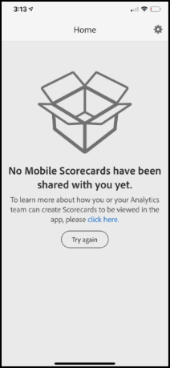

# Guida introduttiva per utenti direzionali

Le informazioni seguenti forniscono agli utenti direzionali informazioni sulle best practice per l’utilizzo e la visualizzazione delle dashboard di Adobe Analytics. Per vedere un video che illustra queste informazioni, consulta [Esperienza in-app delle dashboard di Adobe Analytics](https://youtu.be/QXqQ_PkArbA).

Questa guida ha lo scopo di aiutare gli utenti direzionali a leggere e interpretare le scorecard nelle dashboard di Analytics. L’app consente agli utenti direzionali di visualizzare una rappresentazione generale di importanti dati riassuntivi in modo semplice e veloce sui propri dispositivi mobili.

## Configurare le dashboard sul dispositivo

Per utilizzare le dashboard in modo efficace è necessario che il curatore della scorecard ti aiuti a configurarle. Questa sezione fornisce informazioni per aiutarti a effettuare la configurazione con l’assistenza del tuo curatore.

### Ottenere l’accesso

Per accedere alle scorecard sulle dashboard, assicurati:

* Di avere un accesso valido ad Adobe Analytics
* Che il tuo curatore abbia creato correttamente le scorecard per dispositivi mobili e le abbia condivise con te

### Scaricare e installare i dashboard

Per scaricare e installare l’app, segui i passaggi relativi al sistema operativo del tuo dispositivo.

**Per gli utenti direzionali su iOS:**

Fai clic sul seguente collegamento (disponibile anche in Analytics in **[!UICONTROL Tools]** > **[!UICONTROL Analytics dashboards (Mobile App)]**) e segui le istruzioni per scaricare, installare e aprire l’app:

[Collegamento per iOS](https://apple.co/2zXq0aN)

**Per gli utenti direzionali su Android:**

Fai clic sul seguente collegamento (disponibile anche in Analytics in **[!UICONTROL Tools]** > **[!UICONTROL Analytics dashboards (Mobile App)]**) e segui le istruzioni per scaricare, installare e aprire l’app:

[Collegamento per Android](https://bit.ly/2LM38Oo)

Una volta scaricata e installata, gli utenti direzionali possono accedere all’app utilizzando le credenziali di Adobe Analytics esistenti.

## Utilizzare le dashboard

Per utilizzare le dashboard:

1. Accedi all’app. La schermata di accesso apparirà all’avvio delle dashboard. Segui le istruzioni utilizzando le tue credenziali esistenti di Adobe Analytics. Supportiamo sia gli ID Adobe che Enterprise ID e Federated ID.

   

1. Scegli un’azienda. Dopo aver effettuato l’accesso alle dashboard, viene visualizzata la schermata **[!UICONTROL Choose a company]**. Questa schermata elenca le aziende di accesso a cui appartieni. Tocca il nome dell’azienda associata alla scorecard condivisa con te.

1. L’elenco delle scorecard mostra quindi tutte le scorecard che sono state condivise con te. Tocca la scorecard che desideri visualizzare.

   

   Se effettui l’accesso e vedi un messaggio che dice che non è stato condiviso nulla, verifica quanto segue con il tuo curatore:

   * Riesci ad accedere alla giusta istanza di Analytics
   * La scorecard è stata condivisa con te

   

1. Esamina l’aspetto delle sezioni nella scorecard (la prima scorecard viene visualizzata in modalità scura; per ulteriori informazioni, consulta **[!UICONTROL Preferences]** di seguito).

   

   Ulteriori informazioni sulle sezioni:

   * La granularità dei grafici sparkline dipende dalla lunghezza dell’intervallo date:

      * Un giorno mostra una tendenza oraria
      * Più di un giorno e meno di un anno mostra una tendenza giornaliera.
      * Un anno o più mostra una tendenza settimanale.
   * La formula della variazione percentuale del valore è metrica totale (intervallo date attuale) – metrica totale (intervallo date di confronto)/metrica totale (intervallo date di confronto).

   * È possibile trascinare lo schermo verso il basso per aggiornare la scorecard.

   La scorecard di esempio seguente viene visualizzata in modalità normale:

   

1. Tocca una sezione per vedere come funziona un suo raggruppamento dettagliato.

   

1. Per modificare gli intervalli date per la tua scorecard:

   

   * Puoi modificare allo stesso modo anche gli intervalli date all’interno della vista raggruppamento mostrata sopra.

   * A seconda dell’intervallo che si tocca (**Giorno**, **Settimana**, **Mese** o **Anno**), si vedranno due opzioni per gli intervalli date: l’intervallo di tempo attuale o quello immediatamente prima. Tocca una di queste due opzioni per selezionare il primo intervallo. Nell’elenco **[!UICONTROL COMPARE TO]**, tocca una delle opzioni che vengono mostrate per confrontare i dati di questo periodo di tempo con il primo intervallo date selezionato. Tocca **[!UICONTROL Done]** in alto a destra. Il campo **[!UICONTROL Date Ranges]** e le sezioni della scorecard vengono aggiornati con i nuovi dati di confronto dei nuovi intervalli selezionati.

1. Per applicare un filtro segmenti alla scorecard, tocca il menu a discesa del filtro e seleziona un segmento configurato dal tuo curatore. I [filtri](https://experienceleague.adobe.com/docs/analytics-learn/tutorials/analysis-workspace/using-panels/using-drop-down-filters.html?lang=it) nell’app funzionano allo stesso modo di Analytics Workspace.

   

1. Ricevere gli aggiornamenti delle scorecard. Se una scorecard non include tutte le metriche o i raggruppamenti che potrebbero interessarti, contatta il tuo team di Analytics per far aggiornare la scorecard. Una volta aggiornata, è possibile trascinare giù la scheda sullo schermo per aggiornarla e caricare i dati aggiunti di recente.

1. Per lasciare un feedback su questa app:

   1. Tocca l’icona dell’utente in alto a destra della schermata dell’app.
   2. Nella schermata **[!UICONTROL Settings]**, tocca l’opzione **[!UICONTROL Feedback]**.
   3. Tocca per visualizzare le opzioni per lasciare un feedback.

      

1. Per modificare le preferenze, tocca l’opzione **[!UICONTROL Preferences]** mostrata sopra. Nelle preferenze, puoi attivare l’accesso biometrico oppure la modalità scura dell’app come illustrato di seguito:

   

**Per segnalare un bug**:

Toccare l’opzione e scegliere una sottocategoria del bug. Nel modulo per la segnalazione di un bug, fornisci il tuo indirizzo e-mail nel campo superiore e la tua descrizione del bug nel campo sotto di esso. Al messaggio viene automaticamente allegata una schermata con le informazioni del tuo account, ma puoi cancellarla, se lo desideri, toccando la **X** nell’immagine allegata. Ci sono anche delle opzioni per effettuare una registrazione dello schermo, aggiungere altre schermate o allegare file. Per inviare la segnalazione, toccare l’icona dell’aeroplano di carta in alto a destra del modulo.

**Per suggerire un miglioramento**:

Toccare l’opzione e scegliere una sottocategoria del suggerimento. Nel modulo di suggerimento, fornisci il tuo indirizzo e-mail nel campo superiore e la tua descrizione del bug nel campo sotto di esso. Al messaggio viene automaticamente allegata una schermata con le informazioni del tuo account, ma puoi cancellarla, se lo desideri, toccando la **X** nell’immagine allegata. Ci sono anche delle opzioni per effettuare una registrazione dello schermo, aggiungere altre schermate o allegare file. Per inviare il suggerimento, toccare l’icona dell’aeroplano di carta in alto a destra del modulo.

**Per fare una domanda**:

Tocca l’opzione e fornisci il tuo indirizzo e-mail nel campo superiore e la tua domanda nel campo sotto di esso. Al messaggio viene automaticamente allegata una schermata, ma puoi cancellarla, se lo desideri, toccando la **X** nell’immagine allegata. Ci sono anche delle opzioni per effettuare una registrazione dello schermo, aggiungere altre schermate o allegare file. Per inviare la domanda, toccare l’icona dell’aeroplano di carta in alto a destra del modulo.

## Glossario dei termini

| Termine | Definizione |
|--- |--- |
| Consumatore | Utente direzionale che visualizza metriche e conoscenze chiave provenienti da Analytics su un dispositivo mobile |
| Curatore | Persona esperta in materia di dati che trova e distribuisce le conoscenze provenienti da Analytics e configura le scorecard da mostrare al consumatore |
| Cura | L’atto di creare o modificare una scorecard mobile contenente metriche, dimensioni e altri componenti pertinenti per il consumatore |
| Scorecard | Una vista dashboard contenente una o più sezioni |
| Sezione | Una rappresentazione di una metrica all’interno di una vista Scorecard |
| Raggruppamento | Una vista secondaria accessibile toccando una sezione nella scorecard. Questa vista mostra maggiori informazioni sulla metrica visualizzata sulla sezione e, opzionalmente, riporta informazioni su dimensioni di raggruppamento aggiuntive |
| Intervallo date | L’intervallo date primario per la generazione di rapporti delle dashboard |
| Intervallo date di confronto | L’intervallo date che viene confrontato con l’intervallo date primario |

