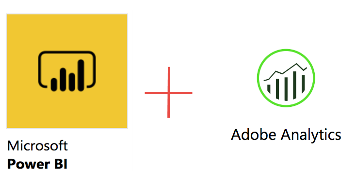
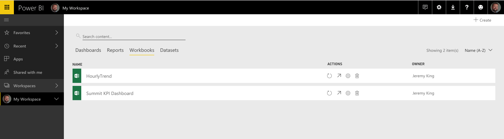
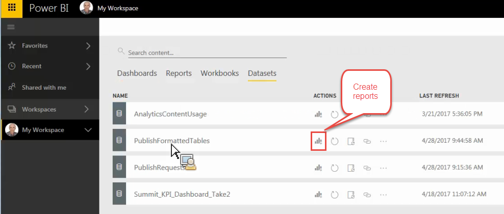

# Pubblicare su Power BI: panoramica

Microsoft Power BI è una suite di dashboard di analisi business per l’analisi dei dati e la condivisione di approfondimenti. L’integrazione di Adobe Analytics con Power BI consente di visualizzare i dati del Report Builder di Analytics all’interno di Microsoft Power BI e di condividerli facilmente in tutta l’organizzazione.

Precedentemente l’analista pianificava la diffusione delle cartelle di lavoro del Report Builder tramite e-mail (o ftp). Ora è possibile consentire agli utenti aziendali interessati di accedere (dall’interno dei loro account Power BI) a dati precisi e aggiornati in un ambiente basato sul web accessibile su più piattaforme e dispositivi.

La combinazione della capacità di generazione rapporti di Report Builder e delle funzionalità di visualizzazione di Power BI rende le informazioni più accessibili per tutti coloro che fanno parte dell’organizzazione. Con Power BI, puoi anche integrare Adobe Analytics con altre origini dati (ad esempio punto vendita, CRM) per scoprire approfondimenti unici sui clienti, associazioni e opportunità.

## Requisiti di sistema {#section_0B71092D853446F38FA36447DAC0D32B}

* Adobe Report Builder 5.5 [installato](/help/analyze/report-builder/setup/t-install-arb.md)
* Account Microsoft attivo che consente di accedere a Power BI

## Pubblica la cartella di lavoro in Power BI {#section_21CA66229EC240D49594A9A7D3FBA687}

Le cartelle di lavoro pianificate sono fogli di calcolo Excel formattati con dati provenienti da Adobe Analytics e inviati regolarmente.

**Pubblica cartella di lavoro in Report Builder**

1. In Report Builder, generare e salvare una cartella di lavoro.
1. Sulla barra degli strumenti del Report Builder, fai clic su **[!UICONTROL Schedule]** > **[!UICONTROL New]**.

1. Nella Pianificazione guidata di base, seleziona la casella accanto a **[!UICONTROL Publish Workbook to Microsoft Power BI]**.

   

1. Specifica l’e-mail e l’invio immediato o specifica la frequenza di pianificazione (oraria, giornaliera, ecc.).
1. Fai clic su **[!UICONTROL OK]** per pubblicare.
1. Ora ti verrà chiesto di accedere al tuo account Microsoft. Immetti le tue credenziali.
1. La cartella di lavoro del Report Builder viene pianificata e pubblicata in Power BI.

   Per ogni istanza pianificata e dopo che il processo di pianificazione del Report Builder ha aggiornato la cartella di lavoro con dati Analytics aggiornati, la cartella di lavoro verrà pubblicata in Microsoft Power BI.

**Visualizza i dati della cartella di lavoro del Report Builder in Power BI**

1. In Power BI, fare doppio clic sulla cartella di lavoro nel menu [!UICONTROL Workbooks].

   

1. È ora possibile visualizzare i dati del dashboard della cartella di lavoro.  

1. È quindi possibile fissare un&#39;area della cartella di lavoro in modo da includerla in una qualsiasi delle dashboard Power BI.

## Pubblica tutte le tabelle formattate nella cartella di lavoro come tabelle di set di dati Power BI {#section_7C54A54E75184DD6BAEF4ACCE241239A}

>[!NOTE]
>
>Se la cartella di lavoro contiene una macro, l&#39;opzione &quot;Pubblica tutte le tabelle formattate nella cartella di lavoro come tabelle di dati Power BI&quot; verrà disabilitata.

Invece di importare l&#39;intera cartella di lavoro, è possibile importare solo il contenuto di tutte le tabelle formattate all&#39;interno della cartella di lavoro.

**Caso** di utilizzo: È disponibile una cartella di lavoro di Excel che richiama dati da più richieste di Report Builder e crea una tabella di riepilogo con molte formule. È possibile importare solo la tabella di riepilogo in Power BI e crearne una visualizzazione.

**Pubblicare una tabella formattata in Report Builder**

1. In Report Builder, genera una tabella di dati che include una riga di intestazione seguita da una riga di dati.
1. Selezionare la tabella e selezionare **[!UICONTROL Format as Table]** dal menu [!UICONTROL Home]. La tabella viene denominata per impostazione predefinita (Tabella 1, Tabella 2, ecc.), ma è possibile modificare il nome nel menu [!UICONTROL Design].

1. Sulla barra degli strumenti del Report Builder, fai clic su **[!UICONTROL Schedule]** > **[!UICONTROL New]**.

1. Nella Pianificazione guidata di base, fare clic su **[!UICONTROL Advanced Scheduling Options]**.
1. Nella scheda [!UICONTROL Scheduling Wizard - Advanced] , seleziona la casella accanto a **[!UICONTROL Publish all Formatted Tables as Power BI dataset tables]** nella scheda **[!UICONTROL Publishing Options]** .

   

1. (Facoltativo) Puoi personalizzare il nome della risorsa pubblicata in Power BI. Questo può essere utile se utilizzi il controllo delle versioni come parte del nome della cartella di lavoro (ad esempio, mycartella di lavoro_v1.1.xlsx) e non desideri che il numero di versione venga visualizzato nel nome della risorsa Power BI pubblicata. Inoltre, la risorsa pubblicata non subirà modifiche se cambia il numero di versione. (Vedi [specifiche](/help/analyze/report-builder/c-publish-power-bi/specifications-limits.md) qui.)

**Visualizza i dati della tabella in Power BI**

1. In Power BI, vai al menu **[!UICONTROL Workspaces]** > **[!UICONTROL Datasets]** .

   

1. Seleziona il set di dati pubblicato e fai clic sull’icona [!UICONTROL Create report] accanto a esso. Le tabelle verranno visualizzate come Campi.

   

1. Selezionare una tabella e le relative colonne associate.

   

1. Dal menu [!UICONTROL Visualizations], puoi selezionare come visualizzare una tabella in Power BI. Ad esempio, puoi scegliere di presentare i dati come grafico a linee:

   

1. Da qui puoi creare visualizzazioni da questa tabella di set di dati.

## Pubblica tutte le richieste di Report Builder come tabelle del set di dati Power BI {#section_0C26057C7DBB4068A643FDD688F6E463}

Puoi trasformare tutte le richieste in tabelle di set di dati e creare visualizzazioni al loro interno.

>[!IMPORTANT]
>
>Se la cartella di lavoro contiene più di 100 richieste, solo le prime 100 richieste verranno pubblicate in Power BI. Inoltre, per ogni richiesta pubblicata su Power BI, verranno pubblicate solo le prime 10.000 righe di dati. Quindi, mentre queste richieste verranno recapitate con successo tramite la pianificazione, l&#39;ambito di pubblicazione su Power BI è limitato.

1. In Report Builder, aprire o creare una cartella di lavoro con richieste di Report Builder.
1. Sulla barra degli strumenti del Report Builder, fai clic su **[!UICONTROL Schedule]** > **[!UICONTROL New]**.

1. Nella Pianificazione guidata di base, fare clic su **[!UICONTROL Advanced Scheduling Options]**.
1. Nella scheda [!UICONTROL Scheduling Wizard - Advanced] , seleziona la casella accanto a **[!UICONTROL Publish all Report Builder Requests as Power BI Dataset Tables]** **[!UICONTROL Publishing Options]**

1. Fai clic su **[!UICONTROL OK]**.

**Visualizza i dati della richiesta in Power BI**

Ogni richiesta di Report Builder pianificata verrà pubblicata come tabella nel set di dati. Ogni tabella di richiesta prende il nome dalla dimensione primaria nella richiesta e ha una [!UICONTROL Report Suite] e una colonna [!UICONTROL Segments].

1. In Power BI, vai al menu **[!UICONTROL Workspaces]** > **[!UICONTROL Datasets]** .

1. Seleziona la richiesta pubblicata e fai clic sull’icona [!UICONTROL Create report] accanto a essa.

   Le richieste vengono visualizzate come tabelle nel menu [!UICONTROL Fields] .

   

   >[!NOTE]
   >
   >Indipendentemente da come hai configurato la richiesta di Report Builder per il layout sul foglio di lavoro (layout pivot, layout personalizzato, alcune colonne invisibili), Report Builder pubblicherà sempre la richiesta nello stesso formato bidimensionale a riga singola di intestazione: Data, Dimension, Metriche, Suite di rapporti, Segmenti.

1. Noterai inoltre che esiste una tabella aggiuntiva denominata **[!UICONTROL Legend]**. Se si toglie una richiesta dal contesto del Report Builder, può essere difficile ricordare cosa significa ogni richiesta. La tabella Legenda ha lo scopo, ad esempio, di mostrarti il nome di ogni richiesta in ID tabella. Puoi anche aggiungere le altre colonne Legenda per ottenere una visualizzazione completa della richiesta.

   

