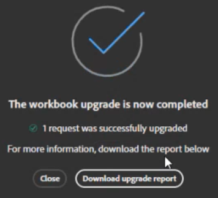

# Conversione di cartelle di lavoro di Report Builder legacy in blocchi di dati

Con il passaggio a una nuova tecnologia di Report Builder, è possibile convertire rapidamente le cartelle di lavoro legacy correnti in cartelle di lavoro basate su JavaScript.

>[!IMPORTANT]
>
>Duplicare ogni cartella di lavoro e rinominare una versione prima di convertirla. In questo modo, se necessario, si disporrà comunque di una copia della cartella di lavoro originale.

>[!VIDEO](https://video.tv.adobe.com/v/3434957/?quality=12&learn=on)

1. Configura il nuovo Report Builder [seguendo queste istruzioni](/help/analyze/report-builder/report-builder-setup.md).

1. Apri Excel e fai clic sull’icona Adobe Report Builder in alto a destra.

1. Fare clic su **[!UICONTROL Login]** e accedere al Report Builder.

1. Il componente aggiuntivo Report Builder rileva se la cartella di lavoro contiene [richieste Report Builder legacy](/help/analyze/legacy-report-builder/home.md).

   

1. Se vengono trovate una o più richieste legacy, fare clic su **[!UICONTROL Upgrade]** per aggiornare una cartella di lavoro.

   >[!NOTE]
   >
   >È necessario aggiornare ogni richiesta singolarmente. Aggiornamento in blocco non supportato.

1. Se si esegue l&#39;aggiornamento, viene visualizzato un avviso che avvisa l&#39;utente delle modifiche apportate alla cartella di lavoro. Viene inoltre richiesto di creare un backup della cartella di lavoro precedente prima di procedere.

   

1. Fare clic su **[!UICONTROL Proceed]** per continuare con l&#39;aggiornamento.

   Se l’aggiornamento ha esito positivo, viene visualizzato il seguente avviso di completamento:

   

1. (Facoltativo) Fare clic su **[!UICONTROL Download upgrade report]**. Questo report contiene lo stato di ogni blocco di dati aggiornato.

Ora puoi [gestire il blocco di dati](/help/analyze/report-builder/manage-reportbuilder.md).

## Funzioni di Report Builder legacy non supportate nel nuovo Report Builder

Quando si confrontano le funzionalità del Report Builder legacy con il nuovo componente aggiuntivo di Report Builder, alcune funzionalità legacy non sono più disponibili:

- Richieste in tempo reale

- Generazione di rapporti percorso/fallout

- Opzione FTP per i rapporti pianificati

- Metriche dei visitatori. Le metriche seguenti verranno tutte convertite in &quot;visitatori univoci&quot;, anche se il risultato del reporting potrebbe non corrispondere esattamente: `visitorshourly`, `visitorsdaily`, `visitorsweekly`, `visitorsmonthly`, `visitorsquarterly` e `visitorsyearly`. Questo vale anche per `mobilevisitorshourly`, `mobilevisitorsdaily`, `mobilevisitorsweekly`, `mobilevisitorsmonthly`, `mobilevisitorsquarterly` e `mobilevisitorsyearly`.
