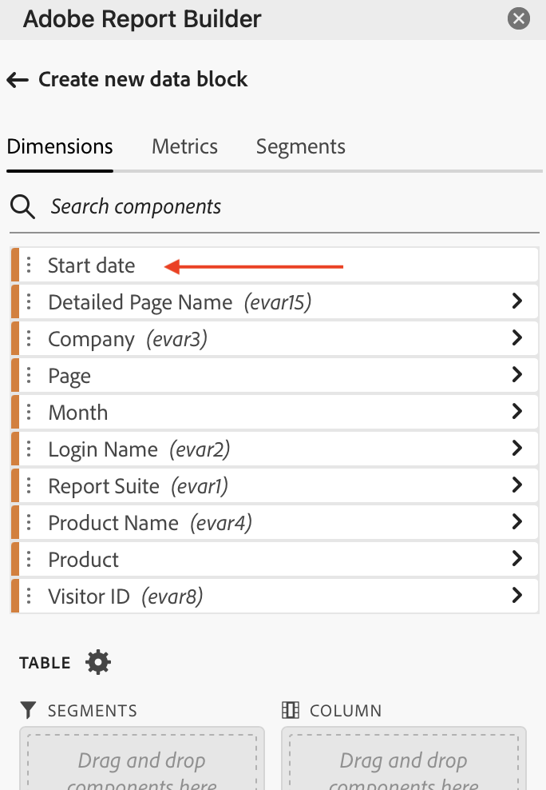

# Creare un blocco di dati

Un *blocco di dati* è la tabella di dati creata da una singola richiesta di dati. Una cartella di lavoro di Report Builder può contenere più blocchi di dati. Quando crei un blocco di dati, configura prima il blocco di dati e quindi lo genera.

## Configurare il blocco di dati

Configura i parametri iniziali dei blocchi di dati per la posizione del blocco di dati, la suite di rapporti e un intervallo di date.

1. Fai clic su **[!UICONTROL Create]**.

   

1. Imposta **[!UICONTROL Data block location]**.

   L&#39;opzione Posizione blocco dati definisce la posizione del foglio di lavoro in cui Report Builder aggiunge i dati al foglio di lavoro.

   Per specificare il percorso del blocco di dati, selezionare una singola cella nel foglio di lavoro e fare clic sull&#39;icona accanto a **[!UICONTROL Data block location]**:

   È inoltre possibile immettere un indirizzo di cella come a3, \\\$a3, a\\\$3 o sheet1!a2. La cella specificata contrassegna l’angolo superiore sinistro del blocco di dati quando questi vengono recuperati.

1. Scegli una **suite di rapporti**.

   L’opzione Suite di rapporti consente di scegliere una suite di rapporti da un menu a discesa o di fare riferimento a una suite di rapporti da una posizione di cella.

1. Imposta **[!UICONTROL Date range]**.

   L’opzione Intervallo date ti consente di scegliere un intervallo di date. Gli intervalli di date possono essere fissi o continui. Per informazioni sulle opzioni dell&#39;intervallo di dati, vedere [Selezionare un intervallo di date](select-date-range.md).

1. Fai clic su **[!UICONTROL Next]**.

   

   Dopo aver configurato il blocco di dati, puoi selezionare dimensioni, metriche e segmenti per crearlo. Le schede Dimension, Metriche e Filtri vengono visualizzate sopra il riquadro Generatore tabella.

## Creare il blocco di dati

Per creare il blocco di dati, seleziona i componenti del rapporto, quindi personalizza il layout.

1. Aggiungere Dimension, metriche e segmenti.

   Scorrere gli elenchi dei componenti o utilizzare il campo **[!UICONTROL Search]** per individuare i componenti. Trascina i componenti nel riquadro Tabella oppure fai doppio clic sul nome di un componente nell’elenco per aggiungerlo automaticamente al riquadro Tabella.

   Fai doppio clic su un componente per aggiungerlo a una sezione predefinita della tabella.

   - I componenti Dimension vengono aggiunti alla sezione Riga o alla sezione Colonna se una dimensione è già presente nelle colonne.
   - I componenti data vengono aggiunti alla sezione Colonna.
   - I componenti del segmento vengono aggiunti alla sezione Segmenti.

   **Data di inizio come Dimension**

   Imposta **[!UICONTROL Start date]** come dimensione per identificare chiaramente la data di inizio del blocco di dati. È utile se disponi di un rapporto pianificato regolarmente con un intervallo di date continuo o se disponi di un intervallo di date non convenzionale e devi essere chiaro sulla data di inizio.

   {width="30%"}

1. Disporre gli elementi nel riquadro Tabella per personalizzare il layout del blocco di dati.

   Trascina i componenti nel riquadro Tabella per riordinarli oppure fai clic con il pulsante destro del mouse sul nome di un componente e scegli dal menu delle opzioni.

   Quando si aggiungono componenti alla tabella, nella posizione del blocco di dati nel foglio di lavoro viene visualizzata un&#39;anteprima del blocco di dati. Il layout dell’anteprima dei blocchi di dati viene aggiornato automaticamente quando aggiungi, sposti o rimuovi elementi nella tabella.

   

   **Visualizzare o nascondere le intestazioni di riga e di colonna**

1. Fai clic sull’icona **[!UICONTROL Table settings]**.

   {width="35%"}

1. Seleziona o deseleziona l’opzione per Visualizzare le intestazioni di riga e colonna. Le intestazioni vengono visualizzate per impostazione predefinita.

   **Nascondi o mostra le etichette delle dimensioni e le intestazioni delle metriche**

1. Fai clic sull’icona dei puntini di sospensione sulle dimensioni o sulle intestazioni di colonna per visualizzare le impostazioni.

   {width="35%"}

1. Fate clic su Nascondi (Hide) o Mostra (Show) per attivare/disattivare le etichette di quota o le intestazioni di colonna. Tutte le etichette sono visualizzate per impostazione predefinita.

1. Fai clic su **[!UICONTROL Finish]**.

   Durante il recupero dei dati di analisi viene visualizzato un messaggio di elaborazione.

   Il Report Builder recupera i dati e visualizza il blocco di dati completato nel foglio di lavoro.

   
