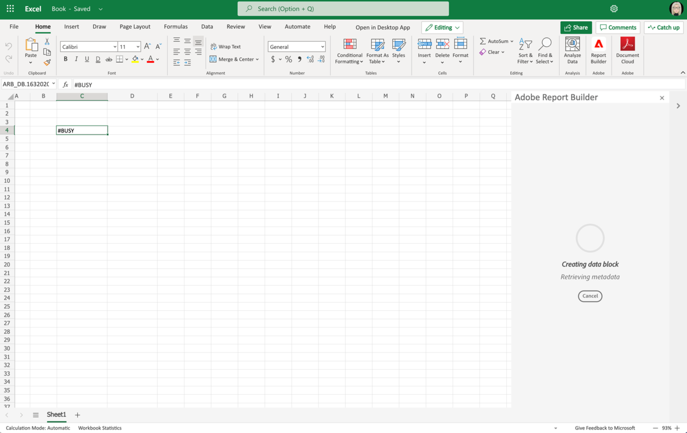
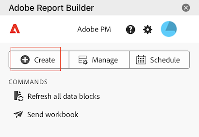

# Creare un blocco di dati

Un *blocco di dati* è la tabella di dati creata da una singola richiesta di dati. Una cartella di lavoro di Report Builder può contenere più blocchi di dati. Quando crei un blocco di dati, configura prima il blocco di dati e quindi lo genera.

## Configurare il blocco di dati

Configura i parametri iniziali dei blocchi di dati per la posizione del blocco di dati, la suite di rapporti e un intervallo di date.

1. Selezionare  **[!UICONTROL Create]**.

   {zoomable="yes"}

1. Imposta **[!UICONTROL Data block location]**.

   L&#39;opzione Posizione blocco dati definisce la posizione del foglio di lavoro in cui Report Builder aggiunge i dati al foglio di lavoro.

   Per specificare il percorso del blocco di dati, selezionare una singola cella nel foglio di lavoro o immettere un indirizzo di cella, ad esempio `a3`, `\\\$a3`, `a\\\$3` o `sheet1!a2`. La cella specificata diventa l&#39;angolo superiore sinistro del blocco di dati quando i dati vengono recuperati.

   Utilizza  per scegliere una posizione di blocco di dati dalla cella selezionata corrente nel foglio.

1. Scegliere **[!UICONTROL Report suites]**.

   L’opzione Suite di rapporti consente di scegliere una suite di rapporti da un menu a discesa o di fare riferimento a una suite di rapporti da una posizione di cella.

   Seleziona  per creare una suite di rapporti da una cella.

1. Imposta **[!UICONTROL Date range]**.

   L&#39;opzione **[!UICONTROL Date range]** consente di scegliere un intervallo di date. Gli intervalli di date possono essere fissi o continui.

   Selezionare **[!UICONTROL Calendar]** per scegliere un intervallo di dati utilizzando  oppure immettere manualmente un intervallo di date. È possibile scegliere un predefinito dal menu a discesa **[!UICONTROL _Predefiniti di ricerca_]**.

   Selezionare **[!UICONTROL From cell]** per definire i dati iniziali e finali in base a una cella del foglio corrente.

   Per informazioni sulle opzioni dell&#39;intervallo di date, vedere [Selezionare un intervallo di date](select-date-range.md).

1. Seleziona **[!UICONTROL Next]**.

   

   Dopo aver configurato il blocco di dati, puoi selezionare dimensioni, metriche e segmenti per crearlo. Le schede **[!UICONTROL Dimensions]**, **[!UICONTROL Metrics]** e **[!UICONTROL Segments]** sono visualizzate sopra il riquadro **[!UICONTROL Table]**.

## Creare il blocco di dati

Per creare il blocco di dati, seleziona i componenti del rapporto, quindi personalizza il layout.

1. Aggiungere **[!UICONTROL Dimensions]**, **[!UICONTROL Metrics]** e **[!UICONTROL Segments]** componenti.

   Scorrere gli elenchi dei componenti o utilizzare il campo  **[!UICONTROL _Cerca componenti_]** per individuare i componenti. Trascinare i componenti nel riquadro [!UICONTROL Table] oppure selezionare due volte il nome di un componente nell&#39;elenco per aggiungerlo al riquadro [!UICONTROL Table].

   Selezionate due volte un componente per aggiungerlo a una sezione di default della tabella.

   - I componenti Dimension vengono aggiunti alla sezione  **[!UICONTROL Row]** o alla sezione  **[!UICONTROL Column]** se è già presente una dimensione nelle colonne.
   - Componenti data aggiunti alla sezione  **[!UICONTROL Column]**.
   - I componenti del segmento vengono aggiunti alla sezione  **[!UICONTROL Segments]**.
   - I componenti delle metriche vengono aggiunti alla sezione  **[!UICONTROL Values]**.

1. Disporre gli elementi nel riquadro Tabella per personalizzare il layout del blocco di dati.

   Trascina e rilascia i componenti all&#39;interno di ogni elenco nel riquadro Tabella per riordinare i componenti o seleziona  e seleziona  Sposta su,  Sposta giù e altro per spostare i componenti all&#39;interno di un elenco.

   Quando si aggiungono componenti alla tabella, nella posizione del blocco di dati nel foglio di lavoro viene visualizzata un&#39;anteprima del blocco di dati. Il layout dell’anteprima dei blocchi di dati viene aggiornato automaticamente quando aggiungi, sposti o rimuovi elementi nella tabella.

   

1. È possibile impostare **[!UICONTROL Start date]** come dimensione per identificare la data di inizio del blocco di dati. L’aggiunta di dati di inizio come dimensione è utile se disponi di un rapporto pianificato regolarmente con un intervallo di date continuo. Oppure, se hai un intervallo di date non convenzionale e devi essere esplicito sulla data di inizio.

   

1. È possibile visualizzare o nascondere le intestazioni di riga e di colonna. A tale scopo, effettua le seguenti operazioni:

   1. Selezionare l&#39;icona **[!UICONTROL Table]** .

      

   1. Selezionare o deselezionare l&#39;opzione per **[!UICONTROL Display row and column headers]**. Le intestazioni vengono visualizzate per impostazione predefinita.

1. Facoltativamente, puoi anche nascondere o mostrare le etichette delle dimensioni e le intestazioni delle metriche. A tale scopo, effettua le seguenti operazioni:

   1. Seleziona  nell&#39;etichetta della dimensione o nell&#39;intestazione della colonna per visualizzare il menu di scelta rapida.

      

   1. Seleziona  **[!UICONTROL Hide]** o  **[!UICONTROL Show]** per attivare/disattivare l&#39;etichetta della dimensione o l&#39;intestazione della colonna. Tutte le etichette sono visualizzate per impostazione predefinita.

1. Seleziona **[!UICONTROL Finish]** per completare la configurazione del blocco di dati.

1. Durante il recupero dei dati di analisi viene visualizzato un messaggio di elaborazione **[!UICONTROL #BUSY]**.

   

1. Report Builder recupera i dati e visualizza il blocco di dati completato nel foglio di lavoro.

   

>[!MORELIKETHIS]
>
>[Seleziona una suite di rapporti](select-report-suite.md)
>[Seleziona un intervallo di date](select-date-range.md)
>[Filtra dimensioni](filter-dimensions.md)
>[Operazioni con i segmenti](work-with-segments.md)
>

<!--

A *data block* is the table of data created by a single data request. A Report Builder workbook can contain multiple data blocks. When you create a data block, first configure the data block and then build the data block.

## Configure the data block

Configure the initial data block parameters for the data block location, report suite, and a date range.

1. Click **[!UICONTROL Create]**.

    

1. Set the **[!UICONTROL Data block location]**.

    The data block location option defines the worksheet location where report builder adds the data to your worksheet.

    To specify the data block location, select a single cell in the worksheet and click the icon next to **[!UICONTROL Data block location]**: 
    
    You can also enter a cell address such as a3, \\\$a3, a\\\$3 or sheet1!a2. The cell specified marks the upper-left corner of the data block when the data is retrieved.

1. Choose a **Report Suite**.

    The report suites option allows you to choose a report suite from a drop-down menu or to reference a report suite from a cell location.

1. Set the **[!UICONTROL Date range]**.

    The Date range option allows you to choose a date range. Date ranges may be fixed or rolling. For information about data range options, see [Select a Date Range](select-date-range.md).

1. Click **[!UICONTROL Next]**.

    

    After you configure the data block, you can select dimensions, metrics, and segments to build your data block. The Dimensions, Metrics, and Filters tabs are displayed above the Table builder pane.

## Build the data block

To build the data block, select report components, and then customize the layout.

1. Add Dimensions, Metrics, and Segments.

    Scroll the component lists or use the **[!UICONTROL Search]** field to locate components. Drag and drop components to the Table pane or double-click a component name in the list to automatically add the component to the Table pane.

    Double-click a component to add it to a default section of the table.

    - Dimension components are added to the Row section or to the Column section if you have a dimension already in the columns.
    - Date components are added to the Column section.
    - Segment components are added to the Segments section.

    **Start date as a Dimension**

    Set the **[!UICONTROL Start date]** as a dimension to clearly identify the start date of your data block. This is helpful if you have a regularly scheduled report that has a rolling date range or if you have an unconventional date range and you need to be clear on the start date.

    {width="30%"}

1. Arrange the items in the Table pane to customize the layout of your data block.

    Drag and drop components in the Table pane to reorder components or right-click a component name and select from the options menu.

    When you add components to the table, a preview of the data block is displayed at the Data block location in the worksheet. The layout of the data block preview automatically updates as you add, move, or remove items in the table.

    

    **Display or hide row and column headers**

1. Click the **[!UICONTROL Table settings]** icon.

    {width="35%"}

1. Check or uncheck the option to Display row and column headers. The headers are displayed by default.

    **Hide or show dimension labels and metric headers**

1. Click the ellipsis icon on either the dimensions or the column headers to display the settings.

    {width="35%"}

1. Click Hide or Show to toggle the dimension labels or column headers. All labels are displayed by default.

1. Click **[!UICONTROL Finish]**.

    A processing message is displayed while the analytics data is retrieved.

    Report Builder retrieves the data and displays the completed data block in the worksheet.

    

-->