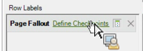

# Filtrare un rapporto di fallout mediante la Creazione guidata richieste

Descrive i passaggi necessari per applicare filtri a un rapporto di abbandono.

Questo esempio mostra il rapporto Abbandono pagina .

1. In Adobe Report Builder, fai clic su **[!UICONTROL Create]** per aprire la Creazione guidata richieste.
1. Seleziona la suite di rapporti giusta.
1. Nella vista struttura a sinistra, selezionare **[!UICONTROL Paths]** > **[!UICONTROL Page]** > **[!UICONTROL Page Fallout]**.

   

1. Configura gli intervalli di date [appropriati](/help/analyze/report-builder/data-requests/configuring-report-dates/custom-calendar.md).
1. Fai clic su **[!UICONTROL Next]**.
1. Nel passaggio 2 della procedura guidata, in **[!UICONTROL Row Labels]** fare clic sul collegamento **[!UICONTROL Define Checkpoints]**. In un rapporto di abbandono, è sempre necessario definire elementi di percorso, a differenza di un rapporto di percorso, in cui un pattern viene preapplicato.

   

1. Seleziona l&#39;opzione **[!UICONTROL Filter]**.

1. Nella finestra di dialogo **[!UICONTROL Define Site Section Fallout Checkpoints]**, definisci i punti di controllo da un intervallo di celle o da un elenco. Quindi fai clic su **[!UICONTROL OK]**.
1. Decidi se scegliere da un intervallo di celle o da un elenco.
1. Se selezioni da un elenco, fai clic su **[!UICONTROL Add]** per selezionare i punti di controllo da aggiungere al percorso di abbandono. Puoi definire tra 3 e 8 punti di controllo. (Cerca gli elementi disponibili facendo clic su **[!UICONTROL More]**.)

   Per ulteriori informazioni sul miglioramento del filtro, consulta [Dimension di filtro](/help/analyze/report-builder/layout/c-filter-dimensions/filter-dimensions.md). 1. Sposta **[!UICONTROL Available Elements]** dalla colonna di sinistra a destra selezionandoli e facendo clic sulla freccia arancione.
1. Fai clic tre volte su **[!UICONTROL OK]**, quindi fai clic su **[!UICONTROL Finish]**.

   Il rapporto dovrebbe essere aggiornato ora.
