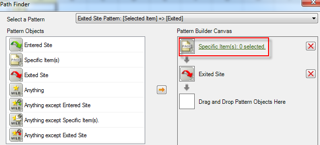

# Filtrare un rapporto di percorso mediante la Creazione guidata richieste

Descrive i passaggi necessari per applicare filtri a un rapporto di percorsi.

In questo esempio vengono utilizzati i percorsi della sezione del sito.

1. In Adobe Report Builder, fai clic su **[!UICONTROL Create]** per aprire la Creazione guidata richieste.
1. Seleziona la suite di rapporti giusta.
1. Nella vista struttura a sinistra, selezionare **[!UICONTROL Paths]** > **[!UICONTROL Site Sections]** > **[!UICONTROL Site Section Paths]**.

   

1. Specifica le date appropriate.
1. Fai clic su **[!UICONTROL Next]**.
1. Nel passaggio 2 della procedura guidata, in **[!UICONTROL Row Labels]** fare clic sul collegamento **[!UICONTROL Top 1-10 (pattern applied)]**. In un rapporto di percorso, un pattern viene applicato per impostazione predefinita.

   

1. Seleziona l&#39;opzione **[!UICONTROL Filter]**.

   

1. Nella finestra di dialogo **[!UICONTROL Define 'Site Section Paths' Path Pattern]**, puoi specificare
   1. il grado iniziale del primo rapporto.
   1. il numero di voci da visualizzare nel rapporto.
1. Fare clic su **[!UICONTROL Edit]** per definire un pattern di percorso.
1. Se desideri un pattern personalizzato, trascina e rilascia qualsiasi elemento **[!UICONTROL Pattern Objects]** dall’elenco a sinistra nella sezione **[!UICONTROL Pattern Build Canvas]** a destra.

   

1. È inoltre possibile selezionare un pattern predefinito dall’elenco a discesa **[!UICONTROL Select a Pattern]** e modificarlo. Di seguito sono riportati i pattern disponibili:

   

   Alcuni di questi pattern sono specifici per Report Builder: Pattern articolo successivo del percorso di ingresso, Pattern articolo precedente del percorso di uscita, Pattern articolo successivo.
1. Per modificare un pattern predefinito, procedere come segue.
   1. Selezionala. Ad esempio, seleziona **[!UICONTROL Exited Site Pattern]**: 

   1. Ora è necessario definire il percorso della sezione del sito che l’utente segue prima di uscire. Fai clic su **[!UICONTROL Specific Item(s): 0 selected]**. Puoi definire questo percorso selezionando da un intervallo di celle (se modifichi una richiesta esistente) o selezionando da un elenco di sezioni.
   1. Per selezionare da un intervallo di celle di una richiesta precedente, selezionare **[!UICONTROL From range of cells]** e fare clic sull&#39;icona del selettore di celle. Quindi scegli le celle dal rapporto. 

   1. Per selezionare da un elenco di sezioni del sito, selezionare **[!UICONTROL From list]** e fare clic su **[!UICONTROL Add]**.
   1. Spostare gli elementi dalla colonna **[!UICONTROL Available Elements]** alla colonna **[!UICONTROL Selected Elements]** selezionandoli e facendo clic sulla freccia arancione. Fare clic su **[!UICONTROL OK]**. 

   1. Per salvare il pattern appena stabilito, fare clic su **[!UICONTROL Save]**.
   1. Fare clic tre volte su **[!UICONTROL OK]**, quindi fare clic su **[!UICONTROL Finish]**. Viene ora generata la richiesta di percorso filtrato.
