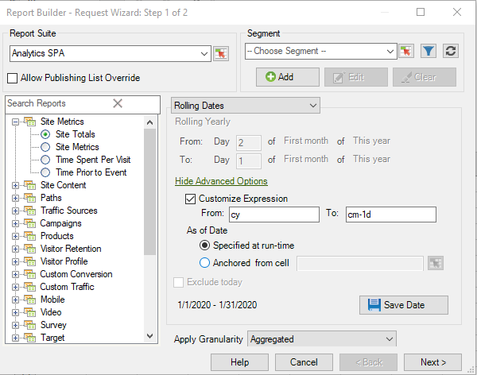

# Espressioni data personalizzate: panoramica

È possibile specificare un intervallo di date complesso creando un&#39;espressione personalizzata.

È consigliabile fare riferimento a un calendario durante la creazione di espressioni per specificare correttamente il numero di settimane e giorni. Excel dispone di diverse funzioni integrate che consentono di calcolare il numero di giorni, giorni lavorativi, mesi e anni tra le date. È possibile utilizzare queste funzioni nelle formule per calcolare altri intervalli, ad esempio settimane e trimestri.

**Attivazione di espressioni personalizzate**

1. In [!UICONTROL Request Wizard: Step 1], invece di utilizzare &quot;Date predefinite&quot;, selezionate **[!UICONTROL Rolling Dates]**. Notate come cambiano le opzioni riportate di seguito.

   

1. Passate a settimanale, mensile, trimestrale o annuale.
1. Per ulteriori opzioni di personalizzazione, fate clic su **[!UICONTROL Show Advanced Options]**. Selezionando le opzioni nella sezione superiore, è possibile visualizzare facilmente la sintassi delle espressioni di data personalizzate.

   

1. Abilita **[!UICONTROL Customize Expression]**. Selezionando le opzioni in **[!UICONTROL Rolling Dates]**, è possibile visualizzare facilmente la sintassi delle espressioni di data personalizzate.

   

   È possibile utilizzare Opzioni avanzate per combinare e far corrispondere espressioni di data personalizzate. Ad esempio, se si desidera visualizzare i dati dal primo dell&#39;anno alla fine dell&#39;ultimo mese completo, è possibile scrivere quanto segue:Da: cy To: cm-1d. Potete vedere che nella procedura guidata vengono confermate le date indicate come 1/1/2020-1/31/2020.

   Ad esempio, se modificate le date sopra in modo che scorrano mensilmente dal primo giorno di tre mesi fa al primo giorno di questo mese, le date nella porzione Opzioni anticipo si aggiornano automaticamente per riflettere quanto segue:

   

