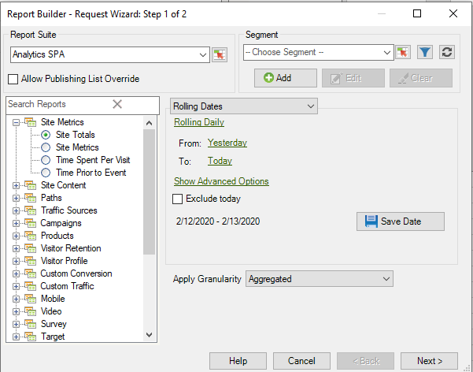

# Espressioni data personalizzate: panoramica

Puoi specificare un intervallo di date complesso creando un’espressione personalizzata.

È consigliabile fare riferimento a un calendario durante la creazione di espressioni al fine di specificare correttamente il numero di settimane e giorni. Excel dispone di diverse funzioni integrate che consentono di calcolare il numero di giorni, giorni lavorativi, mesi e anni tra le date. È possibile utilizzare queste funzioni nelle formule per calcolare altri intervalli, ad esempio settimane e trimestri.

**Per abilitare espressioni personalizzate**

Questo è un esempio che utilizza **[!UICONTROL Rolling Dates]**.

1. In [!UICONTROL Request Wizard: Step 1], invece di utilizzare **[!UICONTROL Preset Dates]**, selezionare **[!UICONTROL Rolling Dates]**.

   

1. Passa a settimanale, mensile, trimestrale o annuale. Osserva come cambiano le opzioni riportate di seguito.
1. Per ulteriori opzioni di personalizzazione, fai clic su **[!UICONTROL Show Advanced Options]**.

   

1. Ad esempio, se modifichi le date di cui sopra in continuo mensile dal primo giorno tre mesi fa al primo giorno di questo mese, le date nella porzione Opzioni anticipo si aggiornano per riflettere che:

   

1. Abilita **[!UICONTROL Customize Expression]**. Selezionando le opzioni in **[!UICONTROL Rolling Dates]**, è possibile visualizzare facilmente la sintassi per le espressioni data personalizzate.

   

   È possibile utilizzare Opzioni avanzate per combinare e abbinare espressioni di data personalizzate. Ad esempio, se desideri visualizzare i dati dal primo dell’anno alla fine dell’ultimo mese completo, puoi immettere quanto segue: `From: cy` `To: cm-1d`. Nella procedura guidata, tali date sono visualizzate come 01/01/2020-1/31/2020.
