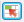

# Gestire segmenti

Aggiungere, modificare, applicare e filtrare i segmenti Adobe Analytics nel Report Builder.

Il Report Builder dispone di un pannello di segmentazione nel passaggio 1 della Creazione guidata richieste che consente di creare e gestire i segmenti.

## Aggiungere o modificare segmenti {#section_B2BC136F9A53498D90C7C2ECC5DB892B}

>[!NOTE]
>
>Per aggiungere o modificare segmenti, l’interfaccia dei segmenti di Report Builder avvia il generatore di segmenti di Analytics in una finestra di Microsoft Internet Explorer. La sessione di Report Builder rimarrà attiva. Per questa operazione non sono supportati browser diversi da Internet Explorer.

1. Nel pannello dei segmenti del passaggio 1 della Creazione guidata richieste fare clic su **[!UICONTROL Add]**.
1. Viene avviata una finestra di Internet Explorer che apre l’interfaccia di Generatore di segmenti di Analytics. Per informazioni su come generare i segmenti, consulta [Segmentazione di Analytics](https://docs.adobe.com/content/help/it-IT/analytics/components/segmentation/seg-home.html).
1. Dopo aver definito e salvato il segmento, tornare alla Creazione guidata richieste.
1. Fai clic sull’icona Aggiorna per aggiornare l’elenco dei segmenti.

>[!IMPORTANT]
>
>Questo elenco è memorizzato nella cache e il segmento appena creato non verrà visualizzato a meno che non si esegua un aggiornamento.

## Creare segmenti nel contesto {#section_6DD2C663B2854469AA1075438F907678}

Puoi avere combinazioni specifiche di dimensioni di report da trasformare in un segmento. Puoi creare questi segmenti dall’interfaccia di Report Builder. Ad esempio, seleziona alcune pagine da un output di richiesta di pagina e crea un segmento in base a questi valori.

1. Seleziona gli elementi di output del report da trasformare in un segmento.
1. Fai clic con il pulsante destro del mouse per selezionare **[!UICONTROL Create In-Context Segment in]** e specificare il contenitore destro (Contenitore di hit, Contenitore visite, Contenitore visitatori).

   

   Per ulteriori informazioni sui contenitori, consulta la [Guida alla segmentazione](https://docs.adobe.com/content/help/en/analytics/components/segmentation/seg-home.html).

1. L’interfaccia utente del Generatore di segmenti verrà ora avviata in Internet Explorer. L’interfaccia utente del Generatore di segmenti viene inizializzata con il contenitore e il filtro specificati.
1. Dopo aver aggiunto un nome e una descrizione al segmento, salvalo.
1. Torna a Report Builder e fai clic sull’icona Aggiorna per aggiornare l’elenco dei segmenti.
1. Ora puoi applicare questo segmento.

## Cercare e applicare segmenti {#section_CACA269B48E94CFD91C2D5A15E9C77B7}

Tutti i segmenti creati in Reports &amp; Analytics, Report Builder o Data Warehouse vengono visualizzati in questo elenco di segmenti. Per aggiornare l’elenco, fai clic sull’icona Aggiorna ( .

Puoi applicare uno o più segmenti a una determinata richiesta. Ciò include segmenti sequenziali.

1. Passa all’elenco a discesa **[!UICONTROL Segment]** e fai clic sulla freccia rivolta verso il basso nella casella **[!UICONTROL Choose Segment]** per visualizzare tutti i segmenti.

   

1. Seleziona i segmenti che desideri applicare.

>[!NOTE]
>
>Che tu sia un amministratore o un non amministratore, nel Report Builder puoi visualizzare solo i segmenti di tua proprietà e quelli che sono stati condivisi con te. Nell’interfaccia utente di Marketing Reports &amp; Analytics, l’amministratore può visualizzare tutti i segmenti dell’organizzazione.

## Filtrare segmenti {#section_376E986D3E684999A7CDB08E53854159}

**** Filtrare i segmenti facendo clic sull’icona Filtro :   

I filtri disponibili includono:

| Nome filtro | Descrizione |
|---|---|
| Tag | Consente di filtrare i segmenti con tag specifici. I filtri di tag utilizzano l’operatore AND. Se controlli due tag, il riquadro a destra mostra i segmenti ai quali sono stati assegnati tag **due tag**. |
| Proprietari | Consente di filtrare i segmenti in base al proprietario. I filtri Proprietari utilizzano l’operatore OR. Se selezioni due proprietari, il riquadro a destra mostra i segmenti di proprietà del proprietario **o**. |
| Altri filtri > Solo *nome della suite di rapporti* | Se applichi il filtro &quot;Solo *nome della suite di rapporti*&quot; nel Generatore di segmenti in [!DNL marketing reports & analytics] e quindi visualizzi il Filtro avanzato in [!DNL report builder], il filtro Avanzate visualizzerà il segmento solo per la suite di rapporti selezionata. |
| Altri filtri > Personali | Mostra tutti i segmenti di tua proprietà. |
| Altri filtri > Condivisi con me | Mostra tutti i segmenti che altri utenti hanno condiviso con te. |
| Altri filtri > Preferiti | Mostra tutti i segmenti contrassegnati come Preferiti. |
| Altri filtri > Approvati | Mostra tutti i segmenti approvati ufficialmente. |

## Aggiungi un controllo di segmento a una cartella di lavoro {#section_E3E5149A8464441FA5445A98DBD520AC}

L’aggiunta di un controllo segmenti consente di cambiare i segmenti all’interno di una cartella di lavoro anziché passare alla Creazione guidata richieste.

1. Fai clic sull’icona Controllo ( ) accanto al menu a discesa del segmento.

   

1. Controlla tutti i segmenti che vuoi visualizzare nel controllo dei segmenti o seleziona **[!UICONTROL Select All]**.
1. Osserva l’opzione **[!UICONTROL Automatically refresh linked requests upon item selection]**.

   * Se questa opzione è selezionata, vengono aggiornate tutte le richieste che utilizzano questo controllo.
   * Se non è selezionato, i parametri di richiesta associati vengono aggiornati, ma le richieste non vengono aggiornate.

1. Specificare la posizione della cella in alto a sinistra del controllo del segmento.
1. Fare clic su **[!UICONTROL OK]** per visualizzare il controllo del segmento nella posizione specificata.

   

## Aggiorna l’elenco dei segmenti {#section_22E4A86789444B4A998532396B476EFB}

Ogni volta che aggiungi un nuovo segmento o ne modifichi uno esistente, fai clic sull’icona Aggiorna ( ) per aggiornare l’elenco dei segmenti nella cache.

## Gestire i segmenti tra le richieste {#section_C3D63FCBE1A94369A319243313B03C93}

Prima della versione 5.4, il Report Builder consente agli utenti di modificare i segmenti su più richieste. Tuttavia, questo processo ha sempre sostituito i segmenti esistenti. Gli utenti che volevano aggiungere un nuovo segmento a ogni richiesta non potevano farlo, poiché l’aggiunta del segmento rimuoverebbe il set precedente di segmenti già assegnati a ogni richiesta.

Il Report Builder 5.4 consente di aggiungere, rimuovere e sostituire tutti i segmenti all’interno di più richieste:

1. Selezionare più richieste in una cartella di lavoro.
1. Fai clic con il pulsante destro del mouse e seleziona **[!UICONTROL Edit Requests]** > **[!UICONTROL By Segment]**.

   

1. Nella finestra di dialogo Modifica gruppo selezionare una delle quattro opzioni seguenti:

   | Opzione | Descrizione |
   |---|---|
   | Add Segmento | Consente di scegliere uno o più segmenti da aggiungere all’elenco dei segmenti correnti. |
   | Sostituisci segmenti | Consente di scegliere i segmenti da sostituire con uno o più segmenti. |
   | Sostituisci tutti i segmenti per | Consente di scegliere uno o più segmenti con cui sostituire i segmenti correnti. |
   | Rimuovi segmenti | Consente di rimuovere segmenti dalle richieste. |

