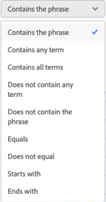
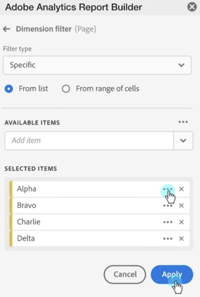

# Dimensioni filtro

Per impostazione predefinita, ogni elemento dimensione nella tabella restituisce i primi 10 elementi per tale dimensione.

Per modificare gli elementi dimensionali restituiti per ogni dimensione:

1. Seleziona una cella nel blocco di dati.

1. Selezionare  **[!UICONTROL Edit data block]** nel pannello **[!UICONTROL Commands]**.

1. Selezionare **[!UICONTROL Next]** per visualizzare la scheda **[!UICONTROL Dimensions]**.

1. Seleziona  accanto al nome di un componente nella tabella.

   {zoomable="yes"}

1. Selezionare **[!UICONTROL Filter dimension]** nel menu popup per visualizzare il riquadro **[!UICONTROL Filter dimension]**.

1. Seleziona **Most popular** o **Specific** come **[!UICONTROL Type]**.

   {zoomable="yes"}

1. Selezionare le opzioni appropriate in base al tipo di filtro [selezionato](#filter-type).

1. Selezionare **[!UICONTROL Apply]** per aggiungere il filtro.

1. In Report Builder viene visualizzata la conferma del filtro aggiunto.

Per visualizzare i filtri applicati, passa il puntatore su una dimensione. Le dimensioni con filtri applicati visualizzano un&#39;icona di filtro  accanto al nome della dimensione.

## Modificare il filtro e l’ordinamento

Accanto alla metrica utilizzata per filtrare e ordinare il blocco di dati viene visualizzato un  o . La direzione della freccia indica se la metrica è in ordine crescente o decrescente.

Per modificare l&#39;ordinamento:

- Seleziona  o  accanto alla metrica per attivare/disattivare l&#39;ordinamento.

Per modificare la metrica utilizzata per filtrare e ordinare il blocco di dati:

1. Passa il puntatore sul componente di metrica desiderato nel generatore di tabelle per visualizzare altre opzioni.

2. Selezionare  per la metrica preferita.

   {zoomable="yes"}

## Tipo di filtro

Esistono due modi per filtrare gli elementi dimensionali: [Most popular](#most-popular) e [Specific](#specific-filtering)

### **[!UICONTROL Most popular]**

L&#39;opzione **[!UICONTROL Most popular]** consente di filtrare dinamicamente gli elementi dimensionali in base ai valori delle metriche. Most popular (Più popolari) restituisce gli elementi dimensionali con classificazione più elevata in base ai valori delle metriche. Per impostazione predefinita, sono elencati i primi 10 elementi dimensione, ordinati in base alla prima metrica aggiunta al blocco di dati.

{zoomable="yes"}

#### Opzioni Page (Pagina) e Rows (Righe)

Utilizzare i campi **[!UICONTROL Page]** e **[!UICONTROL Rows]** per suddividere i dati in pagine o gruppi sequenziali. Questa funzione consente di inserire nel rapporto valori di riga diversi dai primi valori. Ed è particolarmente utile per richiamare dati oltre il limite di 50.000 righe.

L&#39;impostazione predefinita per la pagina è `1` e per le righe è `10`. Queste impostazioni predefinite implicano che ogni pagina abbia 10 righe di dati. La pagina 1 restituisce i primi 10 elementi, la pagina 2 restituisce i successivi 10 elementi e così via.

La tabella seguente riporta alcuni esempi di valori di pagina e riga e dell’output risultante.

| Pagina | Riga | Output |
|------|--------|----------------------|
| 1 | 10 | Primi 10 elementi |
| 2 | 10 | Elementi da 11 a 20 |
| 1 | 100 | Primi 100 elementi |
| 2 | 100 | Elementi da 101 a 200 |
| 2 | 50.000 | Elementi da 50.001 a 100.000 |

Nella tabella seguente sono elencati i valori minimo e massimo per pagina e righe.

|       | Valori minimi | Valori massimi |
|-------|---------------:|---------------:|
| Pagina iniziale | 1 | 50 milioni |
| Numero di righe | 1 | 50.000 |

#### Includi “Nessun valore“

In Customer Journey Analytics, alcune dimensioni raccolgono una voce *Nessun valore*. L&#39;impostazione **[!UICONTROL Include "No value"]** consente di escludere questi valori dai report. Ad esempio, puoi creare una classificazione “Nome prodotto” in base al codice SKU del prodotto. Se uno SKU di prodotto specifico non è stato impostato con la relativa classificazione Nome prodotto specifica, il relativo valore Nome prodotto è impostato su *Nessun valore*.

**[!UICONTROL Include "No value"]** è selezionato per impostazione predefinita. Per escludere le voci prive di valore, deseleziona questa opzione.

#### Filtrare per criterio

Puoi filtrare gli elementi dimensione che soddisfano o meno tutti i criteri o qualsiasi criterio.

Per impostare i criteri di filtro:

1. Seleziona un operatore dal menu a discesa operatore. Per impostazione predefinita **[!UICONTROL Contains the phrase]** è selezionato

   {zoomable="yes"}

1. Immettere un termine di ricerca.

1. Seleziona  **[!UICONTROL Add row]** per confermare la selezione e aggiungere un altro elemento di criteri.

1. Selezionare  per rimuovere un elemento di criteri.

Puoi includere fino a 10 elementi di criteri.

### **[!UICONTROL  Specific]**

L&#39;opzione **[!UICONTROL Specific]** consente di creare un elenco fisso di elementi dimensionali per ogni dimensione. Utilizza il tipo di filtro **[!UICONTROL Specific]** per specificare gli elementi dimensionali esatti da includere nel filtro. Puoi selezionare gli elementi da un elenco o da un intervallo di celle.

{zoomable="yes"}

#### From list (Da elenco)

1. Selezionare l&#39;opzione **[!UICONTROL From list]** per cercare e selezionare gli elementi dimensione.

   Quando selezioni l&#39;opzione **From list**, l&#39;elenco **[!UICONTROL Dimension items]** viene compilato con elementi dimensionali ordinati per numero di eventi.

   {zoomable="yes"}

1. Immetti un termine di ricerca in  **[!UICONTROL _Aggiungi elemento_]** per eseguire la ricerca nell&#39;elenco.

1. Per cercare un elemento non incluso negli ultimi 90 giorni di dati, selezionare **[!UICONTROL Show items for the last 6 months]** per estendere la ricerca. Dopo il caricamento dei dati degli ultimi 6 mesi, Report Builder aggiorna il collegamento a **[!UICONTROL Show items for last 18 months]**.

1. Per eliminare un elemento dall&#39;elenco **[!UICONTROL Selected items]**, selezionare .

1. Per spostare un elemento nell&#39;elenco **[!UICONTROL Selected items]**, trascinare e rilasciare l&#39;elemento oppure selezionare  per visualizzare il menu di scelta rapida e selezionare le opzioni di spostamento.

1. Seleziona **[!UICONTROL Apply]**.

Report Builder aggiorna l’elenco in base al filtro specifico applicato.

#### From range of cells (Da intervallo di celle)

Selezionare l&#39;opzione **From range of cells** per scegliere un intervallo di celle contenente l&#39;elenco degli elementi delle dimensioni da trovare.

{zoomable="yes"}

Quando selezioni un intervallo di celle, considera le seguenti restrizioni:

- L’intervallo deve avere almeno una cella.
- L’intervallo non può avere più di 50.000 celle.
- L’intervallo deve trovarsi in una singola riga o colonna ininterrotta.

La selezione può contenere celle vuote o con valori che non corrispondono a un elemento dimensione specifico.

### Filtrare rapidamente una dimensione

Per filtrare una dimensione per la quale al momento non è applicato alcun filtro:

1. Selezionare  per una dimensione. Ad esempio: **[!UICONTROL Interaction channel]**.

1. Seleziona due volte gli elementi dimensione da aggiungere al filtro. In alternativa, seleziona uno o più elementi dimensione e trascina la selezione nella sezione  **[!UICONTROL Row]**.

   {zoomable="yes"}

<!--

By default, each dimension item in the table returns the top 10 items for that dimension.

To change the dimension items returned for each dimension

1. Click **[!UICONTROL Manage]** and select a data block from the list.

   

1. Click **[!UICONTROL Edit data block]** in the COMMANDS panel.

1. Click **[!UICONTROL Next]** to display the Dimensions tab.

1. Click the **...** icon next to a component name in the table.

    

1. Select **[!UICONTROL Filter dimension]** in the pop-up menu to display the **[!UICONTROL Filter dimension]** pane.

1. Select **[!UICONTROL Most popular]** or **[!UICONTROL Specific]**.

    

1. Select appropriate options based on the filter type chosen.

1. Click **[!UICONTROL Apply]** to add the filter.

    Report Builder displays a notification to confirm the added filter.

To display applied filters, hover over a dimension. Dimensions with applied filters display a filter icon to the right of the Dimension name.

## Filter Type

There are two ways to filter dimension items: Most popular and Specific.

## Most popular

The [!UICONTROL Most popular] option allows you to dynamically filter dimension items based on metric values. [!UICONTROL Most popular] filtering returns the highest ranked dimension items based on metric values. By default, the first 10 dimensions items are listed, sorted by the first metric added to the data block.

 

### Page and Rows options

Use the **Page** and **Rows** fields to divide data into sequential groups or pages. This allows you to pull ranked row values other than the top-most values into your report. This feature is especially useful for pulling data beyond the 50,000 row limit.

#### Page and Rows defaults

- Page = 1
- Rows = 10

The Page and Rows default settings identify that each page has 10 rows of data. Page 1 returns the top 10 items, page 2 returns the next 10 items, and so on.

The table below lists examples of page and row values and the resulting output.

| Page | Row    | Output               |
|------|--------|----------------------|
| 1    | 10     | Top 10 items         |
| 2    | 10     | Items 11-20          |
| 1    | 100    | Top 100 items        |
| 2    | 100    | Items 101-200        |
| 2    | 50,000 | Items 50,001-100,000 |

#### Minimum and maximum values

- Starting page: Min = 1, Max: 50 million
- Number of rows: Min = 1, Max: 50,000

### Include "No value"

In Adobe Analytics, some dimensions collect a "no value" entry. This filter allows you to exclude these values from reports. For example, you can create a classification such as the Product Name classification based on the Product SKU key. If a specific product SKU has not been set up with its specific Product Name classification, its Product Name value is set to "no value".

Include "**No value**" is selected by default. Deselect this option to exclude entries with no value.

### Filter by Criteria

You can filter dimension items based on whether all criteria are met or if any criteria are met.

To set filtering criteria

1. Select an operator from the drop-down list.

    

1. Enter a value into the search field.

1. Click **[!UICONTROL Add row]** to confirm the selection and add another criteria item.

1. Click the delete icon to remove a criteria item.

    You can include up to 10 criteria items.

### Change the filter and sort order

An arrow appears next to the metric used to filter and sort the data block. The direction of the arrow indicates whether the metric is sorted greatest to least or least to greatest.

To change the sort direction, click the arrow next to the metric.

To change the metric used to filter and sort the data block,

1. Hover over the desired metric component in the Table builder to display additional options.

2. Click the arrow on the preferred metric.

   

## Specific filtering

The Specific option allows you to create a fixed list of dimension items for each dimension. Use the **[!UICONTROL Specific]** filtering type to specify the exact dimension items to include in your filter. You can select items from a list or from a range of cells.

### From list

1. Select the **[!UICONTROL From list]** option to search for and select dimension items.

    When you select the **[!UICONTROL From list]** option, the list is populated with dimension items with the most events first.

    

    The **[!UICONTROL Available items]** list is ordered from dimension items with the most events to those with the least.

1. Enter a search term in the **[!UICONTROL Add item]** field to search the list.

1. To search for an item not included in the last 90 days of data, click **[!UICONTROL Show items for the last 6 months]** to extend the search.

    

    After data from the past 6 months loads, Report Builder updates the link to **[!UICONTROL Show items for last 18 months]**.

1. Select a dimension item.

    Selected dimension items are automatically added to the **[!UICONTROL Selected items]** list.

    

    To delete an item from the list, click the delete icon to remove the item from the list.

    To move an item in the list, drag and drop the item or click ... to display the move menu.

    

1. Click **[!UICONTROL Apply]**

    Report Builder updates the list to show the specific filtering you applied.

### From range of cells

Select the **[!UICONTROL From range of cells]** option to choose a range of cell that contain the list of dimensions items to match.

 

When you select a range of cells, consider the following restrictions:

- The range must have at least one cell.
- The range can't have more than 50,000 cells.
- The range must be in a single uninterrupted row, or column.

Your selection can contain empty cells or cells with values that don't match with a specific dimension item.

### From the Dimensions tab in the Table builder

From the **[!UICONTROL Dimensions]** tab, click the chevron icon next to a dimension name to view the list of dimension items.

 

You can drag and drop items onto the **[!UICONTROL Table]** or double-click an item name to add it to the **[!UICONTROL Table]** builder.

-->