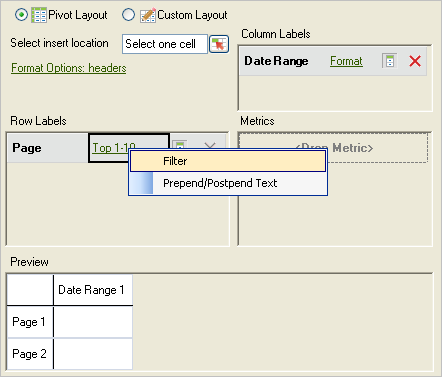

# Filtraggio più comune

Filtri di classificazione e filtri condizionali configurati utilizzando la logica booleana con espressioni di ricerca AND/OR.

I filtri più comuni sono filtri di espressione configurati utilizzando la logica booleana con condizioni AND/OR, ad esempio [!UICONTROL Page does not contain]*`<product name>`*con condizioni o gruppi di condizioni come [!UICONTROL Includes All], [!UICONTROL Includes Any] o [!UICONTROL Excludes All]. È possibile [salvare](/help/analyze/report-builder/layout/c-filter-dimensions/saved-filters.md) queste espressioni per altre richieste in questa cartella di lavoro o in altre cartelle di lavoro.

**Per creare un filtro più popolare**

1. Crea o modifica una richiesta e passa a [!UICONTROL Request Wizard: Step 2].

   

1. In [!UICONTROL Request Wizard: Step 2], fai clic sul collegamento accanto alla dimensione nella griglia, quindi scegli **[!UICONTROL Filter]**.
1. Nel modulo [!UICONTROL Choose Page], abilita **[!UICONTROL Most Popular]**, quindi configura le seguenti opzioni:

   **Classificazione iniziale:** la classificazione iniziale di una dimensione. Una classificazione predefinita pari a 1 indica la voce principale nell’elenco dei dati segnalati. Ad esempio, per la dimensione [!UICONTROL Page], un segno iniziale pari a 1 indica la singola pagina del sito più richiesta. Puoi specificare 10 o un altro valore come cella di rango iniziale, in modo da generare un rapporto che inizia con 10 come la cella di rango più alta. Le metriche sono organizzate in ordine decrescente, in modo che le voci con l’attività maggiore vengano riportate per prime nell’elenco. Se in una richiesta sono necessari più di 50.000 nomi di pagina, ma sono presenti migliaia di pagine su cui eseguire il rapporto, puoi copiare la richiesta e modificare il rango iniziale per recuperare i dati appropriati in blocchi di 50.000.

   **Numero di voci:** (  [!UICONTROL Pivot Layout] solo) Definisce quanti elementi vengono segnalati per una particolare metrica in un intervallo di date. Alcune metriche possono elencare centinaia di voci per una metrica, mentre altre possono mostrarne solo alcune. Ad esempio, per la dimensione [!UICONTROL Site Section], un numero di voci pari a 25 indica che il rapporto mostra le 25 pagine più visitate.

   Le frecce consentono di modificare i valori [!UICONTROL Starting Rank] e [!UICONTROL Number of Entries] del primo punto dati del foglio. Per impostazione predefinita, il valore [!UICONTROL Starting Rank] è impostato su 1 e il valore [!UICONTROL Number of Entries] su 10. Questi valori sono regolabili da almeno uno a un massimo di 50.000 per determinate metriche. Ogni metrica ha il proprio massimale su [!UICONTROL Number of Entries]. In questi campi non sono consentiti valori negativi o zero. Se scegli un [!UICONTROL Starting Rank] come 15 e [!UICONTROL Number of Entries] come 10, le richieste di dati per la metrica restituiscono le 10 pagine più visitate, dove la prima pagina più visitata è il numero 15 nell’elenco per l’intervallo di date specifico. Tutte le pagine più richieste classificate tra il 15° e il 25° sono elencate in ordine decrescente.

   >[!NOTE]
   >
   >L’applicazione di filtri alle richieste esistenti causa modifiche nei dati presentati. Supponiamo di aver mappato i primi dieci [!UICONTROL Pages] alle celle da $A$1 a $A$10, con 1 per [!UICONTROL Starting Rank] e 10 per [!UICONTROL Number of Entries]. Se si modificano questi valori in modo da visualizzare 1 per [!UICONTROL Starting Rank] e solo 3 per [!UICONTROL Number of Entries], i dati che precedentemente riempivano le celle da $A$4 a $A$10 non verranno più visualizzati.

1. Per creare un’espressione di ricerca, fai clic su **[!UICONTROL Add]**.

   

1. Nel modulo [!UICONTROL Define Filter], configura le condizioni appropriate per le tue esigenze.

   : Consente di individuare una condizione definita nel valore di una cella.

   **Aggiungi condizione:** aggiunge una condizione all’espressione. Non esiste alcun limite al numero di condizioni che è possibile aggiungere.

1. Fai clic su **[!UICONTROL OK]**.

   

1. Nel modulo [!UICONTROL Choose Page] fare clic su **[!UICONTROL Save]** per salvare l’espressione.
1. Fai clic su **[!UICONTROL OK]**.
