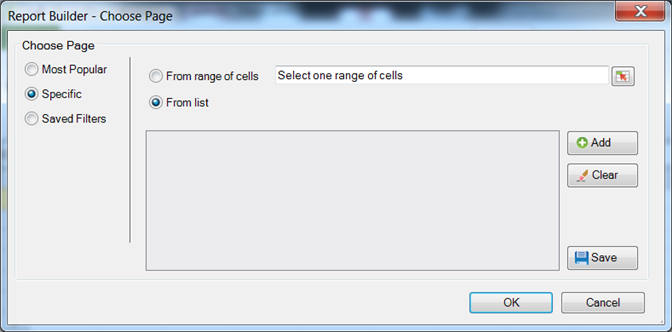

# Filtri specifici

Filtri che applicano termini di dimensione specifici.

Puoi cercare elementi dimensionali specifici creando un filtro che corrisponda a criteri esatti. Ad esempio, puoi creare il seguente tipo di filtro: in [!DNL homepage.htm], [!DNL contact_us.html], [!DNL corporate_info.html].

**Per creare un filtro specifico**

1. Crea o modifica una richiesta e passa a [!UICONTROL Request Wizard: Step 2].

   

1. In [!UICONTROL Request Wizard: Step 2], fai clic sul collegamento accanto alla dimensione nella griglia, quindi scegli **[!UICONTROL Filter]**.

   

1. Abilita **[!UICONTROL Specific]**, quindi attiva una delle seguenti opzioni:

   * **Da intervallo di celle:** consente di selezionare i dati dalle celle. Puoi selezionare:
   * **Tutte le celle nell’intervallo:** consente di mappare ogni cella per l’intervallo. Il testo descrittivo spiega il numero di gruppi di celle da selezionare. Per mappare più di un gruppo di celle, premere il tasto Ctrl mentre si eseguono selezioni successive. Se l’intervallo da mappare contiene una sola cella, questa è l’unica opzione disponibile
   * **Prima cella di intervallo:** è sufficiente selezionare la cella in alto a sinistra dell’intervallo, quindi scegliere una direzione per i dati. Inoltre, se la richiesta ha più periodi, scegli la direzione dei periodi e scegli se desideri saltare un determinato numero di celle tra i periodi.
   * **Da elenco:** consente di selezionare i dati da un elenco a cui è possibile aggiungere i dati.
1. Se si abilita **[!UICONTROL From List]**, selezionare gli elementi elencati disponibili o fare clic su **[!UICONTROL Add]**.

   Quando si fa clic su **[!UICONTROL Add]**, nel modulo [!UICONTROL Select From List] viene visualizzato un elenco di elementi dimensionali disponibili per l’intervallo di date della richiesta corrente, limitato ai primi 10.000 elementi. È possibile eseguire ricerche in questi elementi o fare clic su **[!UICONTROL More ...]**, che visualizza il [!UICONTROL Search Form], in modo da creare una ricerca più dettagliata delle dimensioni.
1. In [!UICONTROL Select From List], fai clic su **[!UICONTROL OK]**.
1. Sul modulo [!UICONTROL Choose Page], salvare il filtro Specifico, se lo si desidera, quindi fare clic su **[!UICONTROL OK]**.
