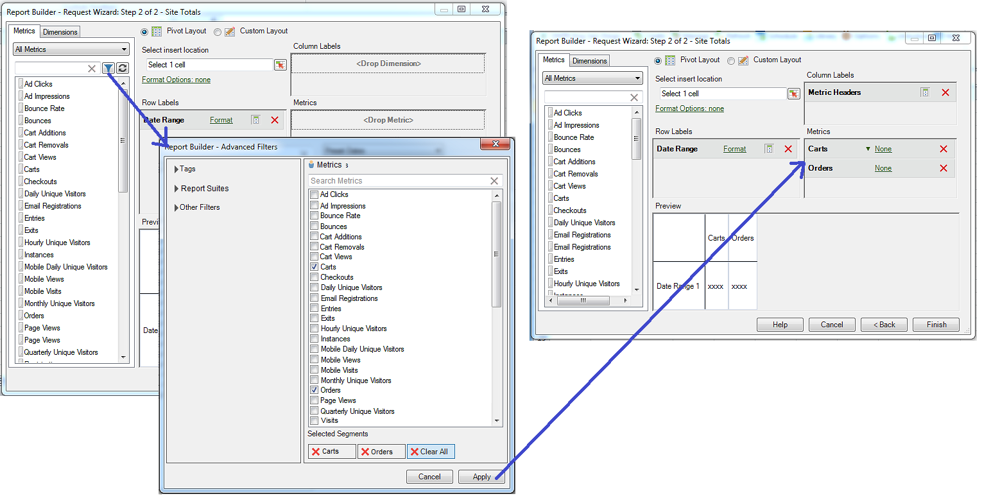

# Metriche calcolate

Report Builder 5.2 supporta le metriche calcolate unificate Adobe Analytics. Tra le altre innovazioni, tutte le metriche calcolate ora dispongono di un ID globale, quindi non sono più limitate a una suite di rapporti.

>[!NOTE]
>
>Le cartelle di lavoro esistenti potrebbero indicare richieste con ID di metriche precedenti. Quando utilizzi Report Builder 5.2, questi ID di metriche legacy verranno convertiti nel nuovo ID globale. Se condividi questa cartella di lavoro con un utente del Report Builder v5.1 o precedente, tale utente non sarà in grado di visualizzare le metriche calcolate.

Per ulteriori informazioni su come creare e gestire le metriche calcolate con il nuovo Generatore e Gestore della metrica calcolata, consulta la [Guida alle metriche calcolate](https://docs.adobe.com/content/help/it-IT/analytics/components/calculated-metrics/cm-overview.html) .

Nel passaggio 2 della Creazione guidata richieste è possibile filtrare e applicare le metriche calcolate.

## Filtrare le metriche calcolate {#section_376E986D3E684999A7CDB08E53854159}

**** Filtrare le metriche calcolate facendo clic sull’icona Filtro :   

. La finestra di dialogo Filtri avanzati viene compilata con metriche standard e calcolate.

I filtri disponibili includono:

| Nome filtro | Descrizione |
|---|---|
| Tag | Consente di filtrare le metriche calcolate con tag specifici. I filtri di tag utilizzano l’operatore AND. Se controlli due tag, il riquadro a destra mostra le metriche a cui sono stati assegnati tag **sia**. |
| Suite di rapporti | Se applichi il filtro &quot;Solo *nome della suite di rapporti*&quot; nel Generatore di metriche calcolate in [!DNL Reports & Analytics] e quindi visualizzi il Filtro avanzato in [!DNL Report Builder], il filtro Avanzate visualizzerà le metriche calcolate solo per la suite di rapporti selezionata. |
| Proprietari | Consente di filtrare le metriche in base al proprietario. I filtri Proprietari utilizzano l’operatore OR. Se selezioni due proprietari, il riquadro a destra mostra le metriche di proprietà del proprietario **o**. |
| Altri filtri > Approvati | Mostra tutte le metriche approvate ufficialmente. |
| Altri filtri > Preferiti | Mostra tutte le metriche contrassegnate come Preferiti. |
| Altri filtri > Personali | Mostra tutte le metriche di tua proprietà. |
| Altri filtri > Condivisi con me | Mostra tutte le metriche condivise da altri utenti con te. |

## Applica metriche calcolate {#section_DF5CF349460A45FDA4B6E6BB8B52F18E}

Dopo aver selezionato i filtri, fai clic su **[!UICONTROL Apply]** per applicarli alla richiesta. Le metriche selezionate vengono ora aggiunte al layout del rapporto.

