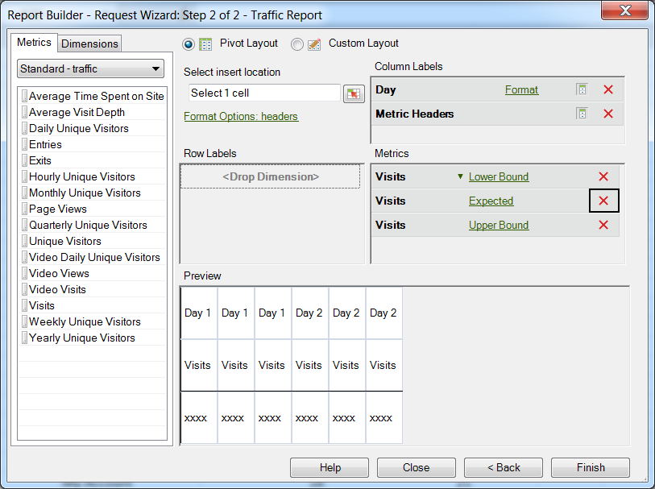

# Configurare una richiesta di rilevamento anomalie

Procedura che descrive come creare una richiesta di rilevamento anomalie nel generatore di report.

1. Select a trended report, such as a **[!UICONTROL Site Metrics]** &gt; **[!UICONTROL Traffic]** report.
1. In the [!UICONTROL Apply Granularity] menu, select **[!UICONTROL Day]**.

   >[!NOTE]
   >
   >[!UICONTROL Anomaly Detection] Il menu è disponibile solo quando selezionate Granularità giorno. I precedenti 30 giorni di dati sono utilizzati come periodo di formazione statistica, indipendentemente dall'intervallo di date selezionato.

1. After configuring date ranges, click **[!UICONTROL Next]**.

   Risultato 1. On the Request Wizard: Step 2 of 2, add a metric, such as **[!UICONTROL Visits]**.

   Risultato 1. For the added metric, click the **[!UICONTROL None]** link.

   

1. Select **[!UICONTROL Anomaly Detection]** &gt; **[!UICONTROL `<selection>`]**.

   

   Quando selezionate una di queste opzioni, il sistema crea copie di Rilevamento anomalie della metrica originale. For example, for the Visit metric, a Lower Bound Visit metric is added to the [!UICONTROL Metric] group.
1. Click **[!UICONTROL Finish]** and select the cell for output to Excel.

   See [Anomaly Detection](../../../analyze/analysis-workspace/virtual-analyst/c-anomaly-detection/anomaly-detection.md#concept_9476D6C093334B1A8044AE63835BDBE7) for definitions.
