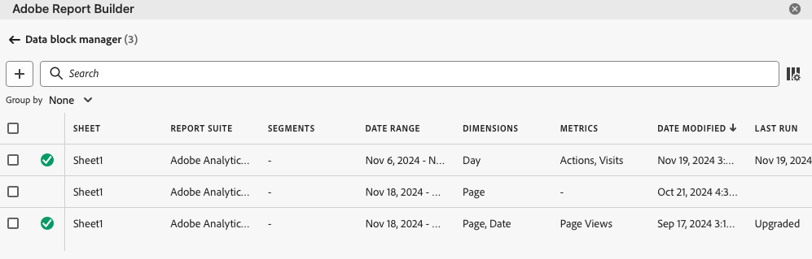
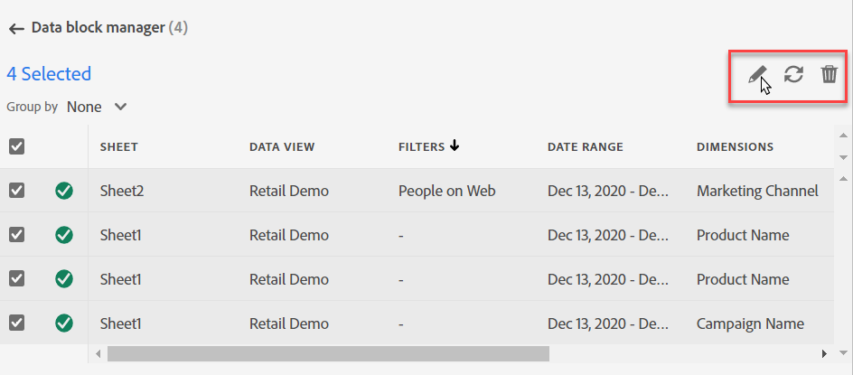
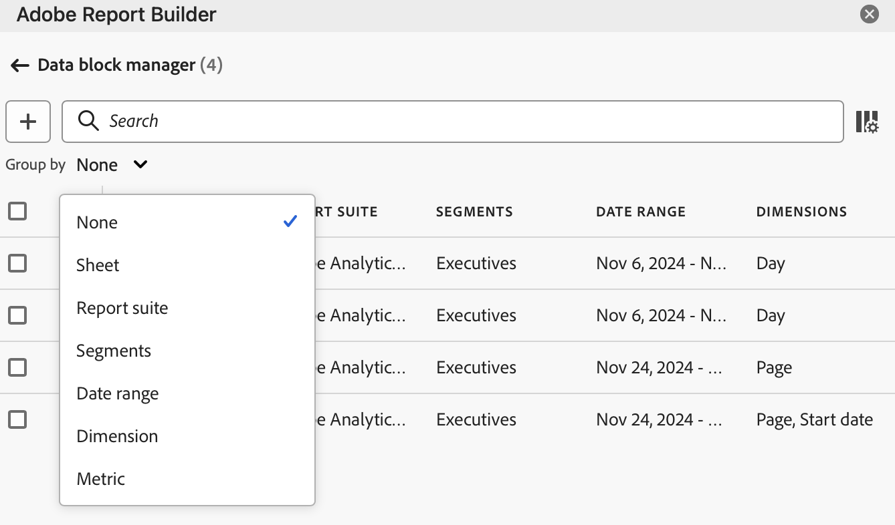

# Gestire i blocchi di dati

È possibile visualizzare e gestire tutti i blocchi di dati in una cartella di lavoro utilizzando [!UICONTROL Data block manager]. [!UICONTROL Data block manager] fornisce funzionalità di ricerca, filtro e ordinamento che consentono di individuare blocchi di dati specifici. Dopo aver selezionato uno o più blocchi di dati, puoi modificare, eliminare o aggiornare i blocchi di dati selezionati.

## Visualizzare i blocchi di dati

Per visualizzare una tabella che elenca tutti i blocchi di dati in una cartella di lavoro, selezionare  **[!UICONTROL Manage]**.

{zoomable="yes"}

**[!UICONTROL Data block manager]** mostra una tabella con tutti i blocchi di dati presenti in una cartella di lavoro.

{zoomable="yes"}

È possibile utilizzare  per selezionare le colonne da visualizzare.

## Ordinare i blocchi di dati

Puoi ordinare la tabella dei blocchi di dati in base a una colonna visualizzata. Ad esempio, puoi ordinare i blocchi di dati per suite di rapporti, segmenti, intervallo di date e altre variabili.

Per ordinare la tabella dei blocchi di dati, seleziona un’intestazione di colonna. Selezionare la stessa intestazione di colonna per invertire l&#39;ordinamento.

## Cercare blocchi di dati

Utilizza il campo  **[!UICONTROL _Ricerca_]** per individuare qualsiasi elemento nella tabella dei blocchi di dati. Ad esempio, puoi cercare le metriche contenute nei blocchi di dati o nella suite di rapporti. Puoi inoltre cercare le date visualizzate nelle colonne dell’intervallo di date, della data di modifica o dell’ultima esecuzione.

## Modificare i blocchi di dati

Puoi modificare le suite di rapporti e gli intervalli di date per i blocchi di dati. Oppure i segmenti applicati ai blocchi di dati.

Ad esempio, puoi sostituire un segmento esistente con un nuovo segmento in uno o più blocchi di dati.

1. Seleziona i blocchi di dati da aggiornare. Puoi selezionare la casella di controllo di primo livello per selezionare tutti i blocchi di dati oppure selezionare i singoli blocchi di dati.

   {zoomable="yes"}

1. Selezionare  per visualizzare la finestra **[!UICONTROL Quick edit]**.

   {zoomable="yes"}

1. Seleziona un collegamento per aggiornare suite di rapporti, intervalli di date o segmenti. In **[!UICONTROL Quick Edit]** - **[!UICONTROL Segments]** è possibile aggiungere, rimuovere o aggiornare i segmenti per i blocchi di dati selezionati.

   {zoomable="yes"}

## Aggiornare blocchi di dati

Seleziona  per aggiornare la tabella dei blocchi di dati.

Per verificare se un blocco di dati è stato aggiornato, visualizza l’icona di stato dell’aggiornamento:

- Un blocco di dati aggiornato correttamente visualizza un .

- Un blocco di dati che non è stato aggiornato visualizza un .

## Eliminare i blocchi di dati

Per eliminare uno o più blocchi di dati:

1. Seleziona uno o più blocchi di dati.
1. Seleziona .
1. Selezionare **[!UICONTROL Delete]** nella finestra di dialogo **[!UICONTROL Delete data block]** o **[!UICONTROL Cancel]** per annullare l&#39;eliminazione.

## Raggruppare blocchi di dati

È possibile raggruppare i blocchi di dati utilizzando il menu a discesa **[!UICONTROL Group by]** oppure selezionare un titolo di colonna.

Per ordinare i blocchi di dati per colonna, seleziona il titolo della colonna. Per raggruppare i blocchi di dati per gruppi, selezionare un nome di gruppo dal menu a discesa **[!UICONTROL Group by]**. Ad esempio, la schermata seguente mostra i blocchi di dati raggruppati per suite di rapporti.

Puoi utilizzare il raggruppamento per selezionare rapidamente i blocchi di dati per i quali desideri modificare un elemento comune, come il segmento.

{zoomable="yes"}

<!--

# Manage Data Blocks in Report Builder

You can view and manage all data blocks in a workbook using the Data Block Manager. The Data Block Manager provides search, filter, and sort capabilities that allow you to quickly locate specific data blocks. After selecting one or more data blocks, you can edit, delete, or refresh the selected data blocks.

## View Data Blocks

Click **Manage** to view a list of all data blocks in a workbook.

The Data Block Manager lists all data blocks present in a workbook. 

## Sort the Data Blocks list

You can sort the data block list by a displayed column. For example, you can sort the data block list by report suites, segments, date range, and other variables.

To sort the data block list, click a column heading.

## Search the Data Block list

Use the Search field to locate anything in the data block table. For example, you could search for metrics contained in the data blocks or report suite. You can also search for dates appearing in the date range, date modified, or last run date columns.

## Edit Data Blocks

You can edit the report suite, date range, or the segments applied to one or more data blocks.

For example, you can replace an existing segment with a new segment in one or more data blocks.

1. Select the data blocks that you want to update. You can select the top-level check box to select all data blocks or you can select individual data blocks.

   

1. Click the edit icon to display the Quick edit window.

   

1. Select a segment link to update report suites, date ranges, or segments.

   

## Refresh Data Blocks

Click the refresh icon to refresh the data blocks in the list.

To verify if a data block is refreshed, view the refresh status icon. 

A successfully refreshed data block displays a checkmark in a green circle: . 

A data block that has failed to refresh displays a warning icon: .This makes it easy to identify if any data blocks have errors.

## Delete a Data Block

1. Select a data block in the Data Block manager. 
1. Click the trash can icon to delete the selected data block.

## Group Data Blocks

You can group data blocks using the **Group by** drop-down menu or you can click a column title. To sort data blocks by column, click the column title. To group data blocks by groups, select a group name from the **Group by** drop-down menu. For example, the screenshot below shows data blocks grouped by Sheet. It shows data blocks grouped by Sheet1 and Sheet2.  This is useful, for example, in the segment-replacing use case. If you have multiple segments applied to each data block, it is helpful to create a group containing all the data blocks that you want to replace. Then you can easily select and edit them all at once.

## Modify the Data Block Manager view

You can modify which columns are visible in the Data Block Manager window.

Click the column list  icon to select which columns are listed in the Data Block Manager. Select a column name to display the column. Deselect the column name to remove the column from view.

-->