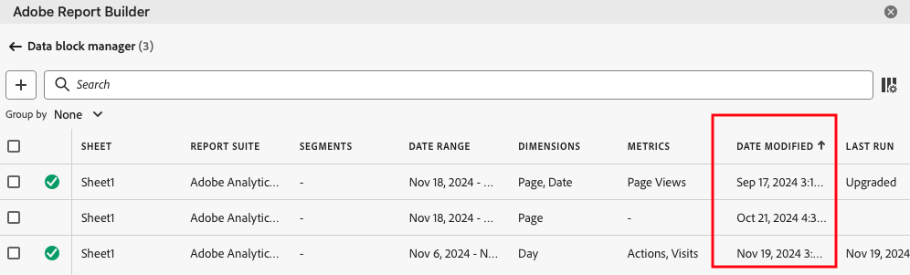
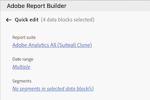

# Gestire i blocchi di dati nel Report Builder

Puoi visualizzare e gestire tutti i blocchi di dati in una cartella di lavoro utilizzando il Data Block Manager (Gestore dei blocchi di dati). Il Data Block Manager (Gestore dei blocchi di dati) fornisce funzionalità di ricerca, filtro e ordinamento che consentono di individuare rapidamente blocchi di dati specifici. Dopo aver selezionato uno o più blocchi di dati, puoi modificare, eliminare o aggiornare i blocchi di dati selezionati.

## Visualizzare blocchi di dati

Fai clic su **Gestisci** per visualizzare un elenco di tutti i blocchi di dati presenti in una cartella di lavoro.

Nel Data Block Manager (Gestore dei blocchi di dati) sono elencati tutti i blocchi di dati presenti in una cartella di lavoro. 

## Ordinare l’elenco di blocchi di dati

Puoi ordinare l’elenco di blocchi di dati in base a una colonna visualizzata. Ad esempio, puoi ordinare l’elenco Bloccati di dati per suite di rapporti, segmenti, intervallo di date e altre variabili.

Per ordinare l’elenco di blocchi di dati, fai clic su un’intestazione di colonna.

## Ricerca nell’elenco di blocchi di dati

Utilizza il campo di ricerca per individuare qualsiasi elemento nella tabella dei blocchi di dati. Ad esempio, puoi cercare le metriche contenute nei blocchi di dati o nella suite di rapporti. Puoi inoltre cercare le date visualizzate nelle colonne dell’intervallo di date, della data di modifica o dell’ultima esecuzione.

## Modificare blocchi di dati

Puoi modificare la suite di rapporti, l’intervallo di date o i segmenti applicati a uno o più blocchi di dati.

Ad esempio, puoi sostituire un segmento esistente con un nuovo segmento in uno o più blocchi di dati.

1. Seleziona i blocchi di dati da aggiornare. Puoi selezionare la casella di controllo di primo livello per selezionare tutti i blocchi di dati oppure selezionare i singoli blocchi di dati.

   

1. Fai clic sull’icona di modifica per visualizzare la finestra di modifica rapida.

   

1. Seleziona un collegamento a un segmento per aggiornare suite di rapporti, intervalli di date o segmenti.

   

## Aggiornare blocchi di dati

Fai clic sull’icona di aggiornamento per aggiornare i blocchi di dati nell’elenco.

Per verificare se un blocco di dati è stato aggiornato, visualizza l’icona di stato dell’aggiornamento.

Un blocco di dati aggiornato correttamente mostra un segno di spunta in un cerchio verde: .

Un blocco di dati che non è stato aggiornato visualizza un’icona di avviso: .Questo consente di identificare facilmente se eventuali blocchi di dati presentano errori.

## Eliminare un blocco di dati

Fai clic sull’icona del cestino per eliminare un blocco di dati selezionato.

## Raggruppare blocchi di dati

Puoi raggruppare i blocchi di dati utilizzando il menu a discesa **Raggruppa per** oppure fare clic sul titolo di una colonna. Per ordinare i blocchi di dati per colonna, fai clic sul titolo della colonna. Per raggruppare i blocchi di dati per gruppi, seleziona un nome di gruppo dal menu a discesa **Raggruppa per**. Ad esempio, la schermata seguente mostra i blocchi di dati raggruppati per Sheet (Foglio). I blocchi di dati sono raggruppati per Sheet1 (Foglio1) e Sheet2 (Foglio2). Ciò è utile, ad esempio, nel caso di sostituzione del segmento. Se a ciascun blocco di dati sono applicati più segmenti, è utile creare un gruppo contenente tutti i blocchi di dati che desideri sostituire. Puoi quindi selezionarli e modificarli tutti in una sola volta.

## Modificare la visualizzazione del Data Block Manager (Gestore dei blocchi di dati)

Puoi modificare le colonne visibili nella finestra del Data Block Manager (Gestore dei blocchi di dati).

Fai clic sull’icona dell’elenco delle colonne  per selezionare le colonne elencate nel Data Block Manager (Gestore dei blocchi di dati). Seleziona il nome di una colonna per visualizzarla. Deseleziona il nome della colonna per rimuoverla dalla visualizzazione.

