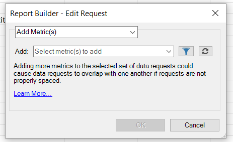
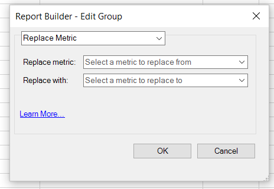

# Modificare le metriche in più richieste

La funzione Modifica metriche in più richieste consente di aggiungere, rimuovere o sostituire agevolmente le metriche in una richiesta o gruppo di richieste preesistenti.

## Aggiungi metriche {#section_3FBDA9668039404895059618D70FCBCD}

Nota bene

* Le metriche possono essere aggiunte solo alle richieste di layout pivot. Se alcune delle richieste selezionate sono Layout personalizzati, non è possibile aggiungere metriche. Il motivo è che il Report Builder non sa dove collocare la nuova metrica nel foglio di calcolo, poiché il layout è personalizzato.
* Di conseguenza, se hai selezionato solo richieste di layout personalizzato, l’opzione **[!UICONTROL Add Metric/s]** non è disponibile.
* L’aggiunta di metriche aumenterà le dimensioni di una richiesta e potrebbe causarne la sovrapposizione con un’altra richiesta. Assicurati che la richiesta disponga di spazio sufficiente intorno a essa per consentire l’aggiunta di metriche.
* Se la metrica aggiunta è già presente in una delle richieste selezionate, non verrà aggiunta a tale richiesta.

Per aggiungere una o più metriche:

1. Seleziona una o più richieste in Excel e fai clic con il pulsante destro del mouse per selezionare **[!UICONTROL Edit Metrics]**. (Oppure, fai clic su **[!UICONTROL Manage]** > **[!UICONTROL Edit Multiple]** > `<choose metric>` > **[!UICONTROL Edit Group]** per selezionare il gruppo di richieste da modificare.)
1. Seleziona **[!UICONTROL Add Metric(s)]**e seleziona le metriche da aggiungere.

   

1. Aggiorna la richiesta per visualizzare i dati effettivi. Fino a quando non ti aggiorni, vedrai i dati offline.

## Sostituire la metrica {#section_D773AAC7B30C4FBEBDB66B203C217818}

Nota bene

* Sono consentite solo sostituzioni 1:1, non 1:molti o molti:1.
* Se la metrica selezionata per la sostituzione non è presente in una delle richieste selezionate, la richiesta viene lasciata invariata.
* La nuova metrica verrà inserita nella stessa posizione della metrica sostituita. Ciò significa:

   * **In un layout** pivot: se una richiesta di layout pivot restituisce data, visita, visitatori, univoci giornalieri e &quot;visitatori&quot; è sostituita da &quot;ricavi&quot;, il layout della richiesta aggiornato sarà: data, visita, ricavi, univoco giornaliero.
   * **In un layout** personalizzato: se la metrica &quot;visitatori&quot; è stata generata nella cella F11, il layout della richiesta aggiornato mostrerà &quot;ricavi&quot; nella stessa cella F11.

* Se alla metrica sostituita è stata applicata un’operazione (media, testo pre-scritto, testo scritto, micrografico), queste operazioni verranno applicate anche alla nuova metrica.

Per sostituire una metrica

1. Seleziona una o più richieste in Excel e fai clic con il pulsante destro del mouse per selezionare **[!UICONTROL Edit Metrics]**. (Oppure, fai clic su **[!UICONTROL Manage]** > **[!UICONTROL Edit Multiple]** > **`<choose metric>`** > **[!UICONTROL Edit Group]** per selezionare il gruppo di richieste da modificare.)

1. Select **[!UICONTROL Replace Metric]**.

   

1. Seleziona la metrica da sostituire e la metrica con cui sostituirla.
1. Aggiorna la richiesta. Fino a quando non ti aggiorni, vedrai i dati offline.

## Rimuovere le metriche {#section_D3CD5BAC7670416593B633B2B8423C60}

Nota bene

* Se una delle metriche selezionate da rimuovere non è presente in una delle richieste selezionate, la richiesta viene lasciata invariata.
* In un layout pivot, la rimozione di una metrica determina lo spostamento del layout per le metriche che si trovano dopo la metrica rimossa.

   **Esempio**: se una richiesta di layout pivot restituisce data, visite, visitatori, univoci giornaliere e si rimuovono &quot;visite&quot;, il layout aggiornato della richiesta mostrerà: data, visitatori, univoco giornaliero.

Per rimuovere le metriche:

1. Seleziona una o più richieste in Excel e fai clic con il pulsante destro del mouse per selezionare **[!UICONTROL Edit Metrics]**. (Oppure, fai clic su **[!UICONTROL Manage]** > **[!UICONTROL Edit Multiple]** > **`<choose metric>`** > **[!UICONTROL Edit Group]** per selezionare il gruppo di richieste da modificare.)

1. Selezionare **[!UICONTROL Remove Metric(s)]**.

   

1. Seleziona una o più metriche da rimuovere dalla richiesta.
1. Aggiorna la richiesta. Fino a quando non ti aggiorni, vedrai i dati offline.

