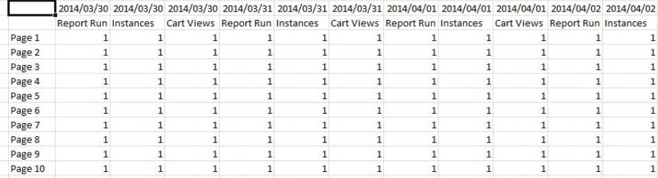

# Modalità offline per la creazione e la modifica delle richieste

La modalità offline restituisce i dati dei segnaposto per accelerare il processo di creazione e modifica delle richieste.

Quando crei o modifichi una nuova richiesta, vengono effettuate chiamate API per i rapporti per recuperare la risposta. Questo rallenta il processo di creazione della richiesta, perché devi attendere che i dati vengano restituiti prima di passare al passaggio successivo. La modalità offline restituisce solo i dati segnaposto, pertanto non è necessario effettuare chiamate API.

Per abilitare la modalità offline:

1. Fare clic su **[!UICONTROL Options]** nel menu Report Builder.

   

1. Spunta la casella di controllo accanto a **[!UICONTROL Turn on offline mode for creating and editing requests]**.
1. Nel campo **[!UICONTROL Display Metric Data as]** , inserisci i dati segnaposto che desideri restituire nella richiesta. Ad esempio, immettere &quot;1&quot;.
1. Fai clic su **[!UICONTROL OK]**.
1. Ora crea ed esegui la richiesta (in modalità offline) utilizzando la Creazione guidata richieste.
1. La tua richiesta con &quot;1&quot; come dati del segnaposto sarà simile alla seguente:

   

   >[!IMPORTANT]
   >
   >Assicurati di disabilitare la modalità offline prima di eseguire le richieste con dati reali. Per farlo, torna a **[!UICONTROL Options]** e rimuovi il segno di spunta.

