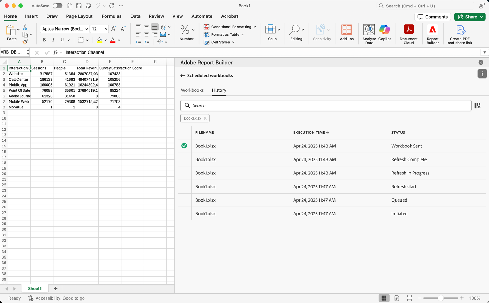

# Gestire le cartelle di lavoro pianificate

Puoi pianificare una cartella di lavoro per la condivisione tramite e-mail o esportandola in una destinazione cloud, come descritto nei seguenti articoli:

* [Pianificare le cartelle di lavoro condividendo tramite e-mail](/help/analyze/report-builder/schedule-reportbuilder.md)

* [Pianificare le cartelle di lavoro esportandole in destinazioni cloud](/help/analyze/report-builder/report-builder-export.md)

Le sezioni seguenti descrivono come gestire le cartelle di lavoro dopo averle pianificate:

## Visualizzare e gestire cartelle di lavoro pianificate

È possibile visualizzare e gestire tutte le cartelle di lavoro pianificate nella scheda **[!UICONTROL Workbooks]**.

1. Seleziona **[!UICONTROL Schedule]** nell&#39;hub Report Builder

1. Seleziona la scheda **[!UICONTROL Workbooks]**. Viene visualizzato un elenco di tutte le cartelle di lavoro pianificate.

   {zoomable="yes"}

   Passa il cursore del mouse sull’icona per visualizzare lo stato di una cartella di lavoro pianificata.

   Utilizza  per cercare specifiche cartelle di lavoro pianificate.
Utilizza  per definire le colonne da visualizzare.

1. Selezionare una o più cartelle di lavoro.

   {zoomable="yes"}

   Sono disponibili le seguenti opzioni:

   | Opzione | Descrizione |
   |---|---|
   |  | Modifica la pianificazione per una cartella di lavoro selezionata. |
   |  | Mostra la cronologia delle cartelle di lavoro selezionate. |
   |  | Sospende la pianificazione delle cartelle di lavoro selezionate. |
   |  | Riprendere la pianificazione delle cartelle di lavoro selezionate. |
   |  | Scarica la cartella di lavoro selezionata in una nuova cartella di lavoro. |
   |  | Elimina la pianificazione delle cartelle di lavoro selezionate. |

## Cronologia e stato delle cartelle di lavoro pianificate

È possibile visualizzare la cronologia e lo stato delle cartelle di lavoro pianificate nella scheda **[!UICONTROL History]**.

1. Selezionare **[!UICONTROL Schedule]** nell&#39;hub Report Builder.

1. Seleziona la scheda **[!UICONTROL History]**. Viene visualizzato un elenco di tutte le cartelle di lavoro pianificate.

   {zoomable="yes"}

   Utilizzare  per cercare cartelle di lavoro specifiche nell&#39;elenco.
Utilizza  per definire le colonne da visualizzare.

   La scheda **[!UICONTROL History]** consente di rivedere lo stato di ogni attività pianificata. Una riga separata documenta la modifica dello stato per ogni attività pianificata.

   * Un  indica che la cartella di lavoro è stata inviata correttamente.
   * Un  indica che si è verificato un errore.

In alternativa, è possibile selezionare  per una o più cartelle di lavoro selezionate nella scheda **[!UICONTROL Workbooks]**. Questa azione mostra la scheda **[!UICONTROL History]** con un elenco filtrato in base alla selezione. Selezionare  per rimuovere un filtro.
