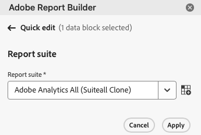

# Hub Report Builder

Utilizza l’hub Report Builder per creare, aggiornare, eliminare e gestire i blocchi di dati.

L&#39;hub di Report Builder contiene i pulsanti Crea, Gestisci e Pianifica, il pannello COMANDI e il pannello QUICK EDIT (MODIFICA RAPIDA).


## Pulsanti Crea, Gestisci e Pianifica

Utilizza i pulsanti Crea, Gestisci e Pianifica per creare nuovi blocchi di dati, gestire quelli esistenti o pianificare blocchi di dati.

>[!NOTE]
>
>La pianificazione della cartella di lavoro per questa versione del Report Builder su Adobe Analytics non è ancora stata rilasciata, ma sarà disponibile all’inizio del 2025. È ora possibile iniziare a utilizzare le cartelle di lavoro che non richiedono la pianificazione.

## Pannello COMANDI

Utilizza il pannello COMANDI per accedere ai comandi compatibili con le celle selezionate o con un’azione precedente.

### Comandi

| Comandi visualizzati | Quando è disponibile | Finalità |
|------|------------------|--------|
| Edit data block (Modifica blocco di dati) | La cella o l’intervallo di celle selezionato fa parte di un solo blocco di dati. | Utilizzato per modificare un blocco di dati |
| Refresh data block (Aggiorna blocco di dati) | La selezione contiene almeno un blocco di dati. Il comando aggiorna solo i blocchi di dati nella selezione. | Utilizzato per aggiornare uno o più blocchi di dati |
| Refresh all data blocks (Aggiorna tutti i blocchi di dati) | La cartella di lavoro contiene uno o più blocchi di dati. | Utilizzato per aggiornare tutti i blocchi di dati nella cartella di lavoro |
| Invia cartella di lavoro |   | Invia una cartella di lavoro in base a una pianificazione. |
| Copy data block (Copia blocco di dati) | La cella o l’intervallo di celle selezionato fa parte di uno o più blocchi di dati. | Utilizzato per copiare un blocco di dati |
| Taglia blocco di dati |   | Utilizzato per tagliare un blocco di dati |
| Delete data block (Elimina blocco di dati) | La cella o l’intervallo di celle selezionato fa parte di un solo blocco di dati. | Utilizzato per eliminare un blocco di dati |

## Pannello QUICK EDIT (MODIFICA RAPIDA)

Quando selezioni uno o più blocchi di dati in un foglio di calcolo, in Report Builder viene visualizzato il pannello QUICK EDIT (MODIFICA RAPIDA). Puoi utilizzarlo per modificare i parametri in un singolo blocco di dati o per modificare i parametri in più blocchi di dati contemporaneamente.


Le modifiche apportate utilizzando le sezioni di Quick Edit (Modifica rapida) si applicano a tutti i blocchi di dati selezionati.

### di Report Suite Manager

I blocchi di dati estraggono dati da una suite di rapporti selezionata. Se più blocchi di dati sono selezionati in un foglio di lavoro e non estraggono dati dalla stessa suite di rapporti, il collegamento **Suite di rapporti** visualizza *Multiple*.

Quando modifichi la suite di rapporti, tutti i blocchi di dati nella selezione adottano la nuova suite di rapporti. I componenti nel blocco di dati vengono associati alla nuova suite di rapporti in base all&#39;ID, ad esempio, corrispondente a ```evars```). Se un componente non viene trovato in un blocco di dati, viene visualizzato un messaggio di avvertenza e il componente viene rimosso dal blocco di dati.

Per modificare la suite di rapporti, seleziona una nuova suite di rapporti dal menu a discesa.



### Intervallo date

**[!UICONTROL Date range]** mostra l&#39;intervallo di date per i blocchi di dati selezionati. Se sono selezionati più blocchi di dati con più intervalli di date, il collegamento **[!UICONTROL Date range]** visualizza *Multiple*. [Ulteriori informazioni](/help/analyze/report-builder/select-date-range.md)

### Segmenti

Il collegamento **Segmenti** visualizza un elenco di riepilogo dei segmenti utilizzati dai blocchi di dati selezionati. Se sono selezionati più blocchi di dati con più segmenti applicati, il collegamento **Segmenti** visualizza *Multipli*. [Ulteriori informazioni](/help/analyze/report-builder/work-with-segments.md)
