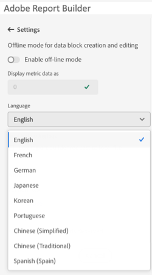

# Impostazioni Report Builder

Utilizza il riquadro **Impostazioni** per configurare le impostazioni a livello di applicazione, ad esempio la lingua visualizzata dall&#39;interfaccia utente o se utilizzare o meno la modalità offline. Le impostazioni vengono applicate immediatamente e vengono impostate per tutte le sessioni future fino a quando non vengono modificate.

Per modificare le impostazioni del Report Builder

1. Fai clic sull&#39;icona **Impostazioni**.

1. Apportare le modifiche necessarie per attivare la modalità offline, selezionare una lingua o attivare le impostazioni del registro di risoluzione dei problemi.

1. Fai clic su **Applica**.

   

## Modalità offline

Durante la creazione e la modifica di un blocco di dati in modalità offline, i dati non vengono recuperati. Al contrario, i dati di simulazione vengono utilizzati in modo da poter creare e modificare rapidamente un blocco di dati senza attendere l’esecuzione della richiesta. Quando si torna online, il comando *Aggiorna blocco dati* o *Aggiorna tutti i blocchi dati* aggiorna i blocchi dati creati con i dati effettivi.

Per attivare la modalità offline

1. Fai clic sull’icona **[!UICONTROL Settings]**.

1. Seleziona **[!UICONTROL Enable off-line mod]e**.

1. Immettere un numero intero positivo nel campo **[!UICONTROL Display metric data as]**.

1. Fai clic su **[!UICONTROL Apply]**.

## Lingua

Puoi scegliere la lingua per l’interfaccia utente del Report Builder. Sono disponibili tutte le lingue Adobe Analytics supportate.

Per selezionare la lingua utilizzata nell’interfaccia utente del Report Builder

1. Fai clic su Impostazioni.

1. Selezionare una lingua dal menu a discesa **[!UICONTROL Language]**.

   

1. Fai clic su **[!UICONTROL Apply].**

## Risoluzione dei problemi

Utilizzare l&#39;impostazione Risoluzione dei problemi per registrare tutti i dati client/server in un file locale. Utilizza questa opzione per risolvere i ticket di supporto.

Per abilitare l&#39;opzione Risoluzione dei problemi, selezionare **[!UICONTROL Log report builder data block to web console]**.
