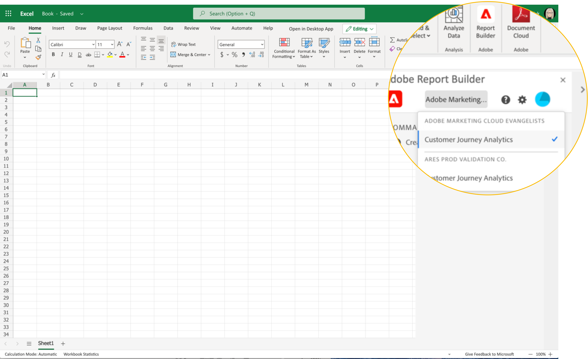

# Configurazione Report Builder

È possibile accedere rapidamente al Report Builder utilizzando il menu Componente aggiuntivo di Excel.

## Requisiti

Il Report Builder per Adobe Analytics è supportato nei seguenti sistemi operativi e browser web.

### macOS

- macOS versione 10.x o successiva
- Tutte le versioni di Microsoft Excel

### Windows

- Windows 10, versione 1904 o successiva
- Excel versione 2106 o successiva

  Per utilizzare il componente aggiuntivo, tutti gli utenti di Windows Desktop Excel devono installare Microsoft Edge Webview2. Per installare il controller:

   1. Vai a <https://aka.ms/webview2installer>.
   1. Selezionare e scaricare il programma di installazione autonomo Evergreen.
   1. Seguire le istruzioni di installazione.

### Ufficio web

- Supporta tutti i browser e le versioni

## Componente aggiuntivo Report Builder Excel

È necessario installare il componente aggiuntivo Report Builder Excel per utilizzare Report Builder per Adobe Analytics. Dopo aver installato il componente aggiuntivo Report Builder Excel, è possibile accedere al Report Builder da una cartella di lavoro di Excel aperta.

### Scaricare e installare il componente aggiuntivo di Report Builder

Per scaricare e installare il componente aggiuntivo di Report Builder

1. Avviare Excel e aprire una nuova cartella di lavoro.

1. Selezionare **[!UICONTROL Insert]** > **[!UICONTROL Get Add-ins]**.

1. Nella finestra di dialogo Componenti aggiuntivi di Office selezionare la scheda Archivio.

1. Cercare &quot;Report Builder&quot; e fare clic su **[!UICONTROL Add]**.

1. Nella finestra di dialogo Condizioni di licenza e informativa sulla privacy fare clic su **[!UICONTROL Continue]**.

**Se la scheda Store non è visualizzata**

1. In Excel, selezionare File > Account > Gestisci impostazioni.

1. Seleziona la casella accanto a &quot;Abilita esperienze collegate facoltative&quot;

1. Riavviare Excel.

**Se l&#39;organizzazione blocca l&#39;accesso a Microsoft Store**

Rivolgiti al tuo team IT o di sicurezza per richiedere l’approvazione per il componente aggiuntivo di Report Builder. Dopo aver concesso l&#39;approvazione, nella finestra di dialogo Componenti aggiuntivi di Office selezionare la scheda Gestione amministratore.

Dopo aver installato il componente aggiuntivo di Report Builder, l&#39;icona del Report Builder viene visualizzata nella barra multifunzione di Excel nella scheda Home.

## Accedi al Report Builder

Dopo aver installato il componente aggiuntivo Report Builder for Excel per la piattaforma operativa o il browser in uso, eseguire la procedura seguente per accedere al Report Builder.

1. Aprire una cartella di lavoro di Excel.

1. Fai clic sull’icona Report Builder per avviare il Report Builder.

1. Dalla barra degli strumenti di Adobe Report Builder, fare clic su **[!UICONTROL Login]**.

   

1. Immetti le informazioni del tuo account Adobe Experience ID. Le informazioni sull’account devono corrispondere alle credenziali di Adobe Analytics.

   

Dopo l’accesso, l’icona di accesso e l’organizzazione vengono visualizzate nella parte superiore del pannello

## Cambiare organizzazione

La prima volta che accedi, accedi all’organizzazione predefinita assegnata al tuo profilo.

1. Fare clic sul nome dell&#39;organizzazione visualizzata all&#39;accesso.

1. Seleziona un’organizzazione dall’elenco delle organizzazioni disponibili. Vengono elencate solo le organizzazioni a cui hai accesso.

   

## Uscire

Puoi uscire dal Report Builder dal profilo utente.

1. Salvare le modifiche apportate alle cartelle di lavoro aperte.

1. Fai clic sull’icona dell’avatar per visualizzare il profilo utente.

   

1. Fai clic su **Esci**.
