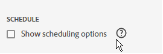

# Pianificare le cartelle di lavoro condividendo tramite e-mail

>[!NOTE]
>
>Oltre a pianificare le cartelle di lavoro per la condivisione tramite e-mail, come descritto in questa sezione, è possibile pianificare le cartelle di lavoro da esportare nelle destinazioni cloud, come descritto in [Pianificare le cartelle di lavoro per l&#39;esportazione nelle destinazioni cloud](/help/analyze/report-builder/report-builder-export.md).

Dopo aver salvato la cartella di lavoro e completato l’analisi, è possibile condividere facilmente la cartella di lavoro con altri membri del team utilizzando la funzione di pianificazione. La funzione Schedule (Pianifica) consente di creare una pianificazione che aggiorna automaticamente i dati nella cartella di lavoro e invia tramite e-mail il file .xlsx della cartella di lavoro di Excel come allegato al pubblico specificato alla data e all’ora indicate. L’impostazione di una pianificazione fornisce automaticamente ai destinatari aggiornamenti regolari. Puoi anche utilizzare la funzione di pianificazione per inviare la cartella di lavoro una volta senza pianificare gli aggiornamenti automatici.

Puoi creare più pianificazioni per una singola cartella di lavoro. Ad esempio, puoi inviare una cartella di lavoro al team su base giornaliera e inviare la cartella di lavoro al tuo responsabile una volta alla settimana creando due pianificazioni diverse.

La funzione Schedule (Pianifica) consente inoltre di impostare la protezione tramite password per una cartella di lavoro e di modificare le cartelle di lavoro pianificate in precedenza.

>[!BEGINSHADEBOX]

Per un video dimostrativo, consulta  [Pianifica cartelle di lavoro](https://video.tv.adobe.com/v/3417505?captions=ita&quality=12&learn=on){target="_blank"}.

>[!ENDSHADEBOX]

## Pianificare una cartella di lavoro

Per pianificare una cartella di lavoro:

1. Selezionare **[!UICONTROL Schedule]** nell&#39;hub di Report Builder per creare una pianificazione che consenta di distribuire automaticamente un file di Excel della cartella di lavoro (con estensione xlsx) a un singolo utente o a un gruppo.

   {zoomable="yes"}

1. Selezionare **[!UICONTROL Schedule Workbook]** o  per creare una nuova cartella di lavoro pianificata.

   {zoomable="yes"}

   Il riquadro di pianificazione mostra alcune informazioni predefinite sulla cartella di lavoro, ad esempio il nome e l’ultima data di modifica della cartella di lavoro.

### File

Nella sezione **[!UICONTROL File]**, è possibile fornire dettagli sul tipo di file, il nome e una password per proteggere il file.

{zoomable="yes"}

1. Utilizza  per selezionare la cartella di lavoro corrente, se non è già selezionata.

1. (Facoltativo) Immetti **[!UICONTROL File name]**.

   Per impostazione predefinita, il nome del file della cartella di lavoro corrisponde al nome della cartella di lavoro, ma è possibile modificare il nome del file in base alle proprie esigenze.

1. Seleziona **[!UICONTROL File type]**.

   * **[!UICONTROL Excel]**
   * **[!UICONTROL PDF]**
   * **[!UICONTROL CSV]**

   Quando selezioni **[!UICONTROL CSV]**, tieni presente che la cartella di lavoro pianificata viene inviata come allegato zip. Alcune amministrazioni e-mail aziendali potrebbero bloccare le e-mail con allegati zip. Di conseguenza viene visualizzato un avviso.

1. (Facoltativo) Selezionare **[!UICONTROL Append time-stamp to file name]**.

   Puoi aggiungere una marca temporale al nome del file per identificare la data di aggiornamento della cartella di lavoro. Una marca temporale è utile per vedere quale versione di una cartella di lavoro è stata inviata in una data specifica. Se selezionata, puoi scegliere tra:

   * **[!UICONTROL ISO Date format]**, con conseguente aggiunta di `YYYY-MM-DD` al nome file.
   * **[!UICONTROL ISO Date format + time stamp]**, con conseguente aggiunta di `YYYY-MM-DD_HH-MM-SS` al nome file.

<!-- Does no longer seem to be an option? 
1. (Optional) Select **.zip compression** to compress the file and set up password protection on the file.

    When you make this selection, you're prompted to enter a password to open the file. This is helpful if you have concerns about data security and you want to password protect the workbook. Protecting the file with a password requires you to select **.zip compression**. The password must be at least 8 characters and contain a number and a special character.

    {zoomable="yes"}{width="55%"}
-->

1. Immettere una password in **[!UICONTROL Password protect the workbook]**. Una password valida richiede almeno 8 caratteri, un numero e un carattere speciale. Seleziona  per visualizzare la password e  per nascondere la password (impostazione predefinita).

### E-mail

Nella sezione **[!UICONTROL Email]**, è possibile fornire i destinatari, l&#39;oggetto e la descrizione dell&#39;e-mail.

{zoomable="yes"}

1. Inserisci i destinatari in **Recipients** (Destinatari). È possibile immettere il nome di una persona riconosciuta nell&#39;organizzazione. Oppure puoi immettere un indirizzo e-mail di una persona esterna alla tua organizzazione.

1. Inserisci l’oggetto dell’e-mail in **Subject** (Oggetto) e una descrizione per i destinatari. L’oggetto viene impostato automaticamente sul nome del file della cartella di lavoro, ma puoi modificarlo se necessario. Puoi aggiungere i dettagli nella sezione della descrizione.

1. Facoltativamente, è possibile immettere una descrizione nell&#39;area di testo **[!UICONTROL Description]**.

### Pianificazione

Nella sezione **[!UICONTROL Schedule]** è possibile definire la pianificazione per l&#39;invio delle e-mail con la cartella di lavoro ai destinatari.

{zoomable="yes"}

1. Selezionare **[!UICONTROL Show scheduling options]** per definire una pianificazione.

1. Immettere una data di inizio in **[!UICONTROL Starting on]**. In alternativa, selezionare  per scegliere una data di inizio dal calendario.

1. Immettere una data di fine in **[!UICONTROL Ending on]**. In alternativa, selezionare  per scegliere una data di fine dal calendario.

1. Seleziona una **[!UICONTROL Frequency]**. A seconda della frequenza selezionata, sono disponibili opzioni aggiuntive. Vedi la tabella seguente.

   | Frequenza | Opzioni |
   |---|---|
   | **[!UICONTROL Send hourly]** | Immettere un valore per **[!UICONTROL Send every number of hours]**. |
   | **[!UICONTROL Send daily]** | Selezionare un **[!UICONTROL Daily frequency]**: **[!UICONTROL Send every day]**, **[!UICONTROL Send every weekday]** o **[!UICONTROL Custom frequency]**. Se si seleziona **[!UICONTROL Custom frequency]**, immettere un valore per **[!UICONTROL Send every number of days]**. |
   | **[!UICONTROL Send weekly]** | Immettere un valore per **[!UICONTROL Send every number of weeks]**. E seleziona un **[!UICONTROL Day of week]**. |
   | **[!UICONTROL Send monthly by day of the week]** | Selezionare **[!UICONTROL Day of week]** e **[!UICONTROL Week of month]**. |
   | **[!UICONTROL Send monthly by day of the month]** | Selezionare un valore da **[!UICONTROL Send on this day of the month]**. |
   | **[!UICONTROL Send yearly by day of the month]** | Selezionare un **[!UICONTROL Day of week]**, selezionare un **[!UICONTROL Week of month]** e selezionare un **[!UICONTROL Monthly of year]**. |
   | **[!UICONTROL Send yearly by specific date]** | Selezionare un **[!UICONTROL Month of year]** e un valore da **[!UICONTROL Send on this day of the month]**. |

### Invia

Per inviare la cartella di lavoro:

* Se non è stata definita una pianificazione utilizzando **[!UICONTROL Show scheduling options]**, selezionare **[!UICONTROL Send now]** per inviare immediatamente la cartella di lavoro tramite e-mail.
* Se è stata definita una pianificazione utilizzando **[!UICONTROL Show scheduling options]**, selezionare **[!UICONTROL Send on schedule]** per inviare la cartella di lavoro tramite e-mail utilizzando la pianificazione definita.

In entrambi i casi, nella parte inferiore dell’hub Report Builder viene visualizzato un avviso popup di conferma.

Per annullare l&#39;invio della cartella di lavoro, selezionare **[!UICONTROL Cancel]**.

## Gestire le cartelle di lavoro pianificate

Per informazioni sulla gestione delle cartelle di lavoro già pianificate, vedere [Gestione delle cartelle di lavoro pianificate](/help/analyze/report-builder/manage-reportbuilder.md).

<!--

## Schedule a workbook

Use the Schedule button in the Report Builder hub to quickly create a schedule so that you can automatically distribute a workbook Excel file (.xlsx) to an individual or a group.

1. Click the Schedule button in the Report Builder hub.

    {width="55%"}

1. Click Schedule Workbook or the plus button in the upper-left to create a new scheduled workbook.

    {width="55%"}

    The scheduling pane displays some pre-defined information about the workbook such as the workbook name and the last date that the workbook was modified.

    {width="55%"}

1. (Optional) Enter a file name.

    The workbook file name defaults to the name of the workbook but you can change this if you want. If you\'re sending the same workbook to multiple audiences and you want to name it something a little bit more friendly for a certain audience, you can change the name.

1. (Optional) Select **Append time-stamp to file name**.

    You can append a timestamp to the file name to identify the date the workbook was updated. This is helpful to quickly see which version of a workbook was sent on a specific date. The **Filename preview** shows how the workbook file name will appear in the email when the workbook is distributed. The time-stamp format is YYYY-MM-DD.

1. (Optional) Select **.zip compression** to compress the file and set up password protection on the file.

    When you make this selection, you're prompted to enter a password to open the file. This is helpful if you have concerns about data security and you want to password protect the workbook. Protecting the file with a password requires you to select **.zip compression**. The password must be at least 8 characters and contain a number and a special character.

    {width="55%"}

1. Enter **Recipients**. You can enter the name of a person that is recognized in your organization, or you can enter an email address of a person inside or outside of your organization.

1. Enter the **Subject** of the email and a description for your recipients. The subject defaults to the workbook file name but you can modify the subject if needed. You can add details in the description section.

    {width="55%"}

1. Set up the scheduling options to set the date and time that you want the workbook emailed to your recipients.

    Choose the start and end date and time frames. This can be today's date or a date in the future.

    Choose the **Frequency** from the drop-down menu. You can set the frequency to be hourly, daily, weekly, monthly, or yearly on a specific day. For example, you can set up a schedule to send the workbook on the first Sunday night of the month so that your recipients will have the email in their inbox first thing on Monday morning.

    {width="55%"}

1. After you set the schedule, click **Send on schedule**.

    {width="55%"}

    You see a confirmation toast at the bottom of the Report Builder hub and the scheduled workbook is listed under the Workbooks tab.

    {width="55%"}

## Schedule a converted workbook {#converted}

1. Schedule a [converted](/help/analyze/report-builder/convert-workbooks.md) legacy workbook.

   A pop up appears, asking if you want to use the scheduling metada from the legacy workbook to create a new scheduled task. 

1. If you select **[!UICONTROL Use]**, Report Builder automatically fills in the legacy scheduling information. 

1. Ensure that this information is correct and schedule. 

1. If you want to send the workbook on a different schedule, schedule a completely fresh scheduled task. 

## Send the workbook one-time only

You can also send out the workbook only once.

1. Un-check **Show scheduling options** 

    {width="40%"}

1. Click **Send Now**.

## Manage scheduled workbooks

For information about managing workbooks that are already scheduled, see [Manage scheduled workbooks](/help/analyze/report-builder/manage-schedules-reportbuilder.md).

-->