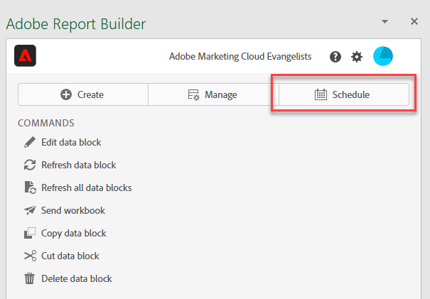

# Pianificare le cartelle di lavoro

Dopo aver salvato la cartella di lavoro e completato l’analisi, è possibile condividere facilmente la cartella di lavoro con altri membri del team utilizzando la funzione di pianificazione. La funzione Schedule (Pianifica) consente di creare una pianificazione che aggiorna automaticamente i dati nella cartella di lavoro e invia tramite e-mail il file .xlsx della cartella di lavoro di Excel come allegato al pubblico specificato alla data e all’ora indicate. L’impostazione di una pianificazione fornisce automaticamente ai destinatari aggiornamenti regolari. Puoi anche utilizzare la funzione di pianificazione per inviare la cartella di lavoro una volta senza pianificare gli aggiornamenti automatici.

Puoi creare più pianificazioni per una singola cartella di lavoro. Ad esempio, puoi inviare una cartella di lavoro al team su base giornaliera e inviare la cartella di lavoro al tuo responsabile una volta alla settimana creando due pianificazioni diverse.

La funzione Schedule (Pianifica) consente inoltre di impostare la protezione tramite password per una cartella di lavoro e di modificare le cartelle di lavoro pianificate in precedenza.

>[!VIDEO](https://video.tv.adobe.com/v/3413079/?quality=12&learn=on)

## Pianificare una cartella di lavoro

Utilizzare il pulsante Pianifica nell&#39;hub di Report Builder per creare rapidamente una pianificazione in modo da poter distribuire automaticamente un file di Excel della cartella di lavoro (con estensione xlsx) a un singolo utente o a un gruppo.

1. Fai clic sul pulsante Schedule (Pianifica) nell’hub di Report Builder.

   {width="55%"}

1. Fai clic su Schedule Workbook (Pianifica cartella di lavoro) o sul pulsante in alto a sinistra per creare una nuova cartella di lavoro pianificata.

   {width="55%"}

   Il riquadro di pianificazione mostra alcune informazioni predefinite sulla cartella di lavoro, ad esempio il nome e l’ultima data di modifica della cartella di lavoro.

   {width="55%"}

1. (Facoltativo) Immetti un nome del file.

   Il file della cartella di lavoro viene salvato con il nome della cartella di lavoro per impostazione predefinita, ma può essere modificato. Se la stessa cartella di lavoro viene inviata a più tipi di pubblico e desideri assegnargli un nome più descrittivo per un determinato pubblico, puoi modificare il nome.

1. (Facoltativo) Seleziona **Append time-stamp to file name** (Aggiungi marca temporale al nome del file).

   Puoi aggiungere una marca temporale al nome del file per identificare la data di aggiornamento della cartella di lavoro. È utile per vedere rapidamente quale versione di una cartella di lavoro è stata inviata in una data specifica. **Filename preview** (Anteprima nome file) mostra come verrà visualizzato il nome del file della cartella di lavoro nell’e-mail quando la cartella di lavoro viene distribuita. Il formato della marca temporale è AAAA-MM-GG.

1. (Facoltativo) Seleziona **.zip compression** (compressione .zip) per comprimere il file e proteggerlo tramite password.

   Selezionando questa opzione, viene richiesto di immettere una password per aprire il file. È utile se hai dei dubbi sulla sicurezza dei dati e desideri proteggere la cartella di lavoro tramite password. Per proteggere il file con una password è necessario selezionare **.zip compression** (compressione .zip). La password deve contenere almeno 8 caratteri, un numero e un carattere speciale.

   {width="55%"}

1. Inserisci i destinatari in **Recipients** (Destinatari). Puoi inserire il nome di una persona riconosciuta nell’organizzazione oppure l’indirizzo e-mail di una persona interna o esterna all’organizzazione.

1. Inserisci l’oggetto dell’e-mail in **Subject** (Oggetto) e una descrizione per i destinatari. L’oggetto viene impostato automaticamente sul nome del file della cartella di lavoro, ma puoi modificarlo se necessario. Puoi aggiungere i dettagli nella sezione della descrizione.

   {width="55%"}

1. Configura le opzioni di pianificazione per impostare la data e l’ora in cui desideri inviare la cartella di lavoro ai destinatari tramite e-mail.

   Scegli le date e ore di inizio e fine e l’arco temporale. Può essere la data odierna o una data futura.

   Scegli la frequenza in **Frequency** (Frequenza) dal menu a discesa. Puoi impostare la frequenza in modo che sia ogni ora, giorno, settimana, mese o anno in un giorno specifico. Ad esempio, puoi impostare una pianificazione per l’invio della cartella di lavoro la prima domenica notte del mese in modo che i destinatari abbiano l’e-mail nella casella in entrata il lunedì mattina.

   {width="55%"}

1. Dopo aver impostato la pianificazione, fai clic su **Send on schedule** (Invia secondo programma).

   {width="55%"}

   Nella parte inferiore dell’hub di Report Builder viene visualizzato un avviso di conferma e la cartella di lavoro pianificata viene elencata nella scheda Workbooks (Cartelle di lavoro).

   {width="55%"}

## Pianificare una cartella di lavoro convertita {#converted}

1. Pianifica una cartella di lavoro legacy [convertita](/help/analyze/report-builder/convert-workbooks.md).

   Viene visualizzato un pop-up in cui viene richiesto se si desidera utilizzare la metada di pianificazione della cartella di lavoro precedente per creare una nuova attività pianificata.

1. Se si seleziona **[!UICONTROL Use]**, il Report Builder inserisce automaticamente le informazioni di pianificazione legacy.

1. Verifica che queste informazioni siano corrette e pianificate.

1. Se si desidera inviare la cartella di lavoro in base a una pianificazione diversa, pianificare un&#39;attività pianificata completamente aggiornata.

## Inviare la cartella di lavoro una sola volta

Puoi anche inviare la cartella di lavoro una sola volta.

1. Deseleziona **Show scheduling options** (Mostra opzioni di pianificazione)

   {width="40%"}

1. Fai clic su **Send Now** (Invia subito).

## Visualizzare e modificare le cartelle di lavoro pianificate {#view-edit}

Puoi visualizzare e gestire tutte le cartelle di lavoro pianificate in un’unica posizione nella scheda Workbooks (Cartelle di lavoro).

1. Nella sezione Schedule (Pianifica) dell’hub di Report Builder, fai clic sulla scheda Workbooks (Cartelle di lavoro). Usa questa visualizzazione per visualizzare un elenco di tutte le cartelle di lavoro pianificate.

1. Seleziona una cartella di lavoro. Vengono visualizzati diversi strumenti che consentono di modificare la cartella di lavoro, modificare l&#39;attività di pianificazione, mettere in pausa e riavviare l&#39;attività di pianificazione, scaricare un rapporto attività pianificata o eliminare l&#39;attività di pianificazione.

   {width="20%"}

* (Facoltativo) Fai clic sull’icona della matita per modificare l’attività di pianificazione della cartella di lavoro.

* (Facoltativo) Fai clic sull’icona dell’orologio per visualizzare la cronologia di ciascuna attività pianificata.

* (Facoltativo) Fai clic sull’icona Pausa per sospendere e riavviare l’attività di pianificazione della distribuzione. Questa opzione è utile se è necessario modificare la cartella di lavoro prima di inviarla. Fai nuovamente clic sull’icona di pausa per riavviare la distribuzione.

* (Facoltativo) Fare clic sull&#39;icona di download per scaricare una copia dell&#39;attività di pianificazione della cartella di lavoro.

* (Facoltativo) Fai clic sul cestino per eliminare l’attività di pianificazione.

  {width="40%"}

## Rivedere lo stato delle attività programmate {#status}

La visualizzazione della cronologia consente di controllare lo stato di ogni attività pianificata. È disponibile una riga separata che documenta il cambiamento stato per ogni attività pianificata. Nell’esempio riportato di seguito, la pianificazione *New Hourly Schedule* (Nuova pianificazione oraria) è stata avviata il 5 gennaio alle 15.04. Entro le 15:05 è stata aggiornata correttamente ed è stata inviata ai destinatari. La cartella di lavoro successiva, *Bad workbook* (Cartella di lavoro non valida), ha riscontrato un errore durante il processo di aggiornamento. Se una cartella di lavoro non è stata inviata, la scheda della cronologia consente di risolvere i problemi mostrando in quale punto del processo si è verificato l’errore. In questo caso, è probabile che sia dovuto ad alcuni errori del blocco dati, ad esempio un componente mancante, che hanno impedito l’aggiornamento della cartella di lavoro.

Un segno di spunta verde indica che la cartella di lavoro è stata inviata correttamente. Un punto esclamativo all’interno di un triangolo rosso indica che si è verificato un errore.

Per scegliere le colonne da visualizzare nella scheda della cronologia, fai clic sull’icona delle impostazioni delle colonne a destra della barra di ricerca.

{width="55%"}

Puoi filtrare la cronologia per visualizzare solo quella di una singola cartella di lavoro pianificata andando alla scheda delle cartelle di lavoro, selezionando la cartella di lavoro e facendo clic sull’icona della cronologia.

Puoi anche visualizzare la cronologia di una cartella di lavoro specifica dalla scheda Workbooks (Cartelle di lavoro). Nella scheda Workbooks (Cartelle di lavoro) seleziona la cartella di lavoro, quindi fai clic sull’icona della cronologia.

{width="55%"}

Il filtro della cartella di lavoro verrà quindi visualizzato nella parte superiore della cronologia. Per visualizzare nuovamente la cronologia di tutte le attività pianificate, fai clic sulla x accanto al filtro.

{width="55%"}
