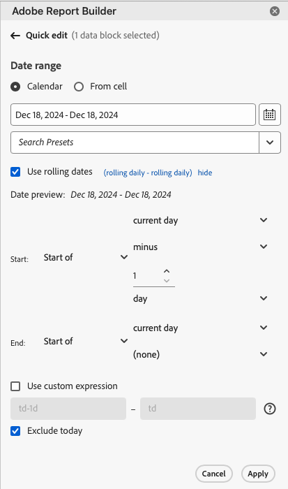
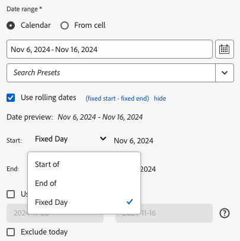
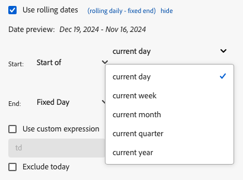

# Selezionare un intervallo di date

Per modificare l’intervallo di date di un blocco di dati esistente:

- Seleziona **[!UICONTROL Edit a data block]**, oppure
- Selezionare il collegamento **[!UICONTROL Date range]** in **[!UICONTROL Quick edit]**.

Utilizza le seguenti opzioni per modificare un intervallo di date per un blocco di dati.

## Calendario

L&#39;opzione **[!UICONTROL Calendar]** consente di creare date statiche o continue utilizzando le opzioni seguenti:

### Intervallo date

Nel campo intervallo di date viene visualizzato l’intervallo di date corrente per la richiesta di blocco di dati. Puoi immettere le date direttamente oppure utilizzare  per specificare un intervallo di date.

{zoomable="yes"}

### Predefiniti

Utilizza il menu a discesa dei predefiniti per selezionare un predefinito. Potete anche immettere del testo per cercare dei predefiniti.

{zoomable="yes"}

Il menu a discesa dei predefiniti include un set standard di intervalli di date predefiniti e componenti di intervallo di date per una suite di rapporti salvata o condivisa con te.

### Date di rotazione

Per definire le date di rotazione:

{zoomable="yes"}

1. Selezionare **[!UICONTROL Use rolling dates]** per definire la logica per una definizione di data continua. È possibile selezionare il testo tra parentesi (ad esempio **[!UICONTROL fixed start - rolling daily]**) per estendere il pannello e specificare i dettagli per **[!UICONTROL Start]** e **[!UICONTROL End]**.

1. Seleziona **[!UICONTROL Start of]**, **[!UICONTROL End of]**, or **[!UICONTROL Fixed day]**.

   - Dopo aver selezionato **[!UICONTROL Start of]** o **[!UICONTROL End of]**, è possibile creare un’espressione completa. Ad esempio: **[!UICONTROL End of]** **[!UICONTROL current year]** **[!UICONTROL plus]** `1` **[!UICONTROL day]**. Seleziona il valore appropriato per ogni singola parte dell’espressione.

      - Seleziona un valore corrente. Ad esempio: **[!UICONTROL current year]**.
      - Selezionare un valore per un calcolo aggiuntivo facoltativo. Ad esempio: **[!UICONTROL plus]**.
      - Dopo aver specificato un calcolo aggiuntivo, specifica un valore. Ad esempio: `1`.
      - Dopo aver specificato un calcolo aggiuntivo, seleziona il periodo di tempo da utilizzare per il calcolo. Ad esempio: **[!UICONTROL day]**.

   - Dopo aver selezionato **[!UICONTROL Fixed Day]**, specificare un giorno fisso o utilizzare il selettore per selezionare un giorno.

1. Seleziona **[!UICONTROL hide]** per nascondere i dettagli del calcolo delle date continue.


### Espressioni personalizzate

L’opzione di espressione personalizzata consente di modificare l’intervallo di date creando un’espressione personalizzata oppure di immettere una formula aritmetica.

{zoomable="yes"}

1. Seleziona **[!UICONTROL Use rolling dates]** (Aggiungi set di dati).

1. Seleziona **[!UICONTROL Use custom expression]** (Salva).

   Quando si seleziona **[!UICONTROL Use custom expression]**, i controlli standard dell&#39;intervallo di date continuo sono disabilitati.

1. Immetti un&#39;[espressione personalizzata](#create-a-custom-expression).

1. Utilizza **[!UICONTROL Date preview]** per verificare l&#39;intervallo di date risultante.

#### Creare un’espressione personalizzata

1. Immetti un [riferimento data](#date-references).

1. Aggiungi un operatore [date](#date-operators) facoltativo per spostare la data nel passato o nel futuro.

È possibile immettere un&#39;espressione personalizzata che includa più operatori, ad esempio `tm-11m-1d`.

#### Riferimenti data

Nella tabella seguente sono elencati alcuni esempi di riferimenti di date.

| Riferimento data | Tipo | Descrizione |
|----------------|--------------|----------------------------|
| `1/1/10` | Data statica | Immesso in formato data ISO |
| `td` | Data continua | Inizio del giorno corrente |
| `tw` | Data continua | Inizio della settimana corrente |
| `tm` | Data continua | Inizio del mese corrente |
| `tq` | Data continua | Inizio del trimestre corrente |
| `ty` | Data continua | Inizio dell&#39;anno corrente |

#### Operatori di data

Nella tabella seguente sono elencati alcuni esempi di operatori di date.

| Operatore data | Unità | Descrizione |
|----------------|---------|--------------------|
| `+6d` | Giorno | Aggiungi 6 giorni alla data di riferimento |
| `+1w` | Settimana | Aggiungi una settimana intera alla data di riferimento |
| `-2m` | Mese | Sottrarre 2 mesi interi alla data di riferimento |
| `-4q` | Trimestre | Sottrarre 4 trimestri alla data di riferimento |
| -`1y` | Anno | Sottrai un anno alla data di riferimento |

#### Espressioni data

Nella tabella seguente sono elencati alcuni esempi di espressioni di data.

| Espressione data | Significato |
|-----------------|--------------------------------------|
| `td` | Oggi |
| `td-1w` | Primo giorno della settimana scorsa |
| `tm-1d` | Ultimo giorno del mese precedente |
| `td-52w` | Lo stesso giorno, 52 settimane fa |
| `tm-11m-1d` | Ultimo giorno dello stesso mese lo scorso anno |
| `"2020-09-06"` | Data specifica, 9 settembre 2020 |


## Intervallo di date dalla cella

L&#39;intervallo di date può essere specificato nelle celle del foglio di lavoro. Utilizzare l&#39;opzione **[!UICONTROL Date range from cell]** per scegliere la data di inizio e di fine del blocco di dati dalle celle selezionate. Quando selezioni l&#39;opzione **[!UICONTROL From cell]**, nel pannello vengono visualizzati **[!UICONTROL From]** e **[!UICONTROL To]** campi in cui puoi immettere la posizione di una cella o utilizzare  per scegliere la cella selezionata corrente.

{zoomable="yes"}


## Escludi oggi

Seleziona **[!UICONTROL Exclude today]** per escludere oggi da un intervallo di date selezionato. Il giorno corrente è escluso da tutte le modalità utilizzate per definire un intervallo di date: calendario, date continue o espressioni personalizzate.


## Intervalli di date validi

Nell’elenco seguente sono descritti i formati di intervalli di date validi.

- Le date di inizio e fine devono essere nel formato seguente: AAAA-MM-GG

- La data di inizio deve essere precedente o uguale alla data di fine. Entrambe le date possono essere impostate sul futuro.

- Quando si utilizzano date continue, la data di inizio deve essere oggi o nel passato. Il giorno di inizio deve essere nel passato se si seleziona **[!UICONTROL Exclude today]**.

- Puoi creare un intervallo di date statico impostato per il futuro. Ad esempio, potrebbe essere necessario impostare una data futura per il lancio di una campagna di marketing la prossima settimana. Questa opzione crea in anticipo un monitoraggio della cartella di lavoro per una campagna.

## Modificare l’intervallo di date

Puoi modificare l’intervallo di date di un blocco di dati esistente.

1. Seleziona una cella nel blocco di dati.

- Selezionare **[!UICONTROL Edit data block]** nel pannello **[!UICONTROL Commands]**, oppure
- Selezionare il collegamento **[!UICONTROL Date range]** nel pannello **[!UICONTROL Quick edit]**.

1. Modifica l’intervallo di date utilizzando una qualsiasi delle opzioni di selezione della data disponibili.

1. Seleziona **[!UICONTROL Apply]**.

Report Builder applica il nuovo intervallo di date a tutti i blocchi di dati della selezione.

<!--
To change the date range of an existing data block, select Edit a data block or use the QUICK EDIT panel.

Use the following options to change a date range for a data block.

**Calendar**

 The Calendar allows you to create static or rolling dates using the following options:

- Date range field
- Calendar
- Preset drop-down menu
- Rolling date mode
- Customize expressions


**From cell**

The **[!UICONTROL From cell]** option allows you to reference dates entered in worksheet cells.

You have the option to exclude today on any selected date range.

 

## Use the Calendar

When you use the **Calendar**, the date range field displays the current date range for the data block request. You can enter dates directly into the date range field or use a data range selection option.

### Date range field

To enter dates directly into the date range field

1. Click the date range field next to the calendar icon.

1. Enter start and end dates for your date range.

### Calendar

To select dates using the calendar

1. Click the calendar icon to display a monthly calendar.

1. Click a start date.

1. Click an end date.

To set a date range in reverse, click the end date first and then click the start date.


### Preset drop down menu

The preset drop-down menu includes a standard set of preset date ranges and date range components for a report suite that you saved or a report suite that was shared with you.

### Rolling dates

The rolling dates option allows you to select a date range using rolling dates.

1. Select **Use rolling dates**.

1. Select a rolling expression for your start and or end date.

    

    **Start of** — Allows you to select the beginning of a day, week, month, quarter, or year.

    **End of** — Allows you to select the end of a day, week, month, quarter, or year.

    **Fixed day** — Allows you to fix a start or end date while the other date is rolling.

1. Choose day, week, month, quarter, or year as the rolling period.

    

1. Add or subtract days, weeks, months, quarters, or years from your rolling date.

    

1. Click Next to define the data range.

    Use the date preview to confirm the resulting date range is the desired range.

### Custom expressions

The custom expression option allows you to change the date range by building a custom expression or you can enter an arithmetic formula.

1. Select **Use rolling dates**.

1. Select **Use custom expression**.

    When you select the **Use custom expression** option, the standard rolling date range controls are disabled.

    

1. Enter a custom expression.

    For a sample list of custom expressions, see **Date expressions**.

1. Use the date preview to verify the resulting date range is the desired range.

#### Create a custom expression

1. Enter a **Date reference**.

1. Add **Date operators** to move the date to the past or future.

You can enter a custom date expression that includes multiple operators, such as ```tm-11m-1d```.

#### Date references

The following table lists date reference examples.

| Date Reference | Type         | Description                |
|----------------|--------------|----------------------------|
| 1/1/10         | Static Date  | Entered in ISO Date format |
| td             | Rolling Date | Start of current day       |
| tw             | Rolling Date | Start of current week      |
| tm             | Rolling Date | Start of current month     |
| tq             | Rolling Date | Start of current quarter   |
| ty             | Rolling Date | Start of current year      |

#### Date operators

The following table lists date operator examples.

| Date Operators | Unit    | Description   |
|----------------|---------|--------------------|
| +6d            | Day     | Add 6 days to the Date Reference |
| +1w            | Week    | Add one full week to the Date Reference |
| -2m            | Month   | Subtract 2 full months to the Date Reference |
| -4q            | Quarter | Subtract 4 quarters to the Date Reference |
| -1y            | Year    | Subtract one year to the Date Reference |

#### Date expressions

The following table lists date expression examples.

| Date Expression | Meaning                              |
|-----------------|--------------------------------------|
| td-1w           | First day of last week               |
| tm-1d           | Last day of previous month           |
| td-52w          | Same day, 52 weeks ago               |
| tm-11m-1d       | Last day of the same month last year |
| "2020-09-06"    | Sept 9th, 2020                       |

## Date range from cell

The date range can be specified in worksheet cells. Use the **Date range from cell** option to choose the data block start and end date from selected cells. When you select the **From cell** option, the panel displays **From** and **To** fields where you can enter a cell location.


## Exclude today

Choose the **Exclude today** option to exclude today from a selected date range. Choosing to include today may pull incomplete data for today.

When selected, the **Exclude today** option excludes the current day from all date range modes including calendar, rolling dates, or custom expressions.

## Valid date ranges

The following list describe valid date range formats.

- The start and end dates must be in the following format: YYYY-MM-DD

- The start date must be earlier to or equal to the end date. Both dates can be set to the future.

- When using rolling dates, the start date must be today or in the past. It must be in the past if **Exclude today** is checked.

- You can create a static date range set for the future. For example, you may need to set a future date for a marketing campaign launch next week. This option creates a workbook monitoring for a campaign ahead of time.

## Change the date range

You can edit the date range of an existing data block by selecting Edit data block in the COMMANDS panel or by selecting the date range link in the QUICK EDIT panel.

**Edit data block** — Allows you to edit multiple data block parameters, including date range, for a single data block.

**Quick Edit: Date range** — Allows you to edit the date range of one or more data blocks.

To edit the date range from the QUICK EDIT panel

1. Select cells within one or more data blocks in a worksheet.

1. Click the **Date range** link in the QUICK EDIT panel.

1. Select the date range using any of the date selection options.

1. Click **Apply**.


Report Builder applies the new date range to all data blocks in the selection.
-->