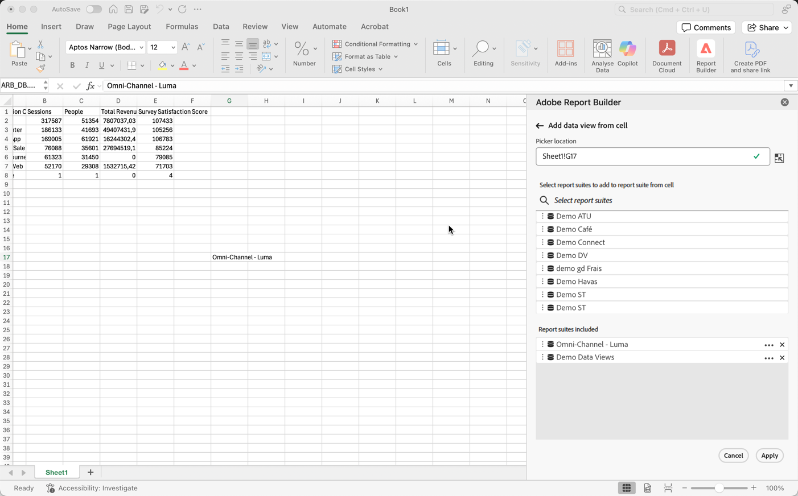

# Seleziona una suite di rapporti

Puoi selezionare una suite di rapporti dal menu a discesa oppure selezionare una suite di rapporti da una cella e aggiornare automaticamente il blocco di dati con una nuova suite di rapporti.

## Seleziona suite di rapporti da una cella

La selezione di una suite di rapporti da una cella semplifica l’aggiornamento dei blocchi di dati utilizzando suite di rapporti diverse. Invece di creare rapporti completamente nuovi con blocchi di dati separati, puoi aggiornare i blocchi di dati con una suite di rapporti selezionata da una cella.

La selezione di una suite di rapporti da una cella è utile quando:

* Più suite di rapporti simili o identiche nella struttura.
* Formati di blocchi di dati complessi che includono componenti e layout personalizzati.

Per selezionare una suite di rapporti da una cella, crea prima un blocco di dati e assegna più suite di rapporti a una cella al di fuori del blocco di dati. Quindi, utilizza il pannello **[!UICONTROL Report suite from cell]** per aggiornare i blocchi di dati da suite di rapporti diverse.

1. Crea un blocco di dati. Per informazioni sulla creazione di un blocco di dati, vedere [Creare un blocco di dati](/help/analyze/report-builder/create-a-data-block.md).

1. Selezionare  in **[!UICONTROL Report suites]**.

1. Selezionare una cella utilizzando  all&#39;esterno del blocco di dati.

1. Aggiungi una o più suite di rapporti da **[!UICONTROL Select report suites to add to report suite from cell]** tramite trascinamento della selezione. In alternativa, è possibile selezionare una suite di rapporti per aggiungerla all&#39;elenco **[!UICONTROL Report suites included]**.

   * Puoi usare  **[!UICONTROL _Seleziona suite di rapporti_]** per cercare suite di rapporti.
   * Utilizza  per aprire un menu di scelta rapida in modo da poter spostare le suite di rapporti verso l&#39;alto o verso il basso nell&#39;elenco **[!UICONTROL Report suites included]**.
   * Utilizza  per eliminare una suite di rapporti dall&#39;elenco **[!UICONTROL Report suites included]**.

   {zoomable="yes"}

1. Selezionare **[!UICONTROL Apply]** per applicare le suite di rapporti selezionate alla cella selezionata.

## Modificare la suite di rapporti da una cella

1. Seleziona la posizione della cella della suite di rapporti nel foglio.
1. Nell&#39;hub Report Builder selezionare il collegamento **[!UICONTROL Report suites from cell]** in **[!UICONTROL Quick edit]**.
1. Selezionare una suite di rapporti dal menu a discesa **[!UICONTROL Report suite]**.

   {zoomable="yes"}
1. Facoltativo, selezionare **[!UICONTROL Refresh data block(s) upon change]**.

1. Seleziona **[!UICONTROL Apply]**. Report Builder aggiorna il blocco di dati in base alla suite di rapporti selezionata.
