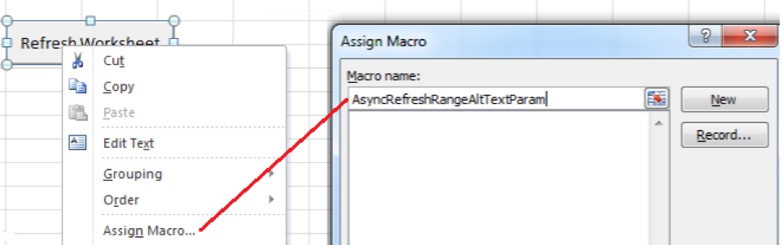

# Richiamo delle funzionalità di Generatore di report dalle funzioni di Microsoft Excel

Questa capacità integra ulteriormente l'utilizzo di Generatore di report nel flusso di lavoro Excel naturale, senza dover accedere all'interfaccia utente di Generatore di report.

Ad esempio, potrebbe essere necessario aggiornare automaticamente le richieste di Generatore di report il cui filtro di input si basa sui dati estesi in Excel da altre fonti. Ora puoi effettuare questa operazione utilizzando la stringa refreshrequestsincellsrange (.) . Tutte le chiamate sono asincrone. Essi tornano immediatamente e non attendono l'esecuzione completa di una chiamata.

>[!NOTE]
>
>Affinché questa funzionalità funzioni, è necessario che sia installato il Generatore di report 5.0 (o versione successiva).

Di seguito è riportata una tabella con l'elenco delle funzioni esposte:

| Nome funzione | Descrizione |
|---|---|
| string asyncrefreshall () | Aggiorna tutte le richieste di Generatore di report presenti in una cartella di lavoro. |
| string asyncrefreshrange (stringa rangeaddressina 1 Format) | Aggiorna tutte le richieste di Generatore di report presenti nell'indirizzo intervallo celle specificato (un'espressione stringa che rappresenta una serie di celle in formato A 1, ad esempio "Sheet 1! A 2: A 10 "). |
| string asyncrefreshrangealttextparam () | Aggiorna tutte le richieste di Generatore di report presenti nell'intervallo di celle specificato, trasmesse attraverso il testo alternativo di Ms Form Control. |
| string asyncrefreshactiveworksheet () | Aggiorna tutte le richieste di Generatore di report presenti nel foglio di lavoro attivo. |
| stringa asyncrefreshworksheet (stringa worksheetname) | Aggiorna tutte le richieste di Generatore di report presenti nel foglio di lavoro specificato (il nome del foglio di lavoro così come appare sulla scheda). |
| string asyncrefreshworksheetalttextparam (); | Aggiorna tutte le richieste di Generatore di report presenti nel nome del foglio di lavoro specifico trasmesso attraverso il testo alternativo di Ms Form Control |
| string getlastrunstatus () | Restituisce una stringa che descrive lo stato dell'ultima esecuzione. |

To access these functions within report builder, go to [!UICONTROL Formulas] &gt; [!UICONTROL Insert Function]. Nella parte inferiore dell'elenco delle categorie è disponibile Adobe. reportbuilder. Bridge:


## Use these functions in a formula {#section_034311081C8D4D7AA9275C1435A087CD}

Ad esempio, la formula

```
=IF(OR(ISTEXT(P5),ISBLANK(P5)),AsyncRefreshRange("P9"),"")
```

" Se il valore nella cella P 5 è testo o è vuoto, aggiornare l'intervallo nella cella P 9. "

## Use Report Builder functions with format control {#section_26123090B5BD49748C8D8ED7A1C5ED84}

Ora potete assegnare una macro a un controllo creato e che il controllo può essere una funzione che aggiorna una richiesta di cartelle di lavoro. Ad esempio, la funzione asyncrefreshactiveworksheet aggiorna tutte le richieste in un foglio di lavoro. A volte, tuttavia, potrebbe essere necessario aggiornare solo alcune richieste, non tutte.

1. Impostate il parametro macro.
1. Right-click the control and select **[!UICONTROL Assign Macro]**.
1. Immettete il nome della funzione del generatore di report (nessun parametro o parentesi).



## Pass parameters to Report Builder functions via format control {#section_ECCA1F4990D244619DFD79138064CEF0}

Le due funzioni che hanno un parametro possono essere utilizzate con il controllo Format, ma solo tramite il campo Testo Alt:

* Asyncrefreshrange (stringa rangeaddressina 1 Format)
* Asyncrefreshworksheet (stringa worksheetname)

1. Right-click the control and select **[!UICONTROL Format Control]**.

   

1. Click the [!UICONTROL Alt Text] tab.

   

1. Under [!UICONTROL Alternative text], enter the cell range that you want refreshed.
1. Open the list of report builder parameters under [!UICONTROL Formulas] &gt; [!UICONTROL Insert Function]&gt; [!UICONTROL Adobe.ReportBuilder.Bridge].

1. Pick one of the two functions that end with AltTextParam and click **[!UICONTROL OK]**.

