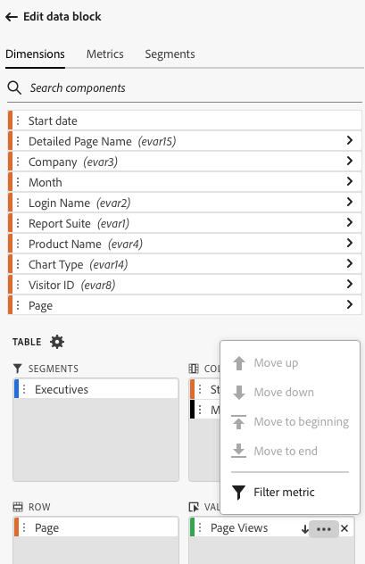

# Utilizzare i segmenti

È possibile applicare segmenti quando si crea un nuovo blocco di dati o quando si seleziona **[!UICONTROL Edit data block]** dal pannello **[!UICONTROL Commands]**.

## Applicare segmenti a un blocco di dati

Per applicare un segmento all’intero blocco di dati, seleziona due volte un segmento o trascina i segmenti dall’elenco dei componenti nella sezione dei segmenti della tabella.

## Applicare filtri alle singole metriche

Per applicare filtri che utilizzano i segmenti a singole metriche:

* Trascinare uno o più segmenti da **[!UICONTROL Segments]** in una metrica della tabella.

* In alternativa:

   1. Selezionare  per una metrica specifica nel riquadro **[!UICONTROL Table]**, quindi selezionare **[!UICONTROL Filter metric]**.

      Scheda {zoomable="yes"}

   1. Selezionare uno o più segmenti dal menu a discesa **[!UICONTROL Segments]**. I segmenti vengono aggiunti all&#39;elenco **[!UICONTROL Segments applied]**.

      
   1. Selezionare  per rimuovere un segmento dall&#39;elenco **[!UICONTROL Segment applied]**. In alternativa, selezionare **[!UICONTROL Clear all]** per rimuovere tutti i segmenti dall&#39;elenco **[!UICONTROL Segment applied]**.
   1. Seleziona **[!UICONTROL Apply]**.

Per visualizzare i filtri applicati, passa il cursore del mouse su una metrica o selezionala nel riquadro Tabella. Le metriche con segmenti applicati visualizzano un’icona di segmento.

## Modifica rapida segmenti

È possibile utilizzare il pannello **[!UICONTROL Quick edit]** per aggiungere, rimuovere o sostituire segmenti per blocchi di dati esistenti.

Quando selezioni un intervallo di celle nel foglio di calcolo, il collegamento **[!UICONTROL Segments]** nel pannello **[!UICONTROL Quick edit]** visualizza un elenco di riepilogo dei segmenti utilizzati dai blocchi di dati nella selezione.

Per modificare i segmenti utilizzando il pannello **[!UICONTROL Quick edit]**:

1. Seleziona un intervallo di celle da uno o più blocchi di dati.

1. Selezionare il collegamento **[!UICONTROL Segments]** per avviare il pannello **[!UICONTROL Quick edit]** **[!UICONTROL Segments]**.

### Aggiungere o rimuovere segmenti

Puoi aggiungere o rimuovere segmenti utilizzando le opzioni Aggiungi/Rimuovi.

1. Selezionare la scheda **[!UICONTROL Add/Remove]** nel pannello **[!UICONTROL Quick edit]** **[!UICONTROL Segments]**.

   1. Selezionare uno o più segmenti dal menu a discesa **[!UICONTROL Segments]**. I segmenti vengono aggiunti all&#39;elenco **[!UICONTROL Segments applied]**.
   1. Selezionare  per rimuovere un segmento dall&#39;elenco **[!UICONTROL Segment applied]**.
   1. Seleziona **[!UICONTROL Apply]**.

In Report Builder viene visualizzato un messaggio per confermare le modifiche al segmento applicato.

### Sostituire i segmenti

Puoi sostituire un segmento esistente con un altro segmento per modificare la modalità di segmentazione dei dati.

1. Selezionare la scheda **[!UICONTROL Replace]** nel pannello **[!UICONTROL Quick edit]** **[!UICONTROL Segments]**.

1. Utilizza il campo di ricerca **Elenco di ricerca** per individuare segmenti specifici.

1. Seleziona uno o più segmenti da sostituire.

1. Cercare uno o più segmenti dal menu a discesa Sostituisci con per aggiungere il segmento all&#39;elenco **[!UICONTROL Replace with]**.

1. Seleziona **[!UICONTROL Apply]**.

Report Builder aggiorna l’elenco dei segmenti in base alla sostituzione.

## Definire i segmenti dei blocchi di dati dalla cella

I blocchi di dati possono fare riferimento a segmenti da una cella. Più blocchi di dati possono fare riferimento alla stessa cella per i segmenti, consentendo di cambiare facilmente i segmenti per più blocchi di dati alla volta.

Per applicare segmenti da una cella:

1. [Creare un nuovo blocco di dati](create-a-data-block.md#create-a-data-block) o modificare un blocco di dati esistente.
1. Selezionare la scheda **[!UICONTROL Segments]** per definire i segmenti.
1. Selezionare .

   {zoomable="yes"}

1. Seleziona la cella da cui desideri che i blocchi di dati facciano riferimento a un segmento.

1. Fai doppio clic su per aggiungere un segmento alla cella. In alternativa, trascinare uno o più segmenti nella sezione **[!UICONTROL Segments included]**.

1. Selezionare **[!UICONTROL Apply]** per creare la cella di riferimento.

1. Dalla scheda **Segmenti**, aggiungi il segmento della cella di riferimento appena creato al blocco di dati.

   Scheda {zoomable="yes"}

1. Seleziona **[!UICONTROL Finish]**.

Per applicare la cella di riferimento come segmento ad altri blocchi di dati, utilizzare il riferimento di cella come uno dei segmenti nell&#39;elenco **[!UICONTROL Segments]** nella scheda **[!UICONTROL Table]**.

### Utilizzare una cella di riferimento per modificare i segmenti dei blocchi di dati

1. Selezionare la cella di riferimento nel foglio di calcolo.

1. Selezionare il collegamento in **[!UICONTROL Segments from cell]** nel menu **[!UICONTROL Quick Edit]**.

   {zoomable="yes"}

1. Seleziona il segmento dal menu a discesa.

1. Seleziona **[!UICONTROL Apply]**.

<!--
You can apply segments when you create a new data block or when you select the **Edit data block** option from the COMMANDS panel.

## Apply segments to a data block

To apply a segment to the entire data block, double-click a segment or drag and drop filters from the components list into the Segments section of the Table.

## Apply segments to individual metrics

To apply segments to individual metrics, drag and drop a segment onto a metric in the table. You can also click the **...** icon to the right of a metric in the Table pane and then select **[!UICONTROL Segment metric]**. To view applied segments, hover over or select a metric in the Table pane. Metrics with applied segments display a filter icon.

## Quick edit segments

You can use the Quick edit panel to add, remove, or replace segments for existing data blocks.

When you select a range of cells in the spreadsheet, the **[!UICONTROL Segments]** link in the Quick edit panel displays a summary list of the segments used by the data blocks in that selection.

To edit segments using the Quick edit panel

1. Select a range of cells from one or multiple data blocks.

    

1. Click the link underneath **[!UICONTROL Segments]** to launch the Quick edit - Filters panel.

    

### Add or remove a segment

You can add or remove segments using the Add/Remove options.

1. Select the **[!UICONTROL Add/Remove]** tab in the Quick edit-segments panel.

    All segments applied to the selected data blocks are listed in the Quick Edit-segments panel. Segments applied to all data blocks in the selection are listed under the **[!UICONTROL Applied to all selected data blocks]** heading. Segments applied to some but not all data blocks are listed under the **[!UICONTROL Applied to 1 or more selected data blocks]** heading.

    When multiple segments are present in the selected data blocks, you can search for specific segments using the **[!UICONTROL Add Filter]** search field.

    

1. Add segments by selecting segments from the **[!UICONTROL Add segment]** drop down menu.

    The list of searchable segments includes all segments accessible to the report suites that are present in one or more of the selected data blocks as well as all the segments that are available globally in the organization.

    Adding a segment applies the segment to all data blocks in the selection.

1. To remove segments, click the delete icon **x** to the right of segments in the **[!UICONTROL Segments applied]** list.

1. Click **[!UICONTROL Apply]** to save changes and return to the hub panel.

    Report Builder displays a message to confirm the applied segment changes.

### Replace a segment

You can replace an existing segment with another segment to change how the data is segmented.

1. Select the **[!UICONTROL Replace]** tab in the Quick edit-segment panel.

    

1. Use the **[!UICONTROL Search list]** search field to locate specific segments.

1. Choose one or more segments that you want to replace.

1. Search for one or more segments in the Replace with field.

    Selecting a filter adds it to the **[!UICONTROL Replace with]**... list.

1. Click **[!UICONTROL Apply]**.

    Report Builder updates the list of segments to reflect the replacement.

### Define data block segments from cell

Data blocks can reference segments from a cell. Multiple data blocks can reference the same cell for segments, allowing you to easily switch segments for multiple data blocks at a time.

To apply segments from a cell

1. Navigate to Step 2 in either the data block creation or editing process. See [Create a Data Block](./create-a-data-block.md).
1. Click the **[!UICONTROL Segments]** tab to define filters.
1. Click **[!UICONTROL Create segment from cell]**.

    

1. Select the cell from which you want the data blocks to reference a segment.
   
1. Add the segment choice you wish to add to the cell by either double clicking the segment, or by dragging and dropping it into the **[!UICONTROL Segments Included]** section. 
   
   Note: Only one choice may be selected for the given cell at one time.

    

1. Click **[!UICONTROL Apply]** to create the reference cell.

1. From the **[!UICONTROL Segments]** tab, add the newly created reference cell segments to your data block.

    

1. Click **[!UICONTROL Finish]**.

    Now this cell can be referenced by other data blocks in their segments. To apply the reference cell as a segment to other data blocks, simply add the cell reference to their segments from the Segments tab. 

#### Use the reference cell to change data block segments

1. Select the reference cell in your spreadsheet.

1. Click the link under **[!UICONTROL Segments from Cell]** in the Quick Edit menu.

    

1. Select your segment from the drop-down menu.

    

1. Click **[!UICONTROL Apply]**.
-->