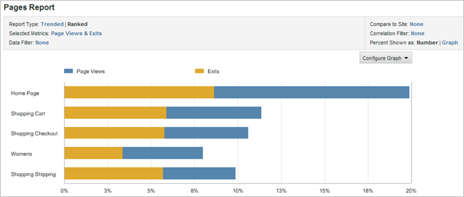
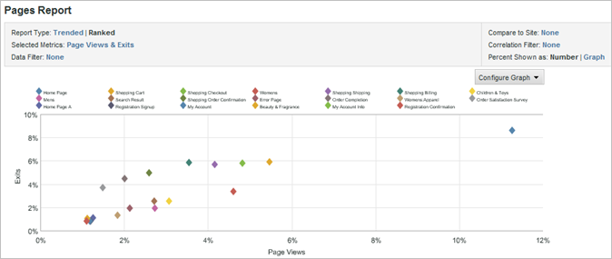

# Modificare i grafici dei rapporti

{{ra-eol}}

Puoi personalizzare il grafico in modo che sia più utile per il pubblico a cui è destinato.

Il tipo di grafico disponibile dipende dal tipo di rapporto eseguito. Ad esempio, i grafici a linee di tendenza sono utili per i rapporti con tendenze, ma è anche possibile utilizzare un grafico a barre verticali con linee di tendenza che illustrano chiaramente le tendenze per giorni, settimane, mesi e così via. In alternativa, è possibile scegliere un grafico a torta per illustrare le percentuali relative alle pagine visualizzate.

Per modificare un grafico del rapporto:

1. Esegui un rapporto.
1. Fai clic su **[!UICONTROL Configure Graph]**.
1. Seleziona un tipo di grafico.

   **[!UICONTROL Trend Line]**: le linee di tendenza mostrano le tendenze giornaliere per le metriche del rapporto e sono utili per la tendenza di una metrica nel tempo per linea.

   

   **[!UICONTROL Smooth Line]**: utilizza questo tipo di grafico con [!UICONTROL Video Detail Report]. Mostra i numeri o le percentuali di visualizzazioni per segmenti specifici di un video. Un aumento delle visualizzazioni per un segmento specifico del video indica che gli utenti hanno riavvolto e visualizzato più volte quella sezione del video. Se utilizzi percentuali, la percentuale visualizzata nel grafico è riferita a tutti i segmenti visualizzati, non è una percentuale degli utenti che hanno guardato quel segmento. Ad esempio, nel grafico la somma di tutti i segmenti del rapporto è 39. Il numero di visualizzazioni per il segmento da 0 a 10 secondi è 10. Pertanto, la percentuale di visualizzazioni per questo segmento è approssimativamente il 26%.

   

   **[!UICONTROL Area]**: il grafico a superficie è simile al grafico a linee di tendenza ma viene riempita l’area sotto le linee. Per visualizzare il grafico a superficie, è necessario visualizzare un rapporto con tendenze.

   

   **[!UICONTROL Stacked Area]**: i grafici a superfici sovrapposte sono utili per presentare un numero di prodotti o campagne nel tempo. Ad esempio, se presenti i primi cinque prodotti che mostrano ricavi, puoi vedere rapidamente quanti ricavi totali generano nel tempo tali prodotti. Puoi perfezionare la visualizzazione utilizzando un filtro di ricerca per includere o escludere prodotti specifici.

   

   **[!UICONTROL Vertical Bar]**: il grafico a barre verticali mostra le percentuali relative alle metriche del rapporto.

   

   **[!UICONTROL Stacked Vertical Bar]**: impilando elementi simili è possibile ottenere una visualizzazione rapida dell’influenza totale di un elemento. Ad esempio, in un [!UICONTROL Campaign Report], puoi impilare metriche di successo simili e vedere quale campagna genera il maggior successo totale. L’impilamento consente di trovare più facilmente le campagne che non sono le più performanti in una metrica, ma che lo sono in una combinazione di metriche.

   

   **[!UICONTROL Horizontal Bar]**: il grafico a barre orizzontali è simile al grafico a barre verticali, ma le colonne sono orizzontali.

   

   **[!UICONTROL Stacked Horizontal Bar]**: il grafico a barre orizzontali sovrapposte è simile al grafico a barre verticali, ma le colonne sono orizzontali.

   

   **[!UICONTROL Pie]**: il grafico a torta mostra le percentuali dei valori della metrica principali in relazione tra loro e mostra la percentuale delle metriche selezionate in relazione all’intero. È possibile visualizzare il grafico a torta per i rapporti con classifica.

   

   **[!UICONTROL Scatter]**: il grafico a dispersione mostra una visualizzazione a dispersione delle metriche selezionate tra loro. I grafici a dispersione consentono di visualizzare i dati in due dimensioni, in modo da identificare quali elementi sono meno importanti.

   

   **[!UICONTROL Bubble]**: il grafico a bolle mostra una visualizzazione a bolle delle metriche selezionate in relazione tra loro. La posizione delle bolle mostra le relazioni tra le metriche sull’asse orizzontale e verticale, mentre la dimensione della bolla mostra la metrica principale del rapporto. I grafici a bolle consentono di visualizzare i dati in due dimensioni, in modo da identificare quali elementi sono anomali.

   
