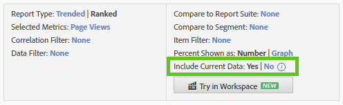
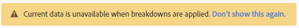

# Dati correnti

L’opzione Includi dati correnti in Reports &amp; Analytics consente di visualizzare i dati Analytics più recenti, spesso prima che i dati siano completamente elaborati e finalizzati. I dati correnti visualizzano la maggior parte delle metriche in pochi minuti, fornendo dati fruibili per processi decisionali rapidi.

È visibile come opzione come parte delle impostazioni di un rapporto:

I dati correnti sono attivati per impostazione predefinita su tutti i rapporti che li supportano. Se preferisci visualizzare tutte le metriche al termine dell’elaborazione dei dati, sono disponibili diverse opzioni:

* Utilizza Analysis Workspace, che utilizza dati completamente elaborati.
* Fare clic su &#39;No&#39; nell&#39;impostazione del report dati corrente per utilizzare solo i dati elaborati completamente.
* Rimuovi l’elemento di autorizzazione &quot;Dati correnti&quot; da un profilo di prodotto nell’Admin Console per impedire agli utenti non amministratori di visualizzare questa opzione. Per ulteriori informazioni, consulta [Autorizzazioni del profilo di prodotto per gli strumenti di Analytics](/help/admin/admin-console/permissions/analytics-tools.md) nella guida utente dell’amministratore .

A causa della priorità sulla disponibilità dei dati, i dati correnti non possono attualmente essere utilizzati con segmenti, classificazioni, raggruppamenti, percorsi e alcune metriche. Se si utilizza una di queste funzioni, i dati correnti vengono forzati a &quot;No&quot; nel rapporto e viene visualizzato un avviso giallo che spiega perché i dati correnti non sono disponibili.

## Latenza dati corrente tipica

Le metriche vengono visualizzate in uno dei tre intervalli di tempo seguenti. Fai clic sull’icona dell’orologio accanto all’opzione Includi dati correnti per visualizzare il valore di latenza effettivo per ogni metrica in un rapporto.

| Intervallo temporale | Metriche |
| --- | --- |
| Meno di 10 minuti | Istanze e visualizzazioni di pagina sulle variabili di traffico |
| Tra 10 e 35 minuti | Eventi di conversione, istanze e visualizzazioni di pagina sulle variabili di conversione |
| Tra 45 e 120 minuti | Tutti gli altri dati, ad esempio visite, visitatori unici e partecipazione |

Poiché alcuni dei dati visualizzati nella visualizzazione dati corrente non sono stati completamente elaborati, è possibile notare una differenza tra i valori segnalati nella visualizzazione dati corrente e nella visualizzazione finale. Nei rapporti con tendenze, la differenza di dati si trova in genere all’1%.

## Metriche calcolate

Poiché le metriche calcolate possono essere create utilizzando metriche con latenza diversa, alcuni valori recenti potrebbero essere calcolati utilizzando dati incompleti nella visualizzazione dati corrente.

Ad esempio, puoi creare la metrica calcolata &quot;Visualizzazioni pagina per visita&quot; utilizzando la formula `Page Views divided by Visits`. Le visualizzazioni di pagina generalmente vengono visualizzate entro 10 minuti e le visite generalmente vengono visualizzate entro 2 ore; le metriche calcolate all’interno di questa finestra di latenza vengono calcolate utilizzando metriche incomplete. Se pubblichi una nuova pagina che riceve 4000 hit da 4000 visite diverse in un intervallo di tempo di 2 ore, la differenza di latenza tra queste metriche può causare calcoli incompleti.

Questa differenza di dati è più visibile quando si riferiscono a nuovi valori o si utilizzano intervalli di tempo brevi. Quando un rapporto utilizza intervalli di date più lunghi, è improbabile che le differenze di latenza che si verificano nelle ultime ore di reporting abbiano un impatto significativo sulle metriche calcolate.

Se disponi di metriche calcolate che potrebbero essere influenzate da queste differenze, disattiva i dati correnti o utilizza le metriche con la stessa finestra di latenza prevista.

## Report scaricati

Quando scarichi un rapporto con la visualizzazione dati corrente abilitata, questo viene messo in coda, generato e quindi restituito al browser. Se i dati vengono raccolti durante la generazione del rapporto, questi vengono visualizzati nel rapporto. Questa finestra di tempo può causare il download del report con un po&#39; più di dati.
