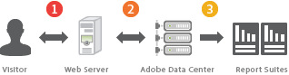

# Informazioni sulla raccolta di dati regionali

Scopri come vengono raccolti i dati per Adobe Analytics.

Ogni Adobe di pagina traccia ha un piccolo frammento di codice JavaScript autorizzato da Adobe. Il tuo account manager fornisce questo codice.

Ad un livello elevato, il processo di raccolta dei dati procede come segue:

1. Un visitatore visita una pagina web che contiene il codice di raccolta dati.
1. Al caricamento della pagina, il codice di raccolta dati invia una richiesta di immagine (chiamata web beacon) ai server di raccolta dati di Adobe. La richiesta di immagine contiene i dati che desideri raccogliere sull’interazione del visitatore con il tuo sito web.
1. Adobe memorizza i dati nelle suite di rapporti. Puoi accedere per accedere ai dati della suite di rapporti e generare rapporti relativi all’attività del visitatore sul tuo sito web.

La raccolta dei dati è molto rapida e non influisce in modo significativo sui tempi di caricamento delle pagine. I dati raccolti includono le visualizzazioni di pagina risultanti dal clic dei pulsanti del browser **Ricarica** o **Indietro** . Il codice JavaScript viene eseguito anche quando la pagina viene recuperata dalla cache.

Consulta [Raccolta dati in Analytics.](/help/import/home.md)
